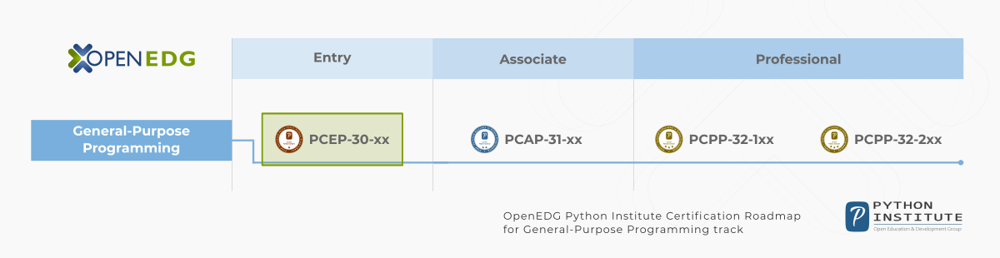

# Программа курса

В этом курсе Вы научитесь:

*   универсальным концепциям компьютерного программирования;
*   синтаксису и семантике языка Python;
*   практическим навыкам в решении типичных задач в реализации;
*   использовать самые важные элементы из Стандартной Библиотеки (Python Standard Library);
*   устанавливать Вашу среду выполнения;
*   проектировать, писать, тестировать и исправлять Ваши собственные программы, написанные в Python.

Курс разделён на 4 модуля:

1.  **Модуль 1**  
    Введение в Python и компьютерное программирование;
2.  **Модуль 2**  
    Типы данных, переменные, базовые операции ввода-вывода и основные операторы;
3.  **Модуль 3**  
    Булевы значения, условия, циклы, списки и работа со списками, логические и бинарные операции;
4.  **Модуль 4**  
    Функции, кортежи, словари и обработка данных.

# Почему Вам стоит учить PYTHON?

Python вездесущ, многие люди ежедневно используют многочисленные устройства на базе Python, осознают они это или нет. На Python написаны миллионы (ну, на самом деле миллиарды) строк кода, что означает почти неограниченные возможности для повторного использования кода и обучения на хорошо составленных примерах. Более того, существует большое и очень активное сообщество Python, где всегда рады помочь.

Есть также несколько факторов, которые делают Python отличным для обучения:

*   Ему легко обучиться - время, необходимое для изучения Python, меньше, чем для изучения многих других языков; это означает, что возможно быстрее начать программировать;
*   Его легко использовать при создании нового программного обеспечения - при использовании Python часто есть возможность писать код быстрее;
*   Его легко получить, установить и развернуть - Python бесплатный, открытый и мультиплатформенный; не все языки могут похвастать этим.

Завершение этого курса может стать отправной точкой для изучения любого другого языка программирования и изучения технологий, использующих Python в качестве основы (например, Django). Курс отличается доступностью, дружелюбием и открытостью для ученика.

Первая часть начинается с абсолютных основ, шаг за шагом направляя вас к сложным задачам, описанным во второй части, что делает вас ответственным создателем программного обеспечения, способным решать различные задачи на многих должностях в ИТ-индустрии.

# Где используется Python?

Помните ли Вы Battlefield 2, Battlefield 2142 и Battlefield Heroes - игры от EA DICE в жанре стратегии и шутера от первого лица? Все эти игры используют Python для логики и управления сервером. Python часто используется при создании open-source, бесплатных игр, например, OpenRTS, PySol, Metin 2, или Frets On Fire - известные похожие на Guitar Hero игры, написанные с использованием pygame.

А что насчёт крупных веб-сайтов и сервисов? Dropbox? UBER? Spotify? Pintrest? BuzzFeed? Да. Все они были написаны, в большей или меньшей степени, в Python. Ещё примеры?

* Интернет приложения (BitTorrent, Jogger Publishing Assistant, TheCircle, TwistedMatrix)
* 3D CAD/CAM (FreeCAD, Fandango, Blender, Vintech RCAM)
* Корпоративные приложения (Odoo, Tryton, Picalo, LinOTP 2, RESTx)
* Приложения для работы с изображениями (Gnofract 4D, Gogh, imgSeek, MayaVi, VPython)
* Мобильные приложения (Aarlogic C05/3, AppBackup, Pyroute)
* Офисные приложения (calibre, faces, Notalon, pyspread)
* Личные информационные менеджеры (BitPim, Narval, Prioritise, Task Coach, WikidPad)  
    (Source: [https://wiki.python.org/moin/PythonProjects](https://wiki.python.org/moin/PythonProjects))

В общем, Python - прекрасный выбор для:

* Веб и Интернет разработки (например, фреймворки Django и Pyramid, микро-фреймворки Flask и Bottle)
* Научных и числовых вычислений (например, SciPy - набор пакетов для нужд математики, науки и инженерии; Ipython - интерактивная оболочка с возможностью редактирования и записи рабочих сессий)
* Образования (это прекрасный язык для изучения программирования. И поэтому мы предлагаем Вам этот курс!)
* Графические интерфейсы пользователя (например, wxWidgets, Kivy, Qt)
* Разработка программного обеспечения (контроль сборок, управление и тестирование - Scons, Buildbot, Apache Gump, Roundup, Trac)
* Приложения для бизнеса (ERP и системы электронной коммерции - Odoo, Tryton)  
    (Source: [https://www.python.org/about/apps](https://www.python.org/about/apps))

И много-много других проектов и инструментов разработки.

# Получите сертификат PCEP

По заврешении _Основы Python 1_ Вы будете подготовлены к попытке получения квалификации [PCEP – Certified Entry-Level Python Programmer](https://pythoninstitute.org/pcep-certification-entry-level/).

Сертификация _PCEP – Certified Entry-Level Python Programmer_ показывает, что Вы знакомы как с такими универсальными концепциями компьютерного программирования как **типы данных**, **контейнеры**, **функции**, **условия** и **циклы**, так и с такими важнейшими аспектами языка Python как **синтаксис**, **семантика** и **среда выполнения**.

 Получение сертификата PCEP гарантирует, что Вы **ознакомитесь с наиболее важными средствами, предоставляемыми Python 3**, которые позволят вам начать собственное обучение на среднем уровне и продолжить свое профессиональное развитие.  
  
Сертификация PCEP позволяет вам продемонстрировать, что вы не только в курсе задач, связанных с Python, но и что вы можете грамотно их решать.  
  
Кроме того, с OpenEDG Python Institute вы получаете доступ к большой сети профессионалов в области программирования Python, ценному ресурсу для решения задач, связанных с Python, и для разработки инновационных решений.  

_PCEP – Certified Entry-Level Python Programmer_ сертификация - это **промежуточный этап** перед сертификацией _PCAP – Certified Associate in Python Programming_ и **отправная точка** для старта карьеры в разработке программного обеспечения, программировании в Python и связанных технологиях.

Получение сертификата PCEP поможет обладателю сертификата выделиться среди других кандидатов и встать на ноги.

  

OpenEDG Python Institute Certification Roadmap
