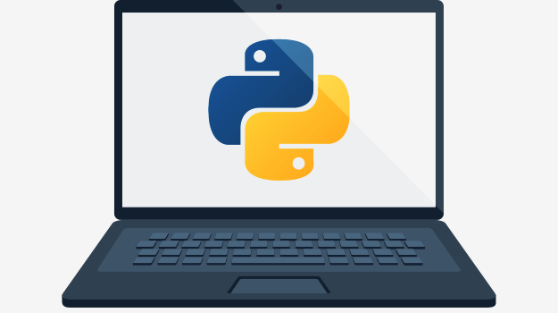
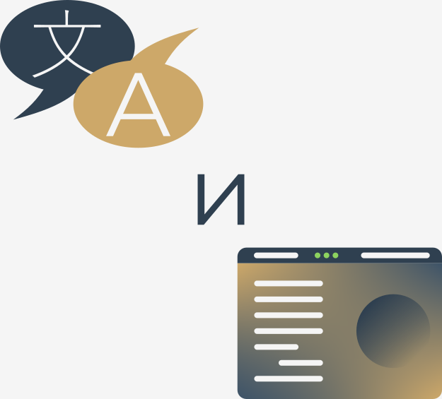
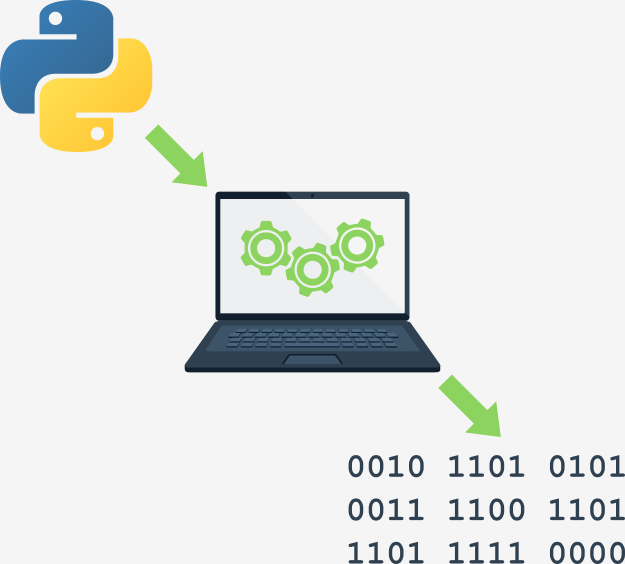

## Как работает компьютерная программа?

Программа делает компьютер пригодным для использования. Без программы компьютер, даже самый мощный, не более чем объект. Точно так же как без пианиста, пианино - не что иное, как деревянный ящик.

Компьютеры способны выполнять очень сложные задачи, но эта способность не является врожденной. Природа компьютера совершенно иная.

Он может выполнять только очень простые операции. Например, компьютер не может сам по себе понять значение сложной математической функции, хотя в ближайшем будущем это не будет за рамками возможностей.

Современные компьютеры могут вычислять результаты только очень простых операций, таких как сложение или деление, но они могут делать это очень быстро и могут повторять эти действия практически любое количество раз.

Представьте, что вы хотите узнать, какую среднюю скорость вы достигли во время долгого путешествия. Вы знаете расстояние, знаете время, вам нужна скорость.

Естественно, компьютер сможет это вычислить, но компьютер не знает таких вещей, как расстояние, скорость или время. Поэтому необходимо дать компьютеру команду:

*   принять число, представляющее расстояние;
*   принять число, представляющее время в пути;
*   разделить первое значение на второе и сохранить результат в памяти;
*   показать результат (представляющий среднюю скорость) в удобочитаемом формате.

Эти четыре простых действия формируют **программу**. Конечно, эти примеры не формализованы, и они очень далеки от того, что компьютер может понять, но они достаточно хороши для того, чтобы их можно было перевести на язык, приемлемый для компьютера.

**Язык** - ключевое слово.

## Естественные языки и языки программирования

Язык - это средство (и инструмент) для выражения и записи мыслей. Вокруг нас много языков. Некоторые из них не требуют ни речи, ни письма, например, язык тела; можно очень точно выразить свои самые глубокие чувства, не говоря ни слова.

Еще один язык, который вы используете каждый день, — это ваш родной язык, Вы используете его для проявления своей воли и размышлений о реальности. У компьютеров тоже есть свой собственный язык, называемый **машинным** языком, который является очень элементарным.

Компьютер, даже самый технически сложный, лишен даже малейшего интеллекта. Можно сказать, что это как хорошо обученная собака - она реагирует только на заранее определенный набор известных команд.

Команды, которые он распознает, очень просты. Мы можем представить, что компьютер реагирует на команды типа "взять это число, разделить на другое и сохранить результат".

Полный набор известных команд называется **списком инструкций**, иногда сокращенно **IL**. Различные типы компьютеров могут отличаться в зависимости от размера их IL, и инструкции могут быть совершенно разными в разных моделях.

Примечание: машинные языки разрабатываются людьми.

В настоящее время ни один компьютер не может создавать новый язык. Однако это может скоро измениться. Так же, как люди используют несколько очень разных языков, машины тоже имеют много разных языков. Однако разница в том, что человеческие языки развивались естественным образом.

Более того, они все еще развиваются, и новые слова создаются каждый день по мере того, как исчезают старые слова. Эти языки называются **естественными языками**.

## Что составляет язык?

Можно сказать, что каждый язык (машинный или естественный, неважно) состоит из следующих элементов:

*   **алфавит**: набор символов, используемых для построения слов определенного языка (например, латинский алфавит для английского, кириллица для русского, кандзи для японского и т. д.)
*   **лексика**: (она же - словарь) набор слов, которые язык предлагает своим пользователям (например, слово "компьютер" происходит из словаря английского языка, а слово "cmoptrue" - нет; слово "чат" присутствует как в английском, так и во французском словарях, но их значения разные)
*   **синтаксис**: набор правил (формальных или неформальных, письменных или интуитивно понятных), используемых для определения того, образует ли определенная строка слов допустимое предложение (например, "I am a python" - синтаксически правильная фраза, а "I a python am" - нет)
*   **семантика**: набор правил, определяющих, имеет ли определенная фраза смысл (например, "Я съел пончик" имеет смысл, а "Пончик меня съел" - нет)

IL фактически является **алфавитом машинного языка**. Это простейший и самый основной набор символов, который мы можем использовать, чтобы отдавать команды компьютеру. Это родной язык компьютера.

К сожалению, этот родной язык очень далек от человеческого родного языка. Нам обоим (компьютерам и людям) нужно что-то еще, общий язык для компьютеров и людей, или мост между двумя разными мирами.

Нам нужен язык, на котором люди могут писать свои программы, и язык, который компьютеры могут использовать для выполнения программ, который намного сложнее, чем машинный язык, но намного проще, чем естественный язык.

Такие языки часто называют языками программирования высокого уровня. Они, по крайней мере, чем-то похожи на естественные в том, что в них используются символы, слова и условные обозначения, понятные человеку. Эти языки позволяют людям выражать команды компьютерам, которые намного сложнее, чем те, которые предлагают IL.

Программа, написанная на языке программирования высокого уровня, называется **исходным кодом** (в отличие от машинного кода, выполняемого компьютерами). Точно так же файл, содержащий исходный код, называется **исходным файлом**.

## Компиляция и интерпретация

Компьютерное программирование - это процесс компоновки элементов выбранного языка программирования в том порядке, который приведет к желаемому эффекту. В каждом конкретном случае эффект может быть разным – это зависит от воображения, знаний и опыта программиста.

Конечно, такая композиция должна быть верной во многих смыслах:

*   **алфавитно** – программа должна быть написана узнаваемым шрифтом, например римским, кириллическим и т. д.
*   **лексически** – у каждого языка программирования есть свой словарь, и вам нужно его освоить; к счастью, он намного проще и меньше, чем словарь любого естественного языка;
*   **синтаксически** – у каждого языка есть свои правила, и они должны соблюдаться;
*   **семантически** – программа должна иметь смысл.

К сожалению, программист также может ошибиться в каждом из четырех вышеупомянутых пунктов. Каждый из них может привести к тому, что программа станет совершенно бесполезной.

Предположим, вы успешно написали программу. Как убедить компьютер выполнить его? Вы должны перевести вашу программу на машинный язык. К счастью, перевод может быть выполнен самим компьютером, что делает весь процесс быстрым и эффективным.

Существует два разных способа **преобразования программы из языка программирования высокого уровня в машинный**:

**Компиляция** - исходная программа транслируется один раз в один исполняемый (бинарный) файл (например, *.exe, если код предназначен для запуска в среде Windows). Такую трансляцию необходимо повторять каждый раз, когда вы изменяете исходный код. Исполняемый файл содержит машинный код и такой файл можно распространять по всему миру. Программа, выполняющая такую трансляцию из исходного кода в машинный называется компилятором или переводчиком;

**Интерпритация** - вы (или любой пользователь кода) можете переводить исходную программу каждый раз, когда она должна быть запущена. Программа, выполняющая такое преобразование, называется интерпретатором, поскольку она интерпретирует код каждый раз во время выполнения. Это также означает, что при распространении исходного кода конечному пользователю также будет нужен интерпретатор для его выполнения.

По некоторым очень простым причинам конкретный язык программирования высокого уровня спроектирован так, чтобы попасть в одну из этих двух категорий.

Очень мало языков, которые можно как компилировать, так и интерпретировать. Обычно язык программирования проектируется с учетом этого фактора в умах его конструкторов - будет ли он компилироваться или интерпретироваться?

## Что именно делает интерпретатор?

Предположим еще раз, что вы написали программу. Теперь она существует как **компьютерный файл**: компьютерная программа на самом деле представляет собой фрагмент текста, поэтому исходный код обычно помещается в **текстовые файлы**.

При этом, это должен быть **чистый текст**, без каких-либо украшений, таких как разные шрифты, цвета, встроенные изображения или другие материалы. Теперь вам нужно вызвать интерпретатор и позволить ему прочитать ваш исходный файл.

Интерпретатор читает исходный код так, как принято в западной культуре: сверху вниз и слева направо (хотя бывают и исключения).

Прежде всего, интерпретатор проверяет правильность всех последующих строк (используя четыре аспекта, рассмотренные ранее).

Если компилятор обнаруживает ошибку, он немедленно завершает свою работу. Единственным результатом в этом случае является **сообщение об ошибке**.

Интерпретатор сообщит вам, где находится ошибка и чем она вызвана. Однако эти сообщения могут вводить в заблуждение, поскольку интерпретатор не может следовать вашим точным намерениям и может обнаруживать ошибки на некотором расстоянии от их реальных причин.

Например, если вы попытаетесь использовать объект с неизвестным именем, это вызовет ошибку, но ошибка будет обнаружена в том месте, где происходит попытка использования объекта, а не там, где было введено имя нового объекта.

Другими словами, настоящая причина обычно находится немного раньше в коде, например, в том месте, где вы должны были сообщить интерпретатору, что собираетесь использовать объект с неким именем.

Если строка выглядит хорошо, интерпретатор пытается ее выполнить (примечание: каждая строка обычно выполняется отдельно, поэтому трио «чтение-проверка-выполнение» может повторяться много раз - больше раз, чем фактическое количество строк в исходном файле, так как некоторые части кода могут выполняться более одного раза).

Также возможно, что значительная часть кода может быть успешно выполнена до того, как интерпретатор обнаружит ошибку. Это нормальное поведение в данной модели выполнения.

Теперь вы можете спросить: что лучше? Модель «компиляции» или «интерпретации»? Нет однозначного ответа. Если бы она была, одна из этих моделей давно бы перестала существовать. У обеих есть свои преимущества и свои недостатки.

## Компиляция и интерпретация - преимущества и недостатки

|| **КОМПИЛЯЦИЯ**| **ИНТЕРПРЕТАЦИЯ**|
|---|---|---|
| ПРЕИМУЩЕСТВА | <li>выполнение переведённого кода обычно происходит быстрее;<li>компилятор должен быть только у автора программы - конечный пользователь может использовать программу без него;<li>переведенный код хранится с использованием машинного языка - поскольку его очень сложно понять, авторские алгоритмы программы, вероятно, останутся секретом. | <li>вы можете запустить код сразу после внесения правок - дополнительных этапов перевода нет;<li>исполняемый код хранится на оригинальном языке программирования, а не на машинном языке - его можно запускать на компьютерах, использующих разные машинные языки; вы не компилируете свой код отдельно для каждой архитектуры (эту задачу выполняют разработчики интерпретатора). |
| НЕДОСТАТКИ   | <li>сама компиляция может занять очень много времени - вы не сможете запустить свой код сразу после внесения правки;<li>у вас должно быть столько же компиляторов, сколько аппаратных платформ, на которых вы хотите, чтобы ваш код запускался.| <li>не ожидайте, что интерпретация сильно ускорит работу вашего кода - ваш код будет делить мощность компьютера с интерпретатором, поэтому он не может быть действительно быстрым;<li>и у вас, и у конечного пользователя должен быть интерпретатор для запуска вашего кода.|

**Что всё это значит для Вас?**

*   Python - это **интерпретируемый язык**. Это означает, что он наследует все описанные преимущества и недостатки. Конечно, он добавляет некоторые из своих уникальных функций в оба набора.
*   Если вы хотите программировать на Python, вам понадобится **интерпретатор Python**. Без него вы не сможете запустить свой код. К счастью, **Python бесплатный**. Это одно из важнейших его преимуществ.

По историческим причинам языки, предназначенные для интерпретации, часто называются **языками сценариев** (или скриптовыми языками), а исходные программы, закодированные с их помощью, называются **сценариями** или **скриптами** (англ. script - сценарий).
