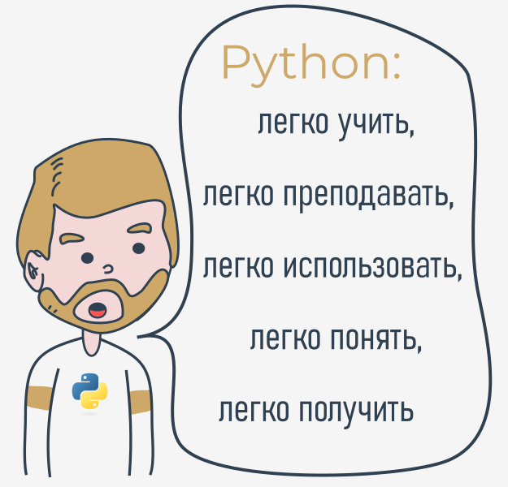
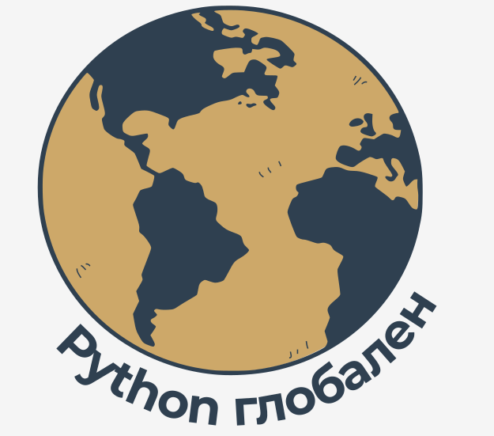

## Что такое Python?

Python - широко используемый, интерпретируемый, объектно-ориентированный язык программирования высокого уровня с динамической семантикой, используемый для программирования общего назначения.

И хотя вам, возможно, питон известен как большая змея, название языка программирования Python происходит от старого комедийного сериала BBC под названием **Летающий цирк Монти Пайтона**.

На пике своего успеха команда Монти Пайтона показывала свои скетчи живой публике по всему миру, в том числе на Hollywood Bowl.

Поскольку Монти Пайтон считается одним из двух основных питательных веществ для программиста (второе - пицца), создатель Python назвал этот язык в честь телешоу.

## Кто изобрёл Python?

Одной из удивительных особенностей Python является тот факт, что на самом деле это работа одного человека. Обычно новые языки программирования разрабатываются и публикуются крупными компаниями, в которых работает множество профессионалов, и из-за правил авторского права очень сложно назвать кого-либо из людей, участвующих в проекте. Python - исключение.

Существует не так много языков, авторы которых известны по именам. Python был создан **[Гвидо ван Россумом](https://ru.wikipedia.org/wiki/%D0%92%D0%B0%D0%BD_%D0%A0%D0%BE%D1%81%D1%81%D1%83%D0%BC,_%D0%93%D0%B2%D0%B8%D0%B4%D0%BE)**, родившимся в 1956 году в Харлеме, Нидерланды. Конечно, Гвидо ван Россум не разрабатывал и развивал все компоненты Python сам.

Скорость, с которой Python распространился по миру, является результатом непрерывной работы тысяч (очень часто анонимных) программистов, тестировщиков, пользователей (многие из которых не являются ИТ-специалистами) и энтузиастов, но следует сказать, что сам Первая идея (семя, из которого вырос Python) пришла в голову одному - Гвидо.

## Проект по программированию как хобби

Обстоятельства, в которых был создан Python, немного озадачивают. По словам Гвидо ван Россума:

> В декабре 1989 года я искал программный проект-хобби, которым бы я занимался всю неделю перед Рождеством. Мой офис (...) был бы закрыт, но у меня был домашний компьютер, и больше ничего в моих руках. Я решил написать интерпретатор для нового языка сценариев, о котором я думал в последнее время: потомка ABC, который понравится хакерам Unix/C. Я выбрал Python в качестве рабочего названия для проекта, находясь в слегка непочтительном настроении (и являясь большим поклонником Летающего Цирка Монти Пайтона). Гвидо ван Россум

## Цели Python

В 1999 году Гвидо ван Россум определил свои цели в Python:

*   **простой и интуитивно понятный** язык, такой же мощный, как и у основных конкурентов;
*   **открытый исходный код**, так что каждый может внести свой вклад в его разработку;
*   код, который **понятен** как простой английский;
*   **подходящий для повседневных задач**, что позволит сократить время разработки.

Спустя примерно 20 лет становится ясно, что все эти намерения осуществились. Некоторые источники говорят, что Python - самый популярный язык программирования в мире, в то время как другие утверждают, что он второй или третий.

В любом случае он по-прежнему занимает высокое место в первой десятке [PYPL PopularitY of Language Programming](http://pypl.github.io/PYPL.html) и [Индекс сообщества программистов TIOBE](https://www.tiobe.com/tiobe-index/).

Python больше не молодой язык. Он **зрелый и заслуживающий доверия**. Это не одноразовое чудо. Это яркая звезда на небосклоне программирования, и время, потраченное на изучение Python, — очень хорошее вложение.

## Что делает Python особенным?

Как так получается, что программисты, молодые и старые, опытные и новички, хотят его использовать? Как случилось, что крупные компании приняли Python и реализовали на нем свои флагманские продукты?

Причин много – Мы уже перечислили некоторые из них, но давайте переберём их еще раз в более практической манере:

*   ему **легко обучиться** – время, необходимое для изучения Python, короче, чем для многих других языков; это означает, что можно быстрее приступить к программированию;
*   ему **легко учить** – учебная нагрузка меньше, чем требуется для других языков; это означает, что учитель может уделять больше внимания общим (независимым от языка) методам программирования, не тратя силы на экзотические трюки, странные исключения и непонятные правила;
*   его **легко использовать** для написания нового программного обеспечения – часто можно писать код быстрее при использовании Python;
*   его **легко понять** - чужой код быстрее понять, если он написан на Python;
*   его **легко получить, установить и развернуть** – Python является бесплатным, открытым и мультиплатформенным; не все языки могут этим похвастать

Конечно, у Python тоже есть свои недостатки:

* это не демон скорости – Python не обеспечивает исключительной производительности;
* в некоторых случаях он может быть устойчивым к некоторым более простым методам тестирования – это может означать, что отладка кода Python может быть более сложной, чем с другими языками; К счастью, ошибаться в Python тоже сложнее.

Следует также отметить, что Python - не единственное решение такого рода, доступное на рынке IT.

У него много поклонников, но многие предпочитают другие языки и даже не рассматривают Python в своих проектах.

## Конкуренты Python?

У Python есть два прямых конкурента с сопоставимыми свойствами и предрасположенностями. Вот они:

*   **Perl** – язык сценариев, созданный Ларри Уоллом;
*   **Ruby** – язык сценариев, созданный Юкихиро Мацумото.

Первый является более традиционным и консервативным, чем Python, и напоминает некоторые старые языки, унаследованные от классического языка программирования C.

Напротив, последний более инновационен и полон свежих идей, чем Python. Сам Python находится где-то между этими двумя творениями.

Интернет полон форумов с бесконечными дискуссиями о превосходстве одного из этих трех над другими, если Вы хотите узнать больше о каждом из них.

## Где мы можем увидеть Python в действии?

Мы видим это каждый день и почти везде. Он широко используется для реализации сложных **Интернет-сервисов**, таких как поисковые системы, облачные хранилища и инструменты, социальные сети и т. Д. Когда бы вы ни использовали любую из этих служб, вы на самом деле очень близки к Python, хотя вы этого не знали.

Многие **инструменты разработки** реализованы на Python. Все больше и больше **приложений для повседневного использования** пишется на Python. Многие **учёные** отказались от дорогих проприетарных инструментов и перешли на Python. Многие **тестировщики** IT-проектов начали использовать Python для выполнения повторяемых процедур тестирования. Список длинный.

## Почему не Python?

Несмотря на растущую популярность Python, всё ещё есть некоторые ниши, в которых Python отсутствует или редко встречается:

*   **низкоуровневое программирование** (иногда называемое "программирование железа"): если вы хотите реализовать чрезвычайно эффективный драйвер или графический движок, вы не будете использовать Python;
*   **приложения для мобильных устройств**: хотя эта область всё ещё ждет своего захвата Python, скорее всего, когда-нибудь это произойдет.
