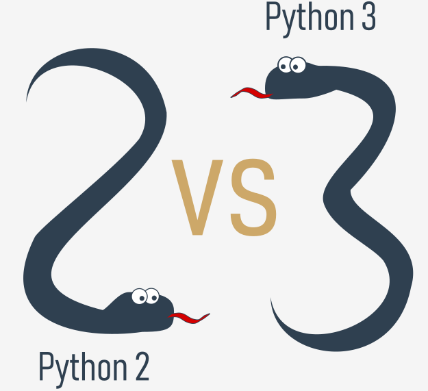
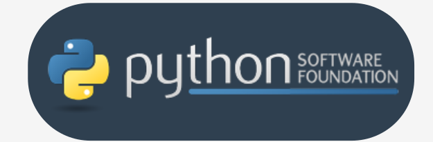
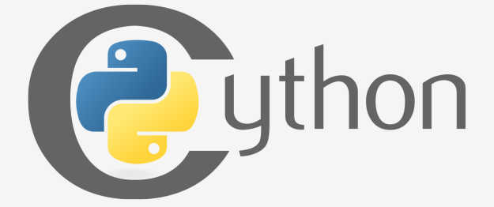
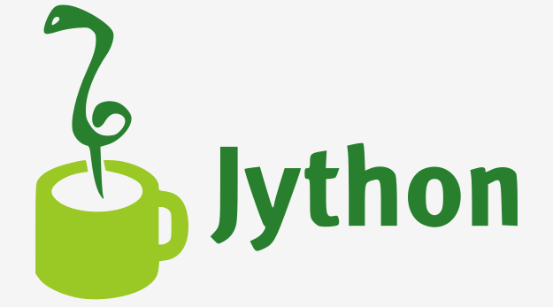
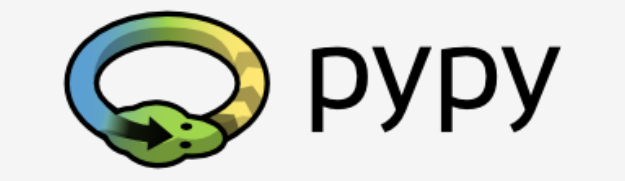

## Python 2 и Python 3

Python 2 - это более старая версия исходного Python. С тех пор его разработка намеренно приостановлена, хотя это не означает, что для него нет обновлений. Напротив, обновления выпускаются регулярно, но они не предназначены для значительного изменения языка. Они скорее исправляют недавно обнаруженные ошибки и дыры в безопасности. Путь разработки Python 2 уже зашел в тупик, но сам Python 2 все еще жив.

**Python 3 - это более новая (точнее, текущая) версия языка. Он проходит собственный эволюционный путь, внедряя свои стандарты и особенности.**

Эти две версии Python несовместимы друг с другом. Скрипты Python 2 не будут работать в среде Python 3 и наоборот, поэтому, если вы хотите, чтобы старый код Python 2 запускался интерпретатором Python 3, единственное возможное решение - переписать его. Конечно - не с нуля, так как большие части кода могут остаться нетронутыми, но вам придется пересмотреть весь код, чтобы найти все возможные несовместимости. К сожалению, полностью автоматизировать этот процесс нельзя.

Перенос старого приложения Python 2 на новую платформу слишком сложный, требует много времени, слишком дорогой и слишком рискованный, и даже возможно, что переписывание кода внесет в него новые ошибки. Проще и разумнее оставить эти системы в покое и улучшить существующий интерпретатор вместо того, чтобы пытаться работать внутри уже функционирующего исходного кода.

 

Python 3 - это не просто лучшая версия Python 2 – это совершенно другой язык, хотя он очень похож на своего предшественника. Когда вы смотрите на них издалека, они кажутся одинаковыми, но если вы посмотрите внимательно, вы заметите много различий.  
  
Если вы изменяете старое существующее решение Python, то весьма вероятно, что оно было написано на Python 2. Это причина, по которой Python 2 все еще используется. Существует слишком много приложений в Python 2, чтобы полностью отказаться от него.

**Примечание:** если вы собираетесь начать новый проект на Python, вам следует использовать Python 3.

Важно понимать, что между минорными версиями Python 3 могут быть определенные различия (например, Python 3.6 представил упорядоченные ключи словаря по умолчанию в реализации CPython).  Хорошая новость заключается в том, что все новые версии Python 3 **обратно совместимы** с предыдущими версиями Python 3.

## Python, также известный как CPython

Внутри Python 2 и Python 3 существует более одной реализации каждого из них.

Прежде всего, это Python-ы, которые поддерживаются в PSF ([Python Software Foundation](https://www.python.org/psf-landing/)) - сообществе, целью которого является разработка, улучшение, расширение и популяризация Python и его среды. Президентом PSF является сам Гвидо фон Россум, и по этой причине эти Python-ы называются **каноническими**. Они также считаются **эталонными Python-ами**, поскольку любая другая реализация языка должна соответствовать всем стандартам, установленным PSF.

Гвидо ван Россум использовал язык программирования "C" для реализации самой первой версии своего языка, и это решение до сих пор остается в силе. Все Python-ы, поступающие из PSF, написаны на языке "C". Для такого подхода есть много причин. Один из них (вероятно, самый важный) заключается в том, что благодаря ему Python можно легко портировать и перенести на все платформы с возможностью компилировать и запускать программы на языке "C" (практически все платформы имеют эту функцию, которая открывает множество возможностей для расширения Python).

Вот почему реализация PSF часто упоминается как **CPython**. Это самый влиятельный Python среди всех Python-ов в мире.

## Cython

Ещё один член семейства Python - **Cython**.

 Cython - одно из возможных решений самой болезненной черты Python – низкая скорость выполнения. Большие и сложные математические вычисления могут быть легко закодированы на Python (намного проще, чем на "C" или любом другом традиционном языке), но выполнение конечного кода может занять очень много времени.

Как примиряются эти два противоречия? Одно из решений - написать свои математические идеи с помощью Python, и когда вы абсолютно уверены, что ваш код правильный и даёт правильные результаты, вы можете перевести его на "C". Конечно, "C" будет работать намного быстрее, чем чистый Python.

Это то, для чего предназначен Cython – для автоматического перевода кода Python (чистого и ясного, но не слишком быстрого) в код "C" (сложный, но быстрый).

## Jython

Другая версия Python называется **Jython** .

"J" означает "Java". Представьте себе Python, написанный на Java вместо C. Это полезно, например, если вы разрабатываете большие и сложные системы, полностью написанные на Java, и хотите добавить к ним некоторую гибкость Python. Традиционный CPython может быть трудно интегрировать в такую среду, поскольку C и Java живут в совершенно разных мирах и не разделяют многих общих идей.

Jython может более эффективно взаимодействовать с существующей инфраструктурой приложений, написанных на Java. Поэтому некоторые проекты находят такую реализацию Python полезной и нужной.

## PyPy и RPython

Взгляните на логотип ниже. Это ребус. Вы можете его решить?

Это логотип **PyPy** - Python в Python. Другими словами, он представляет собой среду Python, написанную на языке, подобном Python, с именем **RPython** (ограниченный Python). На самом деле это подмножество Python.  
  
Исходный код PyPy не запускается в режиме интерпретации, а вместо этого транслируется на язык программирования C, а затем выполняется отдельно.

Это полезно, потому что, если вы хотите протестировать любую новую функцию, которая может быть (но не обязательно) введена в основную реализацию Python, легче проверить ее с помощью PyPy, чем с помощью CPython. Вот почему PyPy - это скорее инструмент для людей, разрабатывающих Python, чем для остальных пользователей.

Это, конечно, не делает PyPy менее важным или менее серьезным, чем CPython.