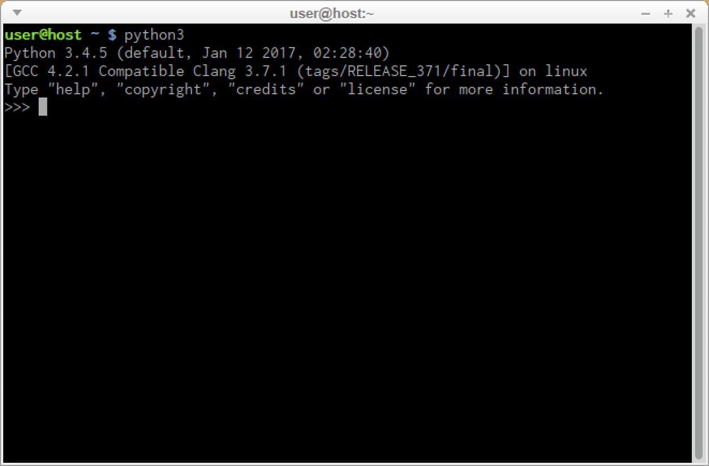
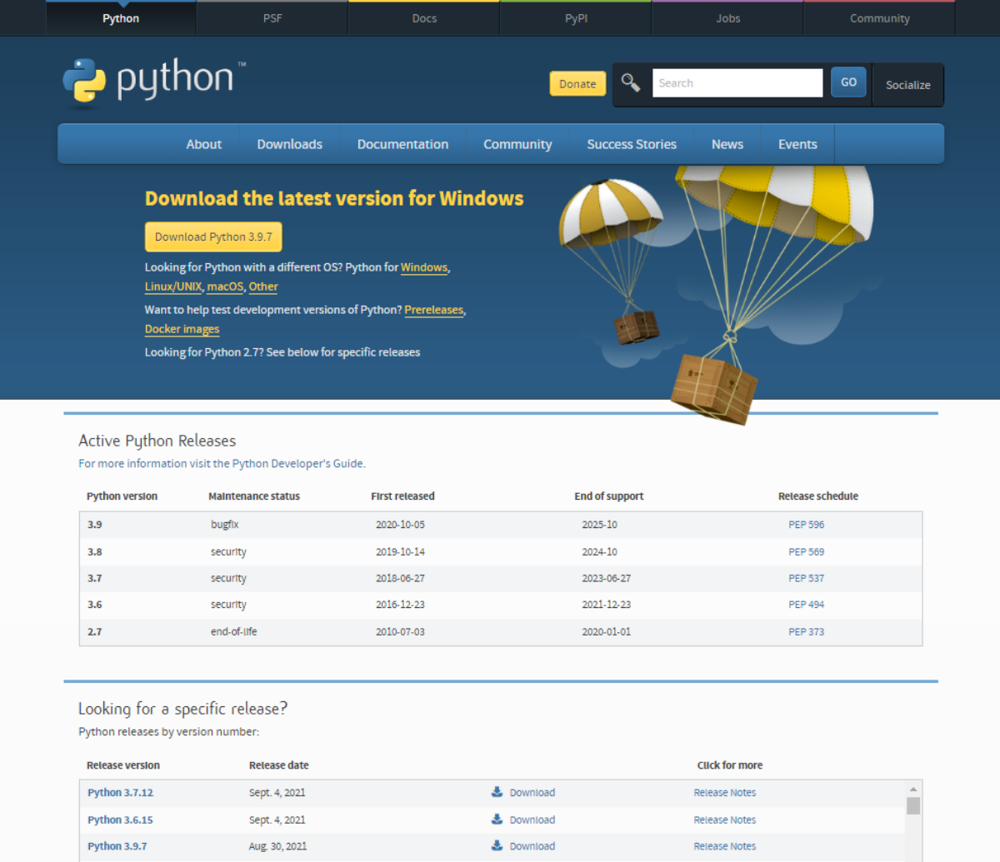
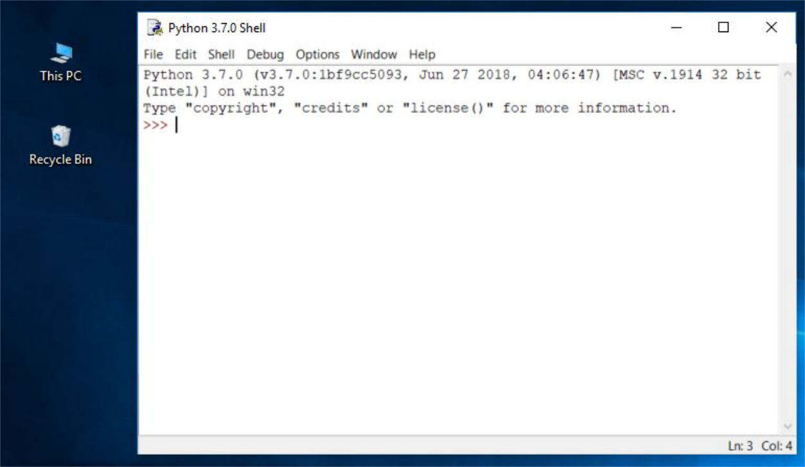
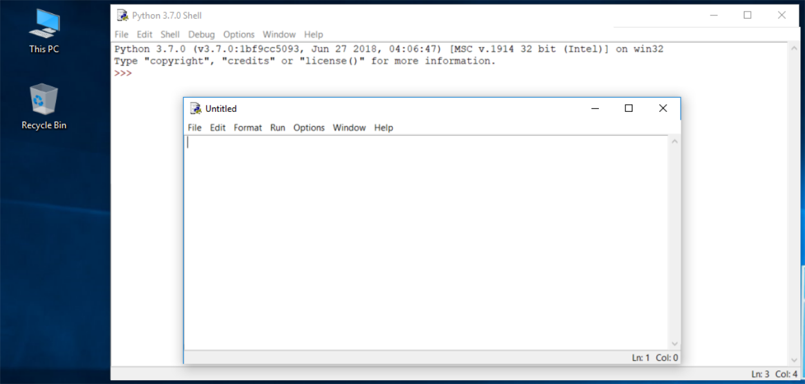
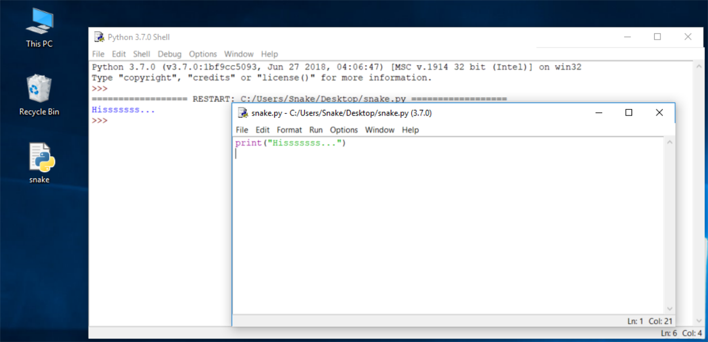
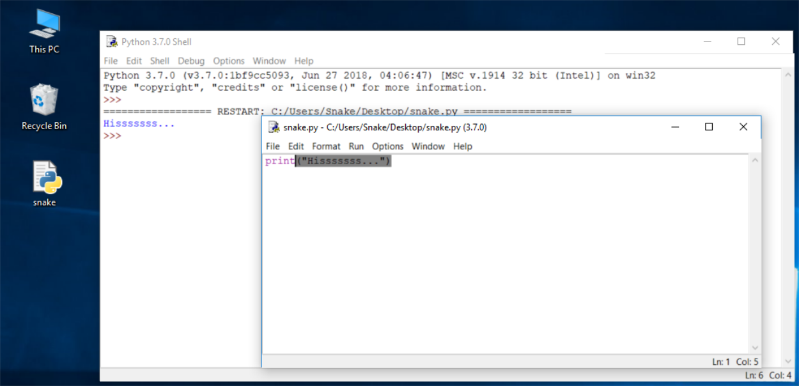
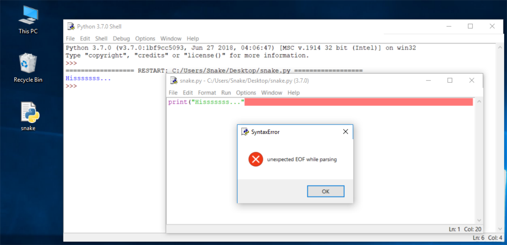
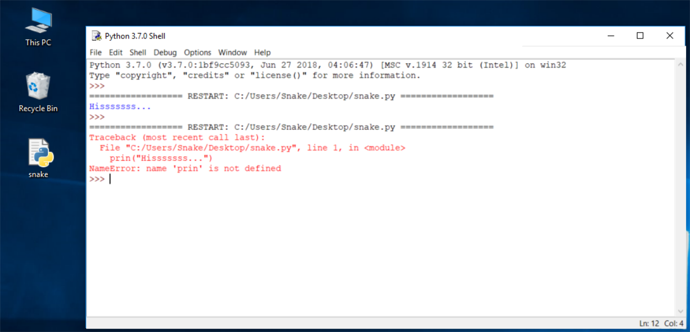

## Как получить Python и как его использовать

Есть несколько способов получить собственную копию Python 3 в зависимости от используемой вами операционной системы.

**Пользователи Linux, скорее всего, уже установили Python** - это наиболее вероятный сценарий, поскольку инфраструктура Python интенсивно используется многими компонентами ОС Linux.

Например, некоторые дистрибьюторы могут объединять свои конкретные инструменты с системой, и многие из этих инструментов, например менеджеры пакетов, часто написаны на Python. Некоторые части графических сред, доступных в мире Linux, также могут использовать Python.

Если вы пользователь Linux, откройте терминал/консоль и введите:

`python3`

Нажмите _Enter_ в консоли и подождите.

Если вы видите что-то вроде этого:

```
Python 3.4.5 (default, Jan 12 2017, 02:28:40)
[GCC 4.2.1 Compatible Clang 3.7.1 (tags/RELEASE_371/final)] on linux
Type "help", "copyright", "credits" or "license" for more information.
>>>  
```

тогда вам не нужно больше ничего делать.

Если Python 3 отсутствует, обратитесь к документации Linux, чтобы узнать, как использовать диспетчер пакетов для загрузки и установки нового пакета - тот, который вам нужен, называется **python3** или его имя начинается с этого.

Все пользователи систем, не относящихся к системам Linux, могут загрузить копию со страницы [https://www.python.org/downloads/](https://www.python.org/downloads/).

  

## Скачивание и установка Python

Поскольку браузер сообщает сайту, что вы вошли в используемую вами ОС, единственный шаг, который вам нужно сделать, — это щелкнуть соответствующую версию Python, которую вы хотите.

В этом случае выберите Python 3. На сайте всегда предлагается последняя версия.

Если вы используете **Windows**, запустите загруженный EXE-файл и выполните все действия.

Оставьте настройки, которые предлагает установщик, по умолчанию, за одним исключением - посмотрите на опцию **Добавить Python 3.x в PATH** и выберите её.

Это упростит жизнь.

Если вы являетесь пользователем **macOS**, версия Python 2, возможно, уже была предустановлена на вашем компьютере, но, поскольку мы будем работать с Python 3, вам все равно потребуется загрузить и установить соответствующую версию .pkg с сайта Python.

  

## Начало работы с Python

Теперь, когда у вас установлен Python 3, пора проверить, работает ли он, и использовать его в первую очередь.

Это будет очень простая процедура, но её должно быть достаточно, чтобы убедить Вас в том, что среда Python является полной и функциональной.

Есть много способов использовать Python, особенно если вы собираетесь стать разработчиком Python.

Для начала работы вам потребуются следующие инструменты:

*   **текстовый редактор**, который поможет Вам в написании кода (он должен иметь некоторые специальные функции, недоступные в простых инструментах); этот специализированный редактор предоставит вам больше, чем стандартное оборудование ОС;
*   **консоль**, в которой вы сможете запустить свой недавно написанный код и принудительно остановить его, когда он выйдет из-под контроля;
*   инструмент под названием **отладчик**, способный запускать ваш код шаг за шагом, что позволит вам проверять его в каждый момент выполнения.

Помимо множества полезных компонентов, стандартная установка Python 3 содержит очень простое, но чрезвычайно полезное приложение под названием IDLE.

**IDLE** - это аббревиатура: Integrated Development and Learning Environment.

Перемещайтесь по меню вашей ОС, найдите IDLE где-нибудь под Python 3.x и запустите его. Вот что вы должны увидеть:

  

## Как написать и запустить свою первую программу

Пришло время написать и запустить вашу первую программу на Python 3. Пока это будет очень просто.

Первый шаг - создать новый исходный файл и заполнить его кодом. Щелкните _Файл_ в меню IDLE и выберите _Новый файл_.



Как видите, IDLE открывает для вас новое окно. Вы можете использовать его для написания и изменения вашего кода.

Это **окно редактора**. Его единственная цель - быть рабочим местом, где обрабатывается ваш исходный код. Не путайте окно редактора с окном оболочки. Они выполняют разные функции.

Окно редактора в настоящее время не имеет названия, но рекомендуется начинать работу с имени исходного файла.

Нажмите _Файл_ (в новом окне), затем нажмите _Сохранить как..._, выберите папку для нового файла (рабочий стол - хорошее место для Ваших первых попыток программирования) и выберите имя для нового файла.


**Примечание**: не устанавливайте расширение для имени файла, который вы собираетесь использовать. Python необходимо, чтобы его файлы имели расширение _.py_, поэтому вам следует полагаться на значения по умолчанию для диалогового окна. Использование стандартного расширения .py позволяет ОС правильно открывать эти файлы.

## Как написать и запустить свою первую программу

Теперь поместите только одну строку в ваше недавно открытое и названное окно редактора.

Строка выглядит так:

```python
print("Hisssssss...")  
```

Вы можете использовать буфер обмена, чтобы скопировать текст в файл.

Мы не собираемся сейчас объяснять смысл программы. Вы найдете подробное обсуждение в следующей главе.

Присмотритесь к кавычкам. Это простейшая форма кавычек (нейтральная, прямая, тупая и т. д.), Обычно используемая в исходных файлах. Не пытайтесь использовать типографские кавычки (изогнутые, фигурные, умные и т. д.), Используемые продвинутыми текстовыми процессорами, поскольку Python их не принимает.


Сохраните файл (_Файл_ -> _Сохранить_) и запустите программу (_Запустить_ -> _Запустить модуль_).

Если всё в порядке и в коде нет ошибок, в окне консоли будут показаны эффекты, вызванные запуском программы.

В этом случае программа **шипит**.

Попробуйте запустить его ещё раз. И ещё раз.

Теперь закройте оба окна и вернитесь на рабочий стол.



## Как испортить и исправить свой код

Теперь снова запустите IDLE.

*   Щелкните _Файл_, _Открыть_, укажите на файл, который вы сохранили ранее, и позвольте IDLE прочитать его.
*   Попробуйте запустить его снова, нажав _F5_, когда окно редактора активно.

Как видите, IDLE может сохранять Ваш код и восстанавливать его, когда он Вам снова понадобится.

IDLE содержит одну дополнительную полезную функцию.

*   Сначала удалите закрывающую скобку.
*   Затем снова введите закрывающую скобку.

Ваш код должен выглядеть так, как здесь:

```
Hisssssss...
```

  
  
Каждый раз, когда вы помещаете закрывающую скобку в свою программу, IDLE будет показывать часть текста, ограниченную парой соответствующих скобок. Это поможет вам не забыть **размещать их попарно.**

Снова удалите закрывающую скобку. Код становится ошибочным. Теперь он содержит синтаксическую ошибку. IDLE не должен позволить Вам его запустить.

Попробуйте запустить программу ещё раз. IDLE напомнит Вам о сохранении измененного файла. Следуйте инструкциям.

Внимательно наблюдайте за всеми окнами.

Появляется новое окно - в нем говорится, что интерпретатор обнаружил EOF (_конец файла_), хотя (по его мнению) код должен содержать ещё немного текста.

Окно редактора ясно показывает, где это произошло.

  

Сейчас исправьте код. Должно получиться так:

```python
print("Hisssssss...")
```

Запустите его, чтобы убедиться, что он снова "шипит".

Давайте ещё раз испортим код. Удалите одну букву из слова print. Запустите код, нажав _F5_. Что происходит? Как видите, Python не может распознать инструкцию.

  

Возможно, вы заметили, что сообщение об ошибке, сгенерированное для предыдущей ошибки, сильно отличается от первого.

  

Это связано с тем, что природа ошибки **другая** и ошибка обнаруживается на **другой стадии** интерпретации.

Окно редактора не предоставит никакой полезной информации об ошибке, но окна консоли могут.

Сообщение (красным) показывает (в следующих строках):

* **Трассировка** (это путь, по которому код проходит через различные части программы - пока вы можете игнорировать его, поскольку в таком простом коде он пуст);
* **Место возникновения ошибки** (имя файла, содержащего ошибку, номер строки и имя модуля); примечание: число может вводить в заблуждение, поскольку Python обычно показывает место, где он впервые замечает последствия ошибки, необязательно саму ошибку;
* **Содержание строки с ошибкой**; примечание: окно редактора IDLE не показывает номера строк, но отображает текущее положение курсора в правом нижнем углу; используйте его, чтобы найти строку, содержащую ошибку, в длинном исходном коде;
* **название ошибки** и краткое объяснение.

Поэкспериментируйте с созданием новых файлов и запуском кода. Попробуйте вывести на экран другое сообщение, например, `roar!`, `meow` или даже, может быть, `oink!`. Попробуйте испортить и исправить свой код - посмотрите, что получится.

# Поздравляем!

# Вы завершили Модуль 1.

Хорошая работа! Вы подошли к концу Модуля 1 и завершили важный этап в своем образовании по программированию на Python. Вот краткое изложение задач, которые Вы рассмотрели и с которыми ознакомились в Модуле 1:

* основы компьютерного программирования, то есть того, как работает компьютер, как выполняется программа, как определяется и конструируется язык программирования;
* разница между компиляцией и интерпретацией;
* основная информация о Python и его позициях среди других языков программирования, а также о том, что отличает его разные версии;
* учебные ресурсы и различные типы интерфейсов, которые Вы будете использовать в курсе.

Теперь Вы готовы пройти тест по модулю, который поможет Вам проверить, чему Вы научились.


  
  

