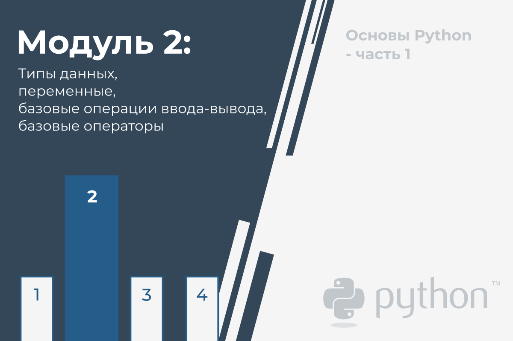

  

# Типы данных, переменные, базовые операции ввода-вывода, базовые операторы

В этом модуле Вы узнаете:

*   как писать и запускать простые программы;
*   что такое литералы, операторы и выражения в Python;
*   что такое переменные, и каким правилам они подчиняются;
*   как производить базовые операции ввода и вывода.


## Hello, World!

Пришло время начать писать **настоящий, работающий код на языке Python**. В данный момент он будет очень простой.

Поскольку мы собираемся показать вам некоторые фундаментальные понятия и термины, эти фрагменты кода не будут серьезными или сложными.

Запустите код в окне редактора справа. Если все будет хорошо, вы увидите **строку текста** в окне консоли.

```python
print("Hello, World!")
```

Либо запустите IDLE, создайте новый исходный файл Python, заполните его этим кодом, присвойте файлу имя и сохраните его. Теперь запустите. Если все пойдет хорошо, вы увидите строку в окне консоли IDLE. Код, который вы запустили, должен выглядеть знакомым. Вы видели нечто очень похожее, когда мы проводили настройку среды IDLE.

Теперь мы потратим некоторое время, показывая и объясняя вам, что вы на самом деле видите и почему это выглядит так.

Как видите, первая программа состоит из следующих частей:

*   слово `print`;
*   открывающая скобка;
*   кавычка;
*   строка текста: `Hello, World!`;
*   другая кавычка;
*   закрывающая скобка.

Все вышеперечисленное играет очень важную роль в коде.

## Функция print()

Посмотрите на строку кода ниже:

```python
[!mark!]print[!/mark!]("Hello, World!")
```

Слово **print**, которое вы видите здесь, является **названием функции**. Это не значит, что везде, где появляется слово, это всегда имя функции. Значение слова происходит из контекста, в котором оно использовалось.

Вы, вероятно, встречали термин «функция» много раз раньше, на уроках математики. Вы также можете перечислить несколько названий математических функций, таких как sin или log.

Функции Python, однако, более гибкие и могут содержать больше контента, чем их математические братья и сестры.

Функция (в этом контексте) - это отдельная часть компьютерного кода, способная:

*   **вызывать некоторый эффект** (например, отправлять текст в терминал, создавать файл, рисовать изображение, воспроизводить звук и т.д.); это нечто совершенно неслыханное в мире математики;
*   **оценивать значение или некоторые значения** (например, квадратный корень значения или длина заданного текста); это то, что делает функции Python родственниками математических понятий.

Более того, многие функции Python могут выполнять две вышеуказанные функции вместе.

Откуда берутся функции?

*   Они могут исходить **из самого Python**; функция печати является одной из таких; такая функция представляет собой добавленную стоимость, получаемую вместе с Python и его средой (она **встроенная**); вам не нужно делать ничего специального, если вы хотите использовать ее;
*   они могут принадлежать одному или нескольким дополнениям Python под названиями **модули**; некоторые модули поставляются с Python, другие могут требовать отдельной установки - в любом случае все они должны быть явно связаны с вашим кодом (мы скоро покажем вам, как это сделать);
*   вы можете **написать их самостоятельно**, разместив в своей программе столько функций, сколько вам необходимо, чтобы сделать ее проще, понятнее и элегантнее.

Имя функции должно быть **значимым** (имя функции печати самоочевидно).

Конечно, если вы собираетесь использовать какую-либо уже существующую функцию, вы не будете иметь никакого влияния на ее имя, но когда вы начнете писать свои собственные функции, вам следует тщательно продумать свой выбор имен.

Как мы уже говорили, функция может иметь:

*   **эффект**;
*   **результат**.

Существует также третий, очень важный функциональный компонент - **аргументы**.

Математические функции обычно принимают один аргумент, например, sin (x) принимает x, который является мерой угла.

Функции Python, с другой стороны, более универсальны. В зависимости от индивидуальных потребностей они могут принять любое количество аргументов - столько, сколько необходимо для выполнения их задач. Примечание: любое число включает ноль - некоторые функции Python не нуждаются в аргументах.

```python
print[!mark!]([!/mark!]"Hello, World!"[!mark!])[!/mark!]
```

Несмотря на количество необходимых/предоставленных аргументов, функции Python настоятельно требуют наличия **пары скобок** - соответственно открывающей и закрывающей.

Если вы хотите передать один или несколько аргументов функции, поместите их **в круглые скобки**. Если вы собираетесь использовать функцию, которая не принимает никаких аргументов, вам все равно нужно иметь круглые скобки.

Примечание: чтобы отличить обычные слова от имен функций, поместите **пару пустых скобок** после их имен, даже если соответствующая функция хочет один или несколько аргументов. Это стандартное соглашение.

Здесь мы говорим о функции `print()`.

Есть ли у функции `print()` в нашем примере какие-либо аргументы?

Конечно, но какие они?

В этом примере единственным аргументом, переданным функции print() является **строка**:

```python
print([!mark!]"Hello, World!"[!/mark!])
```

Как видите, строка **ограничена кавычками** - фактически, кавычки образуют строку - они вырезают часть кода и присваивают ей другое значение.

Вы можете себе представить, что в кавычках написано что-то вроде: текст между нами не код. Он не предназначен для выполнения, и вы должны принять его как есть.

Почти все, что вы помещаете в кавычки, будет восприниматься буквально, не как код, а как **данные**. Попробуйте поиграть с этой конкретной строкой - измените ее, введите новый контент, удалите часть существующего контента.

Существует несколько способов указать строку в коде Python, но пока достаточно этого.


Вы узнали о двух важных частях кода: функции и строке. Мы говорили о них с точки зрения синтаксиса, но теперь пришло время обсудить их с точки зрения семантики.

Название функции (**_print_** в данном случае) вместе с круглыми скобками и аргументом(ами) образует **вызов функции**.

Скоро мы обсудим это более подробно, но сейчас нам просто стоит немного пролить свет на это.

```python
print("Hello, World!")
```

Что происходит, когда Python встречает вызов, подобный приведенному ниже?

```
function_name(argument)  
```

Давайте посмотрим:

*   Во-первых, Python проверяет, является ли указанное имя **допустимым** (он просматривает свои внутренние данные, чтобы найти существующую функцию имени; в случае неудачного поиска Python прерывает код);
*   во-вторых, Python проверяет, позволяет ли требование функции по количеству аргументов **вызывать** функцию таким образом (например, если конкретная функция требует ровно двух аргументов, любой вызов, передающий только один аргумент, будет считаться ошибочным и прервет выполнение кода);
*   в-третьих, Python **на мгновение оставляет ваш код** и переключается на функцию, которую вы хотите вызвать; конечно, он также принимает ваши аргументы и передает ее/их функции;
*   в-четвертых, функция **выполняет свой код**, вызывает желаемый эффект (если есть), оценивает желаемый результат(ы) (если есть) и завершает свою задачу;
*   и наконец, Python **возвращается в ваш код** (на место сразу после вызова) и возобновляет его выполнение.

