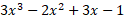

## Цели

* знакомство с концепцией чисел, операторов и арифметических операций в Python;
* выполнение базовых вычислений.

## Сценарий

Посмотрите на код: 

```python
x = # hardcode your test data here
x = float(x)
# write your code here
print("y =", y)
```  

Он читает `"плавающее"` значение, помещает его в переменную с именем `x`, и печатает значение переменной с именем `y`. Ваша задача - дописать код, чтобы вычислить следующее выражение:



Результат должен быть присвоен `y`.

Помните, что классическая алгебраическая нотация любит опускать оператор умножения - вам нужно использовать его явно. Обратите внимание, как мы меняем тип данных, чтобы убедиться, что `x` имеет `"плавающий"` тип.

Сохраняйте код чистым и читаемым, а также проверяйте его, используя предоставленные нами данные, каждый раз присваивая его переменной `x` (путем его жесткого кодирования). Не расстраивайтесь из-за каких-либо начальных неудач. Будьте настойчивы и любознательны.


## Тестовые данные

Пример ввода

```
x = 0
x = 1
x = -1
```  

Ожидаемый вывод

```
y = -1.0
y = 3.0
y = -9.0
```

