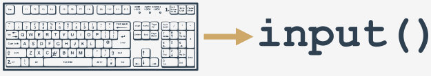

## Функция input()

Теперь хотим представить вам совершенно новую функцию, которая, кажется, является зеркальным отражением старой доброй
функции `print()`.

Почему? Ну, `print()` отправляет данные на консоль.

Новая функция получает данные из нее.

`print()` не дает полезный результат. Смысл новой функции в том, чтобы **возвращать очень полезный результат**.

Функция называется `input()`. Название функции говорит само за себя.

Функция `input()` может считывать введенные пользователем данные и возвращать эти данные в работающую программу.

Программа может манипулировать данными, делая код по-настоящему интерактивным.

Практически все программы **читают и обрабатывают данные**. Программа, которая не получает ввода от пользователя,
является **глухой программой**.

Посмотрите на наш пример:

```python
print("Tell me anything...")
anything = input()
print("Hmm...", anything, "... Really?")

```

Он показывает очень простой случай использования функции `input()`.

Примечание:

* Программа **предлагает пользователю ввести некоторые данные** с консоли (скорее всего, с помощью клавиатуры, хотя
  также можно вводить данные с помощью голоса или изображения);
* функция `input()` вызывается без аргументов (это самый простой способ использования функции); функция **переключит
  консоль в режим ввода**; вы увидите мигающий курсор, и вы сможете ввести несколько нажатий клавиш, заканчивая нажатием
  клавиши _Enter_; все введенные данные будут **отправлены в вашу программу** через результат функции;
* примечание: вам нужно присвоить результат переменной; это очень важно - если пропустить этот шаг, введенные данные
  будут потеряны;
* затем мы используем функцию `print()` для вывода данных, которые мы получаем, с некоторыми дополнительными
  замечаниями.

Попробуйте запустить код и посмотрите, что функция может делать.



## Функция input() с аргументом

Функция `input()` может делать что-то еще: она может запрашивать пользователя без помощи `print()`.

Мы немного изменили наш пример, посмотрите на код:

```python
anything = input([!mark!]"Tell me anything..."[! / mark!])
print("Hmm...", anything, "...Really?")

```  

Примечание:

* функция `input()` вызывается с одним аргументом - это строка, содержащая сообщение;
* сообщение будет отображаться на консоли до того, как только пользователю будет предоставлена ​​возможность ввести
  что-либо;
* `input()` выполнит свою работу.

Этот вариант вызова `input()` упрощает код и делает его более понятным.

## Результат выполнения функции input()

Мы уже говорили об этом, но это должно быть однозначно заявлено еще раз: **результатом функции `input()` является
строка**.

Строка содержит все символы, которые пользователь вводит с клавиатуры. Это не целое число или число с плавающей точкой.

Это означает, что **вы не должны использовать его в качестве аргумента какой-либо арифметической операции**, например,
вы не можете использовать эти данные для их возведения в квадрат, деления на что-либо или деления чего-либо на него.

```
[!mark!]
anything = input("Enter a number: ")
something = anything ** 2.0
print(anything, "to the power of 2 is", something)
[!/mark!]
```  

## Функция input() function - запрещенные операции

Посмотрите на код:

```python
# Проверка сообщения TypeError

anything = input("Введите число: ")
something = anything ** 2.0
print(anything, "в степени 2 это", something)

```

Запустите его, введите любое число и нажмите _Enter_.

Что происходит?

Python должен был дать вам следующий вывод:

```
Traceback (most recent call last):
File ".main.py", line 4, in <module>
something = anything ** 2.0
TypeError: unsupported operand type(s) for ** or pow(): 'str' and 'float'
```

Последняя строка предложения объясняет все - вы пытались применить оператор `**` к `'str'` (строке)
и `'плавающему числу'`.

Это запрещено.

Это должно быть очевидно - можете ли вы предсказать значение `«быть или не быть»`, возведенное в степень `2`?

Мы не можем. Python тоже не может.

Мы зашли в тупик? Есть ли решение этой проблемы? Конечно, есть.

## Приведение типов

Python предлагает две простые функции для указания типа данных и решения этой проблемы - вот они: `int()` и `float()`.

Их имена комментируются самостоятельно:

* функция `int()` принимает один аргумент (например, строку: `int(string)`) и пытается преобразовать его в целое число;
  если это не удастся, вся программа тоже выйдет из строя (в этой ситуации есть обходной путь, но мы покажем вам это
  чуть позже);
* функция `float()` принимает один аргумент (например, строку: `float(string)`) и пытается преобразовать его в число с
  плавающей точкой (остальное тоже самое).

Это очень просто и очень эффективно. Более того, вы можете вызывать любую из функций, передавая результаты `input()`
непосредственно им. Нет необходимости использовать какую-либо переменную в качестве промежуточного хранилища.

Мы реализовали эту идею - взгляните на код:

```python
anything = float(input("Введите число: "))
something = anything ** 2.0
print(anything, "в степени 2 это", something)

```

Можете ли вы представить, как строка, введенная пользователем, преобразуется из `input()` в `print()`?

Попробуйте запустить измененный код. Не забудьте ввести **нужное число**.

Проверьте несколько разных значений, маленьких и больших, отрицательных и положительных, а также ноль.

## Подробнее о input() и приведение типов

Наличие команды, состоящей из трио `input()`-`int()`-`float()` открывает множество новых возможностей.

В конечном итоге вы сможете писать законченные программы, принимать данные в виде чисел, обрабатывать их и отображать
результаты.

Конечно, эти программы будут очень примитивными и не очень удобными в использовании, так как они не могут принимать
решения и, следовательно, не способны по-разному реагировать на различные ситуации.

На самом деле не проблема; мы покажем вам, как преодолеть это в ближайшее время.

Наш следующий пример относится к более ранней программе для определения длины гипотенузы. Давайте перепишем его и
сделаем так, чтобы он мог считывать длины катетов с консоли.

Посмотрите на код - теперь он выглядит так:

```python
leg_a = float(input("Введите длину первого катета: "))
leg_b = float(input("Введите длину второго катета: "))
hypo = (leg_a ** 2 + leg_b ** 2) ** .5
print("Длина гипотенузы равна", hypo)

```

Программа дважды спрашивает пользователя о длине обоих катетов, высчитывает гипотенузу и печатает результат.

Запустите и попробуйте ввести отрицательные значения.

Программа, к сожалению, не реагирует на эту очевидную ошибку.

Давайте пока проигнорируем эту слабость. Мы скоро вернемся к этому.

Обратите внимание, что в программе, переменная `hypo` используется только для одной цели - для сохранения вычисленного
значения между выполнением соседней строки кода.

Поскольку функция `print()` принимает выражение в качестве аргумента, вы можете **удалить переменную** из кода.

Вот так:

```python
leg_a = float(input("Введите длину первого катета: "))
leg_b = float(input("Введите длину второго катета: "))
print("Длина гипотенузы равна", (leg_a ** 2 + leg_b ** 2) ** .5)

```

## Операторы строки - введение

Пришло время вернуться к этим двум арифметическим операторам: `+` и `*`.

Мы хотим показать вам, что у них есть вторая функция. Они могут сделать что-то большее, чем просто **добавить** и **
умножить**.

Мы видели их в действии, где их аргументы являются числами (целыми или плавающими, это не имеет значения).

Теперь мы покажем, что они также могут обрабатывать строки, хотя и весьма специфическим образом.

## Конкатенация

Знак `+` (плюс) при применении к двум строкам становится оператором **конкатенации**:

```
string + string
```  

Он просто **объединяет** (склеивает) две строки в одну. Конечно, как и его арифметический брат, его можно использовать
более одного раза в одном выражении, и в таком контексте он ведет себя в соответствии с левосторонней ассоциативностью.

В отличие от своего арифметического брата, оператор конкатенации является **не коммутативным**, т.е., `"ab" + "ba"` не
совпадает с `"ba" + "ab"`.

Не забудьте - если вы хотите, чтобы знак `+` был **конкатенатором**, а не сумматором, вы должны убедиться, что **оба его
аргумента являются строками**.

Здесь нельзя смешивать типы.

Эта простая программа использует знак `+` несколько раз:

```python
fnam = input("Могу я узнать ваше имя? ")
lnam = input("Могу я узнать вашу фамилию? ")
print("Спасибо.")
print("\nВас зовут " + fnam + " " + lnam + ".")

```

Примечание: использование `+` для объединения строк позволяет создавать вывод более точным способом, чем с помощью
чистой функции `print()`, даже если она обогащена `end=` и `sep=` аргументы ключевых слов.

Запустите код и посмотрите, соответствует ли вывод вашим прогнозам.

## Репликация

Когда знак `*` (звездочка) применяется к строке и числу (или числу и строке, поскольку она остается коммутативной в этой
позиции), она становится **оператором репликации**:

```
string * number
number * string
```

Он реплицирует строку указанное числом количество раз.

Например:

* `"James" * 3` дает `"JamesJamesJames"`
* `3 * "an"` дает `"ananan"`
* `5 * "2"` (или `"2" * 5`) дает `"22222"` (не `10`!)

**ПОМНИТЕ**

Число, меньшее или равное нулю, создает **пустую строку**.

Эта простая программа «рисует» прямоугольник, используя старый оператор (`+`) в новой роли:

```python
print("+" + 10 * "-" + "+")
print(("|" + " " * 10 + "|\n") * 5, end="")
print("+" + 10 * "-" + "+")

```  

Обратите внимание, как мы использовали скобки во второй строке кода.

Попробуйте потренироваться, чтобы создать другие фигуры или свои собственные рисунки!

## Преобразование типов str()

Вы уже знаете, как использовать функции `int()` и `float()` для преобразования строки в число.

Этот тип конверсии не является улицей с односторонним движением. Вы также можете **преобразовать число в строку**, что
намного проще и безопаснее - эта операция всегда возможна.

Функция, способная на это, называется `str()`:

```python
str(number)  
```

Честно говоря, он может сделать гораздо больше, чем просто преобразовать числа в строки, но рассмотрим это позже.

## Снова "прямоугольный треугольник"

Вот снова наша программа "Прямоугольный треугольник":

```
leg_a = float(input("Введите длину первого катета: "))
leg_b = float(input("Введите длину второго катета: "))
print("Длина гипотенузы равна " + [!mark!]str((leg_a**2 + leg_b**2)[!/mark!] ** .5))
```

Мы немного изменили его, чтобы показать вам, как работает функция `str()` Благодаря этому мы можем **передать весь
результат в функцию `print()` в виде одной строки**, забыв о запятых.

## Основные тезисы

1. Функция `print()` **отправляет данные на консоль**, а функция `input()` **получает данные из консоли**.

2. Функция `input()` имеет необязательный параметр: **строка приглашения**. Это позволяет вам написать сообщение перед
   вводом пользователем, например:

    ```python
    name = input([!mark!]"Введите ваше имя: "[!/mark!])
    print("Привет, " + name + ". Рад вас видеть!")
    ```

3. Когда вызывается функция `input()`, поток программы останавливается, символ приглашения продолжает мигать (он
   предлагает пользователю выполнить действие, когда консоль переключается в режим ввода), пока пользователь не введет
   значение и/или нажмет клавишу _Enter_.

   **Примечание**

   Вы можете проверить функциональность функции `input()` в полном объеме локально на вашем компьютере. По причинам
   оптимизации ресурсов мы ограничили максимальное время выполнения программы несколькими секундами. Перейдите в
   консоль, скопируйте и вставьте приведенный выше фрагмент, запустите программу и ничего не делайте - просто подождите
   несколько секунд, чтобы увидеть, что происходит. Ваша программа должна быть автоматически остановлена через короткий
   промежуток времени. Теперь откройте IDLE и запустите там ту же программу - видите ли вы разницу?

   Совет: вышеупомянутое свойство функции `input()` можно использовать, чтобы предложить пользователю завершить
   программу. Посмотрите на код ниже:

    ```python
    name = input("Введите ваше имя: ")
    print("Привет, " + name + ". Рад видеть вас!")
    
    print("\nНажмите Enter для завершения программы.")
    input()
    print("КОНЕЦ.")
    
    ```

4. Результатом функции `input()` является строка. Вы можете добавлять строки друг к другу, используя оператор
   конкатенации (`+`). Проверьте этот код:

    ```python
    num1 = input("Введите первое число: ") # Введите 12
    num2 = input("Введите второе число: ") # Введите 21
    
    print(num1 + num2) # программа выведет 1221
    
    ```

5. Вы также можете умножить (`*` - реплицировать) строки, например:

    ```python
    myInput = ("Введите что-нибудь: ") # Например введите: hello
    print(myInput * 3) # Ожидаемый вывод: hellohellohello
    ```

**Упражнение 1**

Каков вывод следующего фрагмента?

```python
x = int(input("Введите число: "))  # пользователь вводит 2
print(x * "5")

```

<details><summary>Проверка</summary>

`55`

</details>

**Упражнение 2**

Каков ожидаемый результат следующего фрагмента?

```python
x = input("Введите число: ")  # пользователь вводит 2
print(type(x))
```

<details><summary>Проверка</summary>

`<class 'str'>`

</details>

* * *

## Поздравляем! Вы завершили Модуль 2

Отлично! Вы достигли конца Модуля 2 и завершили важный этап своего обучения программированию на Python. Вот краткое
изложение целей, которые вы рассмотрели и с которыми познакомились в Модуле 2:

* основные методы форматирования и вывода данных, предлагаемые Python, а также основные виды данных и числовые
  операторы, их взаимоотношения и привязки;
* концепция переменных и соглашения о присвоении имен;
* оператор присваивания, правила, регулирующие построение выражений;
* ввод и преобразование данных.

Вы добились серьезных успехов на пути к программированию на Python.

Вы уже знаете основные типы данных и набор основных операторов. Вы знаете, как организовать вывод и как получить данные
от пользователя. Это очень прочная основа для модуля 3. Но прежде чем мы перейдем к следующему модулю, давайте проведем
несколько лабораторных работ и подведем итоги всему, чему вы научились в этом разделе.

После выполнения лабораторных работ вы готовы ответить на вопросы по модулю и выполнить финальное задание: тест по
Модулю 2, который поможет вам оценить то, что вы узнали на данный момент.


