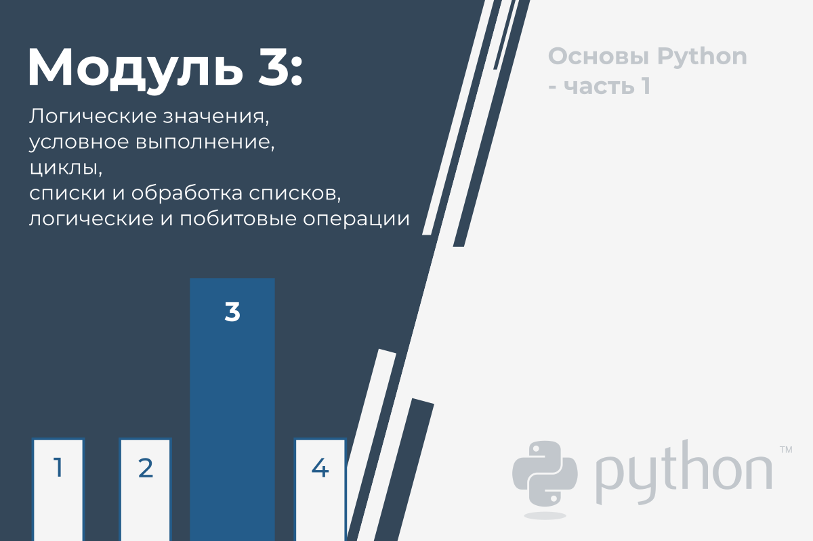

# Логические значения, условное выполнение, циклы, списки и обработка списков, логические и побитовые операции

В этом модуле вы рассмотрите следующие темы:

* тип данных Boolean;
* реляционные операторы;
* принятие решений в Python (if, if-else, if-elif, else)
* как повторить выполнение кода с помощью циклов (while, for)
* как выполнять логические и побитовые операции в Python;
* списки в Python (построение, индексация и срезы; манипулирование содержимым)
* как отсортировать список с помощью алгоритмов пузырьковой сортировки;
* многомерные списки и их приложения.

## Вопросы и ответы

Программист пишет программу, и **программа задаёт вопросы**.

Компьютер выполняет программу и **даёт ответы**. Программа должна уметь **реагировать в соответствии с полученными
ответами**.

К счастью, компьютеры знают только два типа ответов:

* да, это правда;
* нет, это ложь.

Вы никогда не получите ответа типа _Дай подумать ...._, _Я не знаю_ или _Возможно, да, но я не знаю наверняка_.

**Чтобы задать вопросы, Python использует набор очень специальных операторов**. Давайте рассмотрим их один за другим,
проиллюстрировав их действие на нескольких простых примерах.

## Сравнение: оператор равенства

Вопрос: **равны ли два значения**?

Чтобы задать этот вопрос, вы используете оператор `==` (равно равно).

Не забывайте об этом важном различии:

* `[!mark!]=[!/mark!]` - это **оператор присваивания**, например, `a = b` присваивает `a` значение `b`;
* `[!mark!]==[!/mark!]` - это вопрос _Равны ли эти значения?_ то есть, `a == b` **сравнивает** `a` и `b`.

Это **бинарный оператор с левосторонней привязкой**. Ему нужны два аргумента, и он **проверяет, равны ли они**.

## Упражнения

А теперь зададим несколько вопросов. Попробуйте угадать ответы.

**Вопрос #1**: каков результат следующего сравнения?

`2 == 2`

<details><summary>Проверка</summary>

`True` - конечно, 2 равно 2. Python ответит `True` (помните эту пару предопределенных литералов, `True` и `False` - это
тоже ключевые слова Python).

</details>

**Вопрос #2**: Каков результат следующего сравнения?

`2 == 2.`

<details><summary>Проверка</summary>

Этот вопрос не такой простой, как первый. К счастью, Python может преобразовать целочисленное значение в его дробный
эквивалент, и, следовательно, ответ будет `True`.

</details>


**Вопрос #3**: Каков результат следующего сравнения?

`1 == 2`

<details><summary>Проверка</summary>

Это должно быть легко. Ответ будет (точнее, всегда будет) `False`.

</details>  

## Равенство: оператор _равно_ (\==)

Оператор `==` (равно равно) сравнивает значения двух операндов. Если они равны, результатом сравнения будет `True`. Если
они не равны, результатом сравнения будет `False`.

Посмотрите на сравнение ниже - каков результат этой операции?

```python
var[!mark!] == [! / mark!] 0
```  

Обратите внимание, что мы не сможем найти ответ, если не знаем, какое значение в настоящее время хранится в
переменной `var`.

Если переменная менялась много раз во время выполнения вашей программы или её начальное значение вводится с консоли,
ответ на этот вопрос может дать только Python и только во время выполнения.

А теперь представьте программиста, который страдает бессонницей и должен отдельно считать чёрных и белых овец, если
белых овец ровно в два раза больше.

Вопрос будет в следующем:

```python
black_sheep[!mark!] == [! / mark!] 2 * white_sheep
```  

Из-за низкого приоритета оператора `==` вопрос должен рассматриваться как эквивалентный этому:

```python
black_sheep[!mark!] == [! / mark!] (2 * white_sheep)
```  

Итак, давайте попрактикуемся в понимании оператора `==` . Можете ли вы угадать вывод кода ниже?

```python
var = 0  # Присваивание var значения 0
print(var == 0)

var = 1  # Присваивание var значения 1
print(var == 0)
```  

Запустите код и проверьте, правы ли вы.

## Неравенство: оператор _не равно_ (!=)

Оператор `!=` (не равно) также сравнивает значения двух операндов. В этом разница: если они равны, результатом сравнения
будет `False`. Если они не равны, результатом сравнения будет `True`.

Теперь взгляните на приведенное ниже сравнение неравенства - вы можете угадать результат этой операции?

```python
var = 0  # Присваивание var значения 0
print(var[!mark!] != [! / mark!] 0)

var = 1  # Присваивание var значения 1
print(var[!mark!] != [! / mark!] 0)
```  

Запустите код и проверьте, правы ли вы.

## Операторы сравнения: больше чем

Вы также можете задать вопрос для сравнения с помощью оператора `>` (больше).

Если вы хотите узнать, больше ли чёрных овец, чем белых, вы можете написать это так:

```python
black_sheep[!mark!] > [! / mark!] white_sheep  # Больше чем
```  

`True` подтверждает это; `False` отрицает это.

## Операторы сравнения: больше или равно

У оператора _больше чем_ есть другой специальный, **нестрогий** вариант, но он обозначается иначе, чем в классической
арифметической нотации: `>=` (больше или равно).

Это два последующих знака, а не один.

Оба этих оператора (строгий и нестрогий), а также два других, обсуждаемых в следующем разделе, являются **бинарными
операторами с левосторонней привязкой**, и их **приоритет выше, чем у `==` и `!=`**.

Если мы хотим узнать, нужно ли носить теплую шапку, мы задаем следующий вопрос:

```python
centigrade_outside[!mark!]≥[! / mark!] 0.0  # Больше или равно 0.0
```  

## Операторы сравнения: меньше или равно

Как вы, наверное, уже догадались, в этом случае используются следующие операторы: оператор `<` (меньше) и его нестрогий
родственник: `<=` (меньше или равно).

Взгляните на этот простой пример:

```python
current_velocity_mph[!mark!] < [! / mark!] 85  # Меньше чем
current_velocity_mph[!mark!]≤[! / mark!] 85  # Меньше или равно
```  

Мы собираемся проверить, есть ли риск быть оштрафованным дорожной полицией (первый вопрос строгий, второй - нет).

## Использование ответов

Что вы можете сделать с ответом (т.е. результатом операции сравнения), полученным от компьютера?

Есть как минимум два варианта: во-первых, вы можете запомнить его (**сохранить в переменной**) и использовать позже. Как
Вы это делаете? Ну, Вы используете такую произвольную переменную:

```python
[!mark!]answer[! / mark!] = number_of_lions >= number_of_lionesses
```  

Содержимое переменной подскажет Вам ответ на заданный вопрос.

Второй вариант более удобный и гораздо более распространён: вы можете использовать полученный ответ, чтобы **принять
решение о будущем программы**.

Для этого Вам понадобится специальная инструкция, и мы её очень скоро обсудим.

Теперь нам нужно обновить нашу **таблицу приоритетов** и поместить в неё все новые операторы. Теперь это выглядит так:

| Приоритет | Оператор             |          |
|-----------|----------------------|----------|
| 1         | `+`, `-`             | унарный  |
| 2         | `**`                 |          |
| 3         | `*`, `/`, `//`, `%`  |          |
| 4         | `+`, `-`             | бинарный |
| 5         | `<`, `<=`, `>`, `>=` |          |
| 6         | `==`, `!=`           |          |

