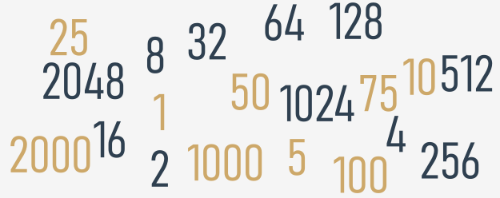

## Условия и условное исполнение

Вы уже знаете, как задавать вопросы Python, но все ещё не знаете, как разумно использовать ответы. У вас должен быть
механизм, который позволит вам делать что-то, **если условие выполняется, и не делать этого, если оно не выполняется**.

Это как в реальной жизни: вы делаете определенные вещи или не делаете, когда выполняется определенное условие или нет,
например, вы идете гулять, если погода хорошая, или остаетесь дома, если холодно и сыро.

Для принятия таких решений Python предлагает специальную инструкцию. Из-за своей природы и применения она называется **
условной инструкцией**.

Есть несколько вариантов. Мы начнём с самого простого, постепенно увеличивая сложность.

Первая форма условного оператора, которую вы можете увидеть ниже, написана очень неформально, но образно:

```python
[!mark!]if [! / mark!] true_or_not:
    do_this_if_true
```  

Этот условный оператор состоит из следующих строго необходимых элементов только в этом и этом порядке:

* ключевое слово`if`;
* один или несколько пробелов;
* выражение (вопрос или ответ), значение которого будет интерпретироваться исключительно в пределах `True` (когда его
  значение не равно нулю) и `False` (когда оно равно нулю);
* **двоеточие**, за которым следует новая строка;
* инструкция или набор инструкций с **отступом** (хотя бы одна инструкция обязательна); **отступ** может быть получен
  двумя способами - путем вставки определенного количества пробелов (рекомендуется использовать **четыре пробела для
  отступа**) или с помощью символа _табуляции_; примечание: если в части с отступом содержится более одной инструкции,
  отступ должен быть одинаковым во всех строках; хотя это может выглядеть одинаково, если вы используете табуляции,
  смешанные с пробелами, важно, чтобы все отступы были **одинаковыми** - Python 3 **не позволяет смешивать пробелы и
  табуляции** для отступа.

Как работает это выражение?

* если выражение `true_or_not` **представляет истину** (т.е. его значение не равно нулю), **будут выполнены выражения с
  отступом**;
* если выражение `true_or_not` **не соответствует истине** (т.е. его значение равно нулю), **выражения с отступом будут
  опущены** (игнорируется), и следующая выполняемая инструкция будет следующей за исходным уровнем отступа.

В реальной жизни мы часто выражаем желание:

_если будет хорошая погода, мы пойдем гулять_

_потом мы пообедаем_

Как видите, обед - это **не условное занятие** и не зависит от погоды.

Зная, какие условия влияют на наше поведение, и предполагая, что у нас есть функции без параметров `go_for_a_walk()`
и `have_lunch()`, мы можем написать следующий фрагмент:

```python
if the_weather_is_good:
    go_for_a_walk()
have_lunch()
```  

### Условное выполнение: оператор `if`

Если некий бессонный разработчик Python засыпает, когда он насчитывает 120 овец, а процедура, вызывающая сон, может быть
реализована как специальная функция с именем `sleep_and_dream()`, весь код принимает следующую форму:

```python
if sheep_counter >= 120:  # Оценка выражения
    sleep_and_dream()  # Выполнение если выражение True
```  

Вы можете читать это так: если `sheep_counter` больше или равно `120`, тогда засыпайте и смотрите сны (т.е. выполните
функцию `sleep_and_dream`.)

Мы сказали, что **операторы условного выполнения должны иметь отступ**. Это создает очень четкую структуру, наглядно
демонстрирующую все возможные пути выполнения в коде.

Взгляните на следующий код:

```python
if sheep_counter >= 120:
    make_a_bed()
    take_a_shower()
    sleep_and_dream()
feed_the_sheepdogs()
```  

Как видите, застилание постели, принятие душа, засыпание и сновидения **выполняются условно** - когда `sheep_counter`
достигает желаемого предела.

Однако кормление овчарок **выполняется всегда** (т.е. функция `feed_the_sheepdogs()` не имеет отступа и не принадлежит
блоку `if`, что означает, что он всегда выполняется.)

Теперь мы собираемся обсудить другой вариант условного оператора, который также позволяет выполнять дополнительное
действие, когда условие не выполняется.

### Условное выполнение: выражение `if-else`

Мы начали с простой фразы, которая гласила: _Если будет хорошая погода, мы пойдем гулять_.

Примечание: ни слова о том, что будет, если погода будет плохой. Мы знаем только то, что не выйдем на улицу, но
неизвестно, что мы могли бы сделать вместо этого. Возможно, мы захотим что-то спланировать и на случай плохой погоды.

Можно сказать, например: _Если будет хорошая погода, пойдем гулять, в ином случае пойдем в театр_.

Теперь мы знаем, что будем делать **при соблюдении условий**, и знаем, что будем делать, **если не все пойдет
по-нашему**. Другими словами, у нас есть "План Б".

Python позволяет нам выражать такие альтернативные планы. Это делается с помощью второй, немного более сложной формы
условного оператора, оператора _if-else_:

```python
if true_or_false_condition:
    perform_if_condition_true
[!mark!] else:[! / mark!]
perform_if_condition_false
```  

Таким образом, появилось новое слово: `else` - это **ключевое слово**.

В части кода, начинающейся с `else`, говорится, что делать, если условие, указанное для `if`, не выполняется (обратите
внимание на **двоеточие** после слова).

Выполнение _if-else_ происходит следующим образом:

* если условие оценивается как **Истина** (его значение не равно нулю), выполняется
  инструкция `perform_if_condition_true`, а условная инструкция подходит к концу;
* если условие оценивается как **Ложь** (равно нулю), выполняется инструкция `perform_if_condition_false`, а условная
  инструкция подходит к концу.

### Оператор `if-else`: больше условного выполнения

Используя эту форму условного оператора, мы можем описать наши планы следующим образом:

```python
if the_weather_is_good:
    go_for_a_walk()
else:
    go_to_a_theater()
have_lunch()
```  

Если будет хорошая погода, пойдем гулять. Иначе случае пойдем в театр. Независимо от того, будет ли погода хорошей или
плохой, потом пообедаем (после прогулки или после похода в театр).

Все, что мы сказали об отступах, работает точно так же внутри **ветки _else_**:

```python
if the_weather_is_good:
    go_for_a_walk()
    have_fun()
else:
    [!mark!]····[! / mark!]go_to_a_theater()
[!mark!]····[! / mark!]enjoy_the_movie()
have_lunch()
```  

### Вложенные операторы if-else

Теперь обсудим два частных случая условного оператора.

Сначала рассмотрим случай, когда **инструкция, помещенная после `if`, является другим `if`**.

Прочтите, что мы запланировали на это воскресенье. Если будет хорошая погода, пойдем гулять. Если найдем хороший
ресторан, пообедаем там. В противном случае съедим бутерброд. Если погода плохая, пойдем в театр. Если билетов нет,
поедем за покупками в ближайший торговый центр.

Напишем то же самое на Python. Внимательно рассмотрите код здесь:

```python
if the_weather_is_good:
    [!mark!]····[! / mark!]if nice_restaurant_is_found:
    have_lunch()
[!mark!]····[! / mark!] else:
eat_a_sandwich()
else:
[!mark!]····[! / mark!]if tickets_are_available:
    go_to_the_theater()
[!mark!]····[! / mark!] else:
go_shopping()
```  

Здесь два важных момента:

* такое использование оператора `if` известно как **вложение**; помните, что каждое `else` относится к `if`, который
  находится **на том же уровне отступа**; вам нужно знать это, чтобы определить, как объединяются в пары _if_ и _else_;
* подумайте, как **отступ улучшает читаемость** и упрощает понимание и отслеживание кода.

### Оператор `elif`

Во втором частном случае вводится еще одно новое ключевое слово Python: **elif**. Как вы, наверное, подозреваете, это
более короткая форма слова **else if**.

`elif` используется для **проверки нескольких условий** и для **остановки** при обнаружении первого истинного
утверждения.

Наш следующий пример напоминает вложение, но сходства очень незначительны. Опять же, мы изменим наши планы и выразим их
так: если будет хорошая погода, мы пойдем гулять, иначе, если получим билеты, мы пойдем в театр, иначе, если есть
свободные столики в ресторан, пойдем обедать; если ничего не возможно, мы останемся дома и сыграем в шахматы.

Вы заметили, сколько раз мы использовали слово _иначе_? Это этап, на котором ключевое слово `elif` играет свою роль.

Напишем тот же сценарий на Python:

```python
if the_weather_is_good:
    go_for_a_walk()
[!mark!] elif [! / mark!] tickets_are_available:
go_to_the_theater()
[!mark!] elif [! / mark!] table_is_available:
go_for_lunch()
else:
play_chess_at_home()

```  

Способ сборки последующих операторов _if-elif-else_ иногда называется **каскадом**.

Еще раз обратите внимание, как отступ улучшает читаемость кода.

В этом случае следует обратить особое внимание:

* вы **не должны использовать `else` без предшествующего `if`**;
* `else` всегда является **последней ветвью каскада**, независимо от того, использовали ли вы `elif` или нет;
* `else` является **необязательной** частью каскада и может быть опущен;
* если в каскаде есть ветвь `else`, выполняется только одна из всех ветвей;
* если нет ветви `else`, возможно, что ни одна из доступных веток не будет выполнена.

Это может показаться немного сложным, но, надеюсь, после нескольких простых примеров Вы сможете разобраться.

### Анализ примеров кода

Теперь мы собираемся показать вам несколько простых, но законченных программ. Мы не будем их подробно объяснять, потому
что считаем комментарии (и имена переменных) внутри кода достаточным руководством.

Все программы решают одну и ту же задачу - они **находят наибольшее из нескольких чисел и распечатывают его**.

**Пример 1:**

Начнем с простейшего случая - **как определить большее из двух чисел**:

```python
# Считывание двух чисел
number1 = int(input("Введите первое число: "))
number2 = int(input("Введите второе число: "))

# Определение большего из чисел
if number1 > number2:
    larger_number = number1
else:
    larger_number = number2

# Вывод результата
print("Большее из чисел:", larger_number)
```  

Приведенный выше фрагмент должен быть ясен - он считывает два целых значения, сравнивает их и находит, какое из них
больше.

**Пример 2:**

Теперь мы собираемся показать вам один любопытный факт. У Python есть интересная особенность - посмотрите на код ниже:

```python
# Считывание двух чисел
number1 = int(input("Введите первое число: "))
number2 = int(input("Введите второе число: "))

# Определение большего из чисел
if number1 > number2:
    larger_number = number1
else:
    larger_number = number2

# Вывод результата
print("Большее из чисел:", larger_number)
```  

Примечание: если какая-либо из ветвей _if-elif-else_ содержит только одну инструкцию, вы можете закодировать ее в более
полной форме (вам не нужно делать строку с отступом после ключевого слова, а просто продолжить строку после двоеточия).

Однако этот стиль может вводить в заблуждение, и мы не собираемся использовать его в наших будущих программах, но его
определенно стоит знать, если вы хотите читать и понимать чужие программы.

Других отличий в коде нет.

**Пример 3:**

Пора усложнить код - найдем наибольшее из трех чисел. Увеличит ли это код? Немного.

Мы предполагаем, что первое значение наибольшее. Затем мы проверяем эту гипотезу с двумя оставшимися значениями.

Посмотрите на код ниже:

```python
# Считывание трех чисел
number1 = int(input("Введите первое число: "))
number2 = int(input("Введите второе число: "))
number3 = int(input("Введите третье число: "))

# Предположим что первое число наибольшее
# После проверим это предположение
largest_number = number1

# Проверим, больше ли второе число, чем текущее значение largest_number
# и обновим largest_number при необходимости.
if number2 > largest_number:
    largest_number = number2

# Проверим, больше ли третье число, чем текущее значение largest_number
# и обновим largest_number при необходимости.
if number3 > largest_number:
    largest_number = number3

# Вывод результата
print("Большее из чисел:", largest_number)

```  

Этот метод значительно проще, чем пытаться найти наибольшее число сразу, сравнивая все возможные пары чисел (то есть
первое со вторым, второе с третьим, третье с первым). Попробуйте перестроить код под себя.

## Псевдокод и введение в циклы

Теперь вы должны быть в состоянии написать программу, которая находит наибольшее из четырех, пяти, шести или даже десяти
чисел.

Вы уже знаете схему, поэтому увеличение размера задачи не составит особого труда.

Но что произойдет, если мы попросим вас написать программу, которая находит наибольшее из двухсот чисел? Вы можете
представить себе код?

Вам понадобится двести переменных. Если двести переменных - не так уж и плохо, представьте себе поиск наибольшего из
миллиона чисел.

Представьте себе код, содержащий 199 условных операторов и двести вызовов функции `input ()`. К счастью, вам не нужно с
этим разбираться. Есть более простой подход.



Мы пока проигнорируем требования синтаксиса Python и попытаемся проанализировать проблему, не думая о реальном
программировании. Другими словами, мы попробуем написать **алгоритм**, и когда он нас устроит, мы его реализуем.

В этом случае мы будем использовать нотацию, которая не является реальным языком программирования (она не может быть ни
скомпилирована, ни выполнена), но она формализованная, краткая и удобочитаемая. Это называется **псевдокод**.

Давайте посмотрим на наш псевдокод ниже:

```
01 largest_number = -999999999
02 number = int(input())
03 if number == -1:
04     print(largest_number)
05     exit()
06 if number > largest_number:
07     largest_number = number
08 # Возврат к строке 02
```

Что в нем происходит?

Во-первых, мы можем упростить программу, если в самом начале кода мы присвоим переменной `large_number` значение,
которое будет меньше любого из введенных чисел. С этой целью мы будем использовать `-999999999`.

Во-вторых, мы предполагаем, что наш алгоритм заранее не будет знать, сколько чисел будет доставлено программе. Мы
ожидаем, что пользователь введет столько чисел, сколько захочет - алгоритм будет хорошо работать и с сотней, и с тысячей
чисел. Как мы это сделаем?

Мы заключаем сделку с пользователем: когда вводится значение `-1`, это будет признаком того, что данных больше нет и
программа должна завершить свою работу.

В противном случае, если введенное значение не равно `-1`, программа прочитает другое число и так далее.

Уловка основана на предположении, что любая часть кода может быть выполнена более одного раза - ровно столько раз,
сколько необходимо.

Выполнение определенной части кода более одного раза называется **циклом**. Значение этого термина, вероятно, Вам
очевидно.

Строки с `02` по `08` образуют цикл. Мы **пройдемся по ним столько раз, сколько потребуется**, чтобы проверить все
введенные значения.

Можете ли Вы использовать аналогичную структуру в программе, написанной на Python? Да, можете.

**Дополнительная информация**

Python часто имеет множество встроенных функций, которые сделают всю работу за вас. Например, чтобы найти наибольшее
количество из всех, вы можете использовать встроенную функцию Python под названием `max()`. Вы можете использовать его с
несколькими аргументами. Проанализируйте код ниже:

```python
# Считывание трех чисел
number1 = int(input("Введите первое число: "))
number2 = int(input("Введите второе число: "))
number3 = int(input("Введите третье число: "))

# Проверим какое из чисел является наибольшим
# и присвоим переменной largest_number.

largest_number = max(number1, number2, number3)

# Вывод результата
print("Большее из чисел:", largest_number)


```

Таким же образом вы можете использовать функцию `min()`, чтобы вернуть наименьшее число. Вы можете перестроить
приведенный выше код и поэкспериментировать с ним в песочнице.

Мы скоро поговорим об этих (и многих других) функциях. В настоящее время наше внимание будет сосредоточено на условном
выполнении и циклах, чтобы дать вам больше уверенности в программировании и научить вас навыкам, которые позволят Вам
полностью понять и применить эти две концепции в своем коде. Так что, на данный момент мы не срезаем путь.

## Основные тезисы

1. Операторы **сравнения** (также известные как _реляционные_) используются для сравнения значений. В таблице ниже
   показано, как работают операторы сравнения при условии, что `x = 0`, `y = 1` и `z = 0`:

   | Оператор | Описание                                                                                                      | Пример                                            |
       |----------|---------------------------------------------------------------------------------------------------------------|---------------------------------------------------|
   | `==`     | возвращает `True`, если значения операндов равны, и `False` в противном случае                                | `x == y # False\nx == z # True`                 |
   | `!=`     | возвращает `True`, если значения операндов не равны, и `False` в противном случае                             | `x != y # True\nx != z # False`                   |
   | `>`      | `True` если значение левого операнда больше, чем значение правого операнда, и `False` в противном случае      | `x > y # False\ny > z # True`                     |
   | `<`      | `True` если значение левого операнда меньше значения правого операнда, и `False` в противном случае           | `x < y # True\ny < z # False`                     |
   | `>=`     | `True` если значение левого операнда больше или равно значению правого операнда, и `False` в противном случае | `x >= y # False\nx >= z # True\ny >= z # True`    |
   | `<=`     | `True` если значение левого операнда меньше или равно значению правого операнда, и `False` в противном случае | `x <= y # True\nx <= z # True\ny <= z # False`    |

2. Если вы хотите выполнить какой-либо код только при соблюдении определенного условия, вы можете использовать **
   условный оператор**:

    * один оператор `if`, например:
        ```python
        x = 10

        if x == 10: # condition
            print("x is equal to 10")  # Executed if the condition is True.

        ```

    * серия операторов `if`, например:
        ```python
        x = 10

        if x > 5: # condition one
            print("x is greater than 5")  # Executed if condition one is True.
    
        if x < 10: # condition two
            print("x is less than 10")  # Executed if condition two is True.
    
        if x == 10: # condition three
            print("x is equal to 10")  # Executed if condition three is True.
        
        ```

        Каждый оператор `if` тестируется отдельно.

    * оператор `if-else`, например:
        ```python
        x = 10

        if x < 10:  # Condition
            print("x is less than 10")  # Executed if the condition is True.
    
        else:
            print("x is greater than or equal to 10")  # Executed if the condition is False.

        ```

    * последовательность операторов `if`, за которыми следует `else`, например:
        ```python
        x = 10

        if x > 5:  # True
            print("x > 5")

        if x > 8:  # True
            print("x > 8")

        if x > 10:  # False
            print("x > 10")

        else:
            print("else will be executed")

        ``` 

      Каждый `if` тестируется отдельно. Тело `else` выполняется, если последний `if` имеет значение `False`.

    * Оператор `if-elif-else`, например:
        ```python
        x = 10

        if x == 10:  # True
            print("x == 10")

        if x > 15:  # False
            print("x > 15")

        elif x > 10:  # False
            print("x > 10")

        elif x > 5:  # True
            print("x > 5")

        else:
            print("else will not be executed")

        ``` 
      Если условие для `if` равно `False`, программа проверяет условия последующих блоков `elif` - первого `elif` блок,
      который имеет значение `True`, выполняется. Если все условия `False`, блок `else` будет выполнен.

    * Вложенные условные операторы, например:
        ```python
        x = 10

        if x > 5:  # True
            if x == 6:  # False
                print("nested: x == 6")
            elif x == 10:  # True
                print("nested: x == 10")
            else:
                print("nested: else")
        else:
            print("else")

        ```  

**Упражнение 1**

Что выводит следующий фрагмент?

```python
x = 5
y = 10
z = 8

print(x > y)
print(y > z)

```  

<details><summary>Проверка</summary>

```
False
True
```

</details>

**Упражнение 2**

Что выводит следующий фрагмент?

```python
x, y, z = 5, 10, 8

print(x > z)
print((y - 5) == x)

```

<details><summary>Проверка</summary>

```
False
True
```

</details>

**Пример 3**

Что выводит следующий фрагмент?

```python
x, y, z = 5, 10, 8
x, y, z = z, y, x

print(x > z)
print((y - 5) == x)

```

<details><summary>Проверка</summary>

```
True
False
```

</details>

**Упражение 4**

Что выводит следующий фрагмент?

```python
x = 10

if x == 10:
    print(x == 10)
if x > 5:
    print(x > 5)
if x < 10:
    print(x < 10)
else:
    print("else")

```

<details><summary>Проверка</summary>

```
True
True
else
```

</details>

**Упражнение 5**

Что выводит следующий фрагмент?

```python
x = "1"

if x == 1:
    print("one")
elif x == "1":
    if int(x) > 1:
        print("two")
    elif int(x) < 1:
        print("three")
    else:
        print("four")
if int(x) == 1:
    print("five")
else:
    print("six")

```

<details><summary>Проверка</summary>

```
four
five
```

</details>

**Упражнение 6**

Что выводит следующий фрагмент?

```python
x = 1
y = 1.0
z = "1"

if x == y:
    print("one")
if y == int(z):
    print("two")
elif x == y:
    print("three")
else:
    print("four")
```

<details><summary>Проверка</summary>

```
one
two
```

</details>

