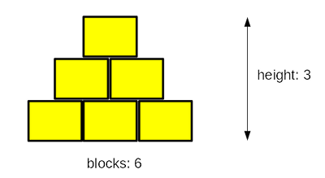

## Цели
  
* использование цикла `while`;
* нахождение правильного выполнения устно определенных правил;
* отражение реальных ситуаций в компьютерном коде.

## Сценарий

Послушайте эту историю: мальчик и его отец, программист, играют с деревянными кубиками. Они строят пирамиду.

Их пирамида немного странная, потому что на самом деле это стена в форме пирамиды - она плоская. Пирамида складывается по одному простому принципу: каждый нижний слой содержит на один блок больше, чем слой выше.

На рисунке показано правило, используемое строителями:

  
  
Ваша задача - написать программу, которая считывает количество блоков, имеющихся у строителей, и выводит высоту пирамиды, которую можно построить из этих блоков.

```python
blocks = int(input("Enter the number of blocks: "))

#
# Write your code here.
#	

print("The height of the pyramid:", height)

```

Примечание: высота измеряется количеством **полностью завершенных слоев** - если строители не имеют достаточного количества блоков и не могут завершить следующий слой, они немедленно заканчивают свою работу.

Протестируйте свой код, используя предоставленные нами данные.

  
## Тестовые данные

Примерный ввод: `6`

Ожидаемый вывод: `The height of the pyramid: 3`

* * *

Примерный ввод: `20`

Ожидаемый вывод: `The height of the pyramid: 5`

* * *

Примерный ввод: `1000`

Ожидаемый вывод: `The height of the pyramid: 44`

* * *

Примерный ввод: `2`

Ожидаемый вывод: `The height of the pyramid: 1`

