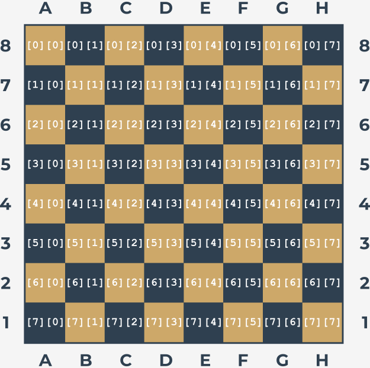
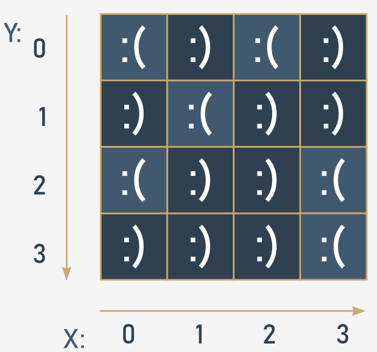
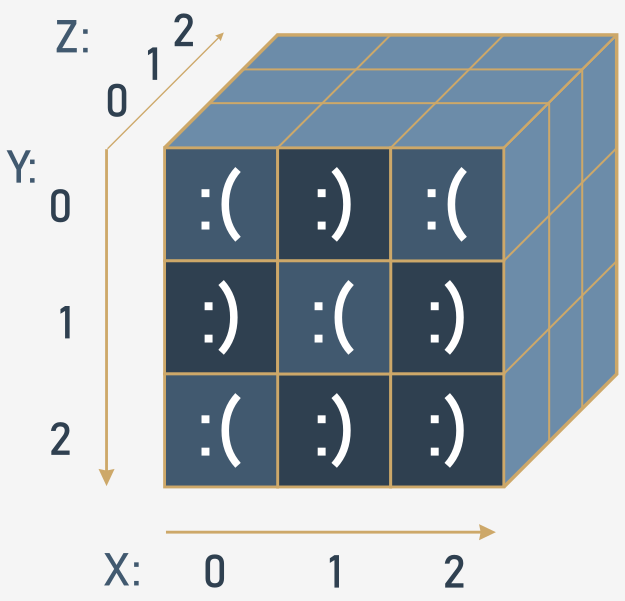

## Списки в списках

Списки могут состоять из скаляров (а именно чисел) и элементов гораздо более сложной структуры (Вы уже видели такие примеры, как строки, логические значения или даже другие списки в предыдущих заключающих уроках раздела). Давайте подробнее рассмотрим случай, когда **элементы списка являются просто списками**.

Такие **массивы** мы часто находим в своей жизни. Вероятно, лучший пример этого - **шахматная доска**.

Шахматная доска состоит из строк и столбцов. Всего восемь строк и восемь столбцов. Каждый столбец помечен буквами от A до H. Каждая строка отмечена цифрой от одного до восьми.

Расположение каждой клетки определяется парами букв и цифр. Таким образом, мы знаем, что левый нижний угол доски (с белой ладьей) - это А1, а противоположный угол - Н8.

Предположим, что мы можем использовать выбранные числа для представления любой шахматной фигуры. Мы также можем предположить, что **каждая строка на шахматной доске представляет собой список**.

Посмотрите на код ниже:

```python
row = []

for i in range(8):
    row.append(WHITE_PAWN)

```  

Он создает список из восьми элементов, представляющих вторую строку шахматной доски - ту, которая заполнена пешками (предположим, что `WHITE_PAWN` - **предопределенный символ**, представляющий белую пешку).

Тот же эффект может быть достигнут с помощью **генератора списка**, специального синтаксиса, используемого Python для заполнения огромных списков.

Генератор списка на самом деле является списком, но **создается на ходу во время выполнения программы и не описывается статически**.

Посмотрите на код:

```python
row = [WHITE_PAWN for i in range(8)]

```

Часть кода, помещенная в скобки, указывает:

* данные, которые будут использоваться для заполнения списка (`WHITE_PAWN`)
* выражение, определяющее, сколько раз данные встречаются внутри списка (`for i in range(8)`)

Взгляните на еще несколько **примеров генерирования списка**:

Пример #1:

```python
squares = [x ** 2 for x in range(10)]

```  

Код создает список из десяти элементов, заполненный квадратами из десяти целых чисел, начиная с нуля (0, 1, 4, 9, 16, 25, 36, 49, 64, 81).

Пример #2:

```python
twos = [2 ** i for i in range(8)]

```  

Код создает массив из восьми элементов, содержащий первые восемь степеней двойки (1, 2, 4, 8, 16, 32, 64, 128).

Пример #3:

```python
odds = [x for x in squares if x % 2 != 0 ]

```  

Код составляет список только из нечетных элементов списка `squares`.

  
## Списки в списках: двумерные массивы

Предположим также, что **предопределенный символ** с именем `EMPTY` обозначает пустое поле на шахматной доске.

Итак, если мы хотим создать список списков, представляющих всю шахматную доску, это можно сделать следующим образом:

```python
board = []

for i in range(8):
    row = [EMPTY for i in range(8)]
    board.append(row)

```  

Примечание:

* внутренняя часть цикла создает строку, состоящую из восьми элементов (каждый из которых равен `EMPTY`), и добавляет ее в список `board`;
* внешняя часть повторяет это восемь раз;
* Всего список `board` состоит из 64 элементов (все равны `EMPTY`).

Эта модель идеально имитирует настоящую шахматную доску, которая на самом деле представляет собой список из восьми элементов, состоящих из отдельных строк. Подведем итог нашим наблюдениям:

* элементы строк - клетки, по восемь в каждой строке;
* элементы шахматной доски - это строки, по восемь на каждой доске.

Переменная `board` теперь представляет собой **двумерный массив**. По аналогии с алгебраическими терминами ее также называют **матрицей**.

Поскольку списки могут быть **вложенными**, мы можем сократить создание доски следующим образом:

```python
board = [[EMPTY for i in range(8)] for j in range(8)]

```  

Внутренняя часть создает строку, а внешняя часть создает список строк.

Для доступа к выбранной клетке доски требуются два индекса - первый выбирает строку; второй - номер клетки внутри строки, который де-факто является номером столбца.

Взгляните на шахматную доску. Каждое поле содержит пару индексов, которые необходимо указать для доступа к содержимому клетки:



Взглянув на рисунок, показанный выше, давайте поставим на доске несколько шахматных фигур. Для начала добавим все ладьи:

```python
board[0][0] = ROOK
board[0][7] = ROOK
board[7][0] = ROOK
board[7][7] = ROOK

```  

Если вы хотите добавить коня на C4, вы делаете это следующим образом:

```python
board[4][2] = KNIGHT

```  

А теперь пешку на Е5:

```python
board[3][4] = PAWN

```  

А теперь - поэкспериментируйте со следующим кодом.

```python
EMPTY = "-"
ROOK = "ROOK"
board = []

for i in range(8):
    row = [EMPTY for i in range(8)]
    board.append(row)

board[0][0] = ROOK
board[0][7] = ROOK
board[7][0] = ROOK
board[7][7] = ROOK

print(board)

```

## Многомерный характер списков: продвинутые приложения

Давайте углубимся в многомерную природу списков. Чтобы найти любой элемент двумерного списка, вы должны использовать две _координаты_:

* вертикальный (номер строки)
* и горизонтальный (номер столбца).

Представьте, что Вы разрабатываете программное обеспечение для автоматической метеостанции. Прибор фиксирует температуру воздуха ежечасно и делает это в течение месяца. Это дает Вам в общей сложности 24 × 31 = 744 значения. Попробуем составить список, способный хранить все эти результаты.

Во-первых, Вы должны решить, какой тип данных подходит для этого приложения. В этом случае лучше всего подойдет `float`, поскольку этот термометр может измерять температуру с точностью до 0,1 ℃.

Затем Вы принимаете произвольное решение, что строки будут записывать показания каждый час (таким образом строка будет иметь 24 элемента), и каждая из строк будет назначена одному дню месяца (предположим, что в каждом месяце 31 день, а значит Вам понадобится 31 строка). Вот подходящая пара включений (`h` для часа, `d` для дня):

```python
temps = [[0.0 for h in range(24)] for d in range(31)]

```  

Теперь вся матрица заполнена нулями. Можно предположить, что она обновляется автоматически с помощью специальных аппаратных агентов. Остается дождаться заполнения матрицы измерениями.

Пришло время определить среднемесячную полуденную температуру. Сложите все 31 показание, записанное в полдень, и разделите полученную сумму на 31. Вы можете предположить, что сначала сохраняется полуночная температура. Вот соответствующий код:

```python
temps = [[0.0 for h in range(24)] for d in range(31)]
#
# The matrix is magically updated here.
#

total = 0.0

for day in temps:
    total += day[11]

average = total / 31

print("Average temperature at noon:", average)

```  

Примечание: переменная `day`, используемая циклом `for`, не является скаляром - каждый проход через матрицу `temps` присваивает ей следующие строки матрицы; следовательно, это список. Он должен быть проиндексирован значением `11`, чтобы получить доступ к значению температуры, измеренному в полдень.

Теперь найдите самую высокую температуру за весь месяц - посмотрите на код:

```python
temps = [[0.0 for h in range(24)] for d in range(31)]
#
# The matrix is magically updated here.
#

highest = -100.0

for day in temps:
    for temp in day:
        if temp > highest:
            highest = temp

print("The highest temperature was:", highest)

```  

Примечание:

* переменная `day` выполняет итерацию по всем строкам в матрице `temps`;
* переменная `temp` выполняет итерацию по всем измерениям, выполненным за один день.

Теперь посчитайте дни, когда температура в полдень была не ниже 20 ℃:

```python
temps = [[0.0 for h in range(24)] for d in range(31)]
#
# The matrix is magically updated here.
#

hot_days = 0

for day in temps:
    if day[11] > 20.0:
        hot_days += 1

print(hot_days, "days were hot.")

```  
  

## Трехмерные массивы

Python не ограничивает глубину включения списка в список. Здесь вы можете увидеть пример трехмерного массива:

Представьте себе отель. Это огромный отель, состоящий из трех корпусов по 15 этажей в каждом. На каждом этаже по 20 комнат. Для этого вам понадобится массив, который может собирать и обрабатывать информацию о занятых/свободных комнатах.

Первый шаг - тип элементов массива. В этом случае подойдет логическое значение (`True`/`False`).

Шаг второй - спокойный анализ ситуации. Обобщите имеющуюся информацию: три корпуса, 15 этажей, 20 комнат

Теперь вы можете создать массив:

```python
rooms = [[[False for r in range(20)] for f in range(15)] for t in range(3)]

```  

Первый индекс (от `0` до `2`) выбирает одно из зданий; второй (от `0` до `14`) выбирает этаж, третий (от `0` до `19`) выбирает номер комнаты. Все комнаты изначально свободные.

Теперь вы можете забронировать номер для двоих молодоженов: во втором корпусе, на десятом этаже, комната 14:

```python
rooms[1][9][13] = True

```  

и освободите вторую комнату на пятом этаже, расположенную в первом корпусе:

```python
rooms[0][4][1] = False

```  

Проверьте, есть ли свободные места на 15 этаже 3 корпуса:

```python
vacancy = 0

for room_number in range(20):
    if not rooms[2][14][room_number]:
        vacancy += 1

```  

Переменная `vacancy` содержит `0`, если все комнаты заняты, или количество доступных комнат в противном случае.

Поздравляем! Вы дошли до конца модуля. Так держать!


## Основные тезисы

1. **Генераторы списков** позволяют кратко и элегантно создавать новые списки из существующих. Синтаксис генератора списка выглядит следующим образом:
    
    ```
    [expression [!mark!]for[!/mark!] element [!mark!]in[!/mark!] list [!mark!]if[!/mark!] conditional]
    
    ```  
    
    который фактически является эквивалентом следующего кода:
    
    ```
    [!mark!]for[!/mark!] element [!mark!]in[!/mark!] list:
        [!mark!]if[!/mark!] conditional:
            expression
            
    ```  
    
    Вот пример генератора списка - код создает список из пяти элементов, заполненный первыми пятью натуральными числами, возведенными в степень 3:
    
    ```python
    cubed = [num ** 3 for num in range(5)]
    print(cubed)  # outputs: [0, 1, 8, 27, 64]
    
    ```  

2. Вы можете использовать **вложенные списки** в Python для создания **матриц** (т.е. двумерных списков). Например:
    
      
      
    ```python
    # A four-column/four-row table ‒ a two dimensional array (4x4)
    
    table = [[":(", ":)", ":(", ":)"],
             [":)", ":(", ":)", ":)"],
             [":(", ":)", ":)", ":("],
             [":)", ":)", ":)", ":("]]
    
    print(table)
    print(table[0][0])  # outputs: ':('
    print(table[0][3])  # outputs: ':)'
    
    ```  

3. Вы можете вкладывать в списки столько списков, сколько захотите, тем самым создавая n-мерные списки, например, трех-, четырех- или даже шестидесяти четырехмерные массивы. Например:
    
      
      
    ```python
    # Cube - a three-dimensional array (3x3x3)
    
    cube = [[[':(', 'x', 'x'],
             [':)', 'x', 'x'],
             [':(', 'x', 'x']],
    
            [[':)', 'x', 'x'],
             [':(', 'x', 'x'],
             [':)', 'x', 'x']],
    
            [[':(', 'x', 'x'],
             [':)', 'x', 'x'],
             [':)', 'x', 'x']]]
    
    print(cube)
    print(cube[0][0][0])  # outputs: ':('
    print(cube[2][2][0])  # outputs: ':)'
    
    ```  
  

## Поздравляем! Вы завершили Модуль 3.

Хорошая работа! Вы подошли к концу Модуля 3 и завершили важный этап в своем образовании по программированию на Python. Вот краткое изложение задач, которые Вы рассмотрели и с которыми ознакомились в Модуле 3:

* Логические значения для сравнения различных значений и управления путями выполнения с помощью инструкций `if` и `if-else`;
* использование циклов (`while` и `for`) и способы управления их поведением с помощью инструкций `break` и `continue`;
* разница между логическими и побитовыми операциями;
* концепция списков и обработка списков, включая итерирование при помощи цикла `for` и срезы;
* идея многомерных массивов.

Теперь Вы готовы пройти тест по модулю и пройти последнее испытание: экзамен' к Модулю 3, который поможет Вам проверить, чему Вы уже научились.


