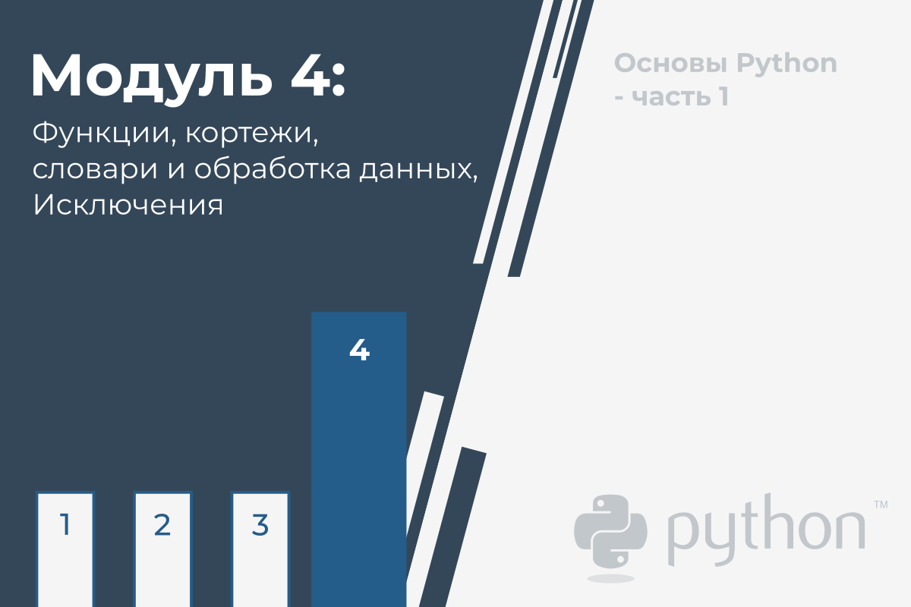
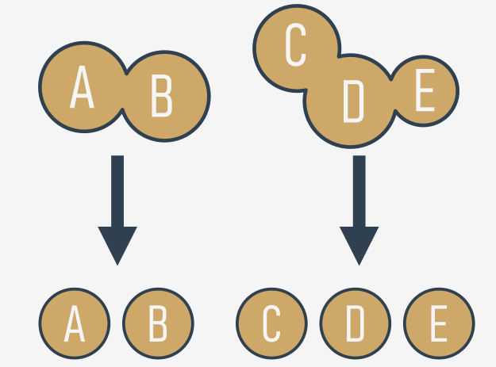
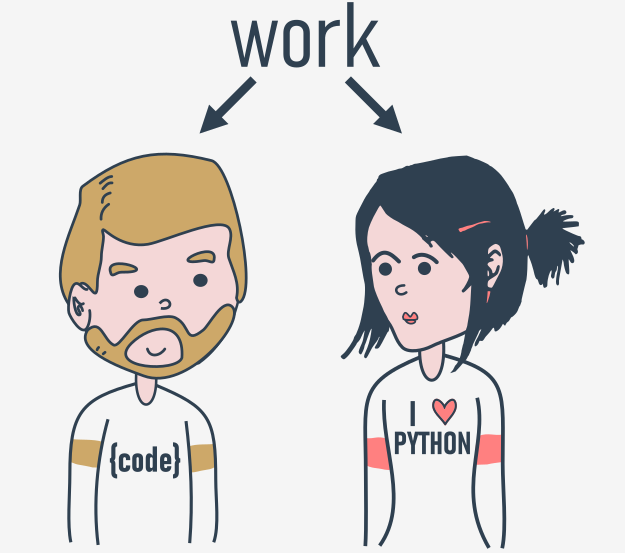
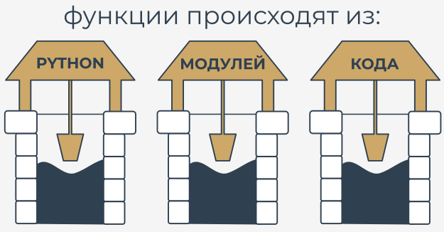
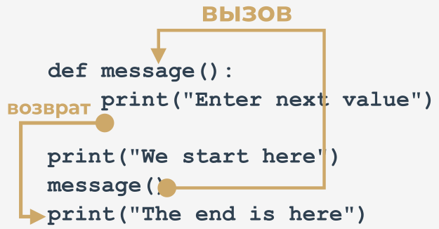

# Функции, кортежи, словари и обработка данных

В этом модуле вы рассмотрите следующие темы:

* структурирование кода и концепция функции;
* вызов функции и возврат результата из функции;
* области видимости и затенение переменных;
* кортежи и их назначение, построение и использование кортежей;
* словари и их назначение, построение и использование словарей.


## Зачем нужны функции?

К этому моменту Вы сталкивались с **функциями** много раз, но взгляд на их достоинства, который мы Вам представляли, был довольно односторонним. Вы только вызывали функции, используя их как инструменты, облегчающие жизнь и упрощающие трудоемкие и утомительные задачи.

Если Вы хотите напечатать в консоли какие-то данные, Вы используете `print()`. Если Вы хотите считать значение переменной, Вы используете `input()` в сочетании с `int()` или `float()`.

Вы также использовали некоторые **методы**, которые на самом деле являются функциями, но объявлены очень специфически.

Теперь Вы научитесь писать и использовать свои собственные функции. Мы напишем вместе несколько функций, от очень простых до довольно сложных, которые потребуют Вашей концентрации и внимания.

Часто случается, что определенный фрагмент кода **многократно повторяется в вашей программе**. Это повторяется либо буквально, либо с небольшими изменениями, заключающимися в использовании других переменных в том же алгоритме. Также случается, что программист не может устоять перед упрощением своей работы и начинает клонировать такие фрагменты кода, используя операции буфера обмена и копирования-вставки.

Это может сильно расстроить, если вдруг окажется, что в клонированном коде есть ошибка. Программисту придется потрудиться, чтобы найти все места, которые нуждаются в исправлениях. Также существует высокий риск того, что исправления вызовут ошибки.

Теперь мы можем определить первое условие, которое может помочь Вам решить, когда начинать писать свои собственные функции: **если определенный фрагмент кода начинает появляться более чем в одном месте, рассмотрите возможность вынесения его в функцию**, вызываемую из мест, где ранее был размещен исходный код.

Может случиться так, что алгоритм, который Вы собираетесь реализовать, настолько сложен, что Ваш код начинает неконтролируемо расти, и Вы внезапно замечаете, что больше не можете так легко перемещаться по нему.

Вы можете попытаться решить эту проблему, подробно комментируя код, но вскоре Вы обнаружите, что это резко ухудшает вашу ситуацию - **слишком много комментариев делают код больше и хуже читаемым**. Некоторые говорят, что **хорошо написанную функцию должно быть видно сразу**.

Хороший внимательный разработчик **делит код** (или, точнее, задачу) на хорошо изолированные части и **кодирует каждую из них в виде функции**.

Это значительно упрощает работу программы, поскольку каждый фрагмент кода можно кодировать и тестировать отдельно. Описанный здесь процесс часто называют **декомпозицией**.



Теперь мы можем сформулировать второе условие: **если фрагмент кода становится настолько большим, что его чтение и понимание могут вызывать проблемы, подумайте о том, чтобы разделить его на отдельные, более мелкие задачи и реализовать каждую из них в виде отдельной функции.**.

Эта декомпозиция продолжается до тех пор, пока вы не получите набор коротких функций, простых для понимания и тестирования.


## Декомпозиция

Часто задача настолько велика и сложна, что ее нельзя поручить одному разработчику, и над ней приходится работать **команде разработчиков**. Проблема должна быть разделена между несколькими разработчиками таким образом, чтобы обеспечить их эффективное и беспрепятственное сотрудничество.



Кажется невообразимым, чтобы несколько программистов могли писать один и тот же фрагмент кода одновременно, поэтому работа должна быть распределена между всеми членами команды.

Такая декомпозиция имеет цель, отличную от описанной ранее, - она касается не только **разделения работы**, но и **разделения ответственности** между многими разработчиками.

Каждый из них пишет четко определенный и описанный набор функций, которые при **объединении в модуль** (мы расскажем об этом чуть позже) дадут конечный продукт.

Это приводит нас непосредственно к третьему условию: если Вы собираетесь разделить работу между несколькими программистами, **разделите задачу так, чтобы продукт можно было реализовать в виде набора отдельно написанных функций, собранных вместе в разные модули**.


### Откуда берутся функции?

В общем, функции поступают как минимум из трех мест:

* из самого Python - многочисленные функции (например, `print()`) являются **неотъемлемой частью Python** и всегда доступны без каких-либо дополнительных усилий со стороны программиста; мы называем эти функции **встроенными функциями** ;
* из **предустановленных модулей** Python - множество функций, очень полезных, но используемых значительно реже встроенных, доступно в ряде модулей, установленных вместе с Python; использование этих функций требует от программиста дополнительных действий, чтобы сделать их полностью доступными (мы расскажем вам об этом позже);
* **прямо из Вашего кода** - Вы можете писать свои собственные функции, размещать их внутри своего кода и свободно использовать;
* есть еще одна возможность, но она связана с классами, поэтому мы ее пока опускаем.




## Ваша первая функция

Посмотрите на код.

```python
print("Enter a value: ")
a = int(input())

print("Enter a value: ")
b = int(input())

print("Enter a value: ")
c = int(input())

```

Это довольно просто, но мы хотим, чтобы это был только пример **преобразования повторяющейся части кода в функцию**.

Сообщения, отправляемые на консоль функцией `print()`, всегда те же. Конечно, в таком коде нет ничего плохого, но попробуйте представить, что бы Вы сделали, если бы начальник попросил Вас изменить сообщение, чтобы сделать его более вежливым, например, начать его с фразы `"Пожалуйста, "`.

Похоже, Вам придется потратить некоторое время на изменение всех сообщений (Вы бы, конечно, использовали буфер обмена, но это не облегчило бы Вам жизнь). Очевидно, что Вы, вероятно, допустите некоторые ошибки в процессе внесения поправок, и Вы (и Ваш босс) бы немного расстроились.

Можно ли отделить такую _повторяющуюся_ часть кода, дать ей имя и сделать ее возможной для многоразового использования? Это будет означать, что **изменение, сделанное один раз в одном месте, будет распространено на все места, где оно использовалось**.

Конечно, такой код должен работать только тогда, когда он явно запущен.

Да, это возможно. Это как раз то, для чего нужны функции.

Как создать такую функцию?

Вам необходимо **определить** ее. Слово _определить_ имеет здесь важное значение.

Вот как выглядит простейшее определение функции:

```python
def my_function():
    # тело функции

```

* Оно всегда начинается с **ключевого слова `def`** (для _define_)
* затем после `def` идет **имя функции** (правила именования функций точно такие же, как и для именования переменных)
* после имени функции есть место для пары **круглых скобок** (здесь они ничего не содержат, но это скоро изменится)
* строка должна заканчиваться **двоеточием**;
* строка сразу после `def` начинает **тело функции** - пару (по крайней мере, одну) обязательно **вложенных инструкций**, которые будут выполняться каждый раз, когда вызывается функция; Примечание: **функция заканчивается там, где заканчивается вложение**, поэтому будьте осторожны.

* Мы готовы определить нашу **подсказывающую функцию**. Назовем ее `message` - вот она:

```python
def message():
    print("Enter a value: ")

```

Функция очень проста, но полностью **пригодна для использования**. Мы назвали ее `message`, но вы можете назвать ее по своему усмотрению. Давай используем ее.

Теперь наш код содержит определение функции:

```python
def message():
    print("Enter a value: ")

print("We start here.")
print("We end here.")

```  

Примечание: мы вообще не используем эту функцию - она **не вызывается** внутри кода.

Когда вы запустите его, вы увидите следующий результат:

```
We start here.
We end here.
``` 

Это означает, что Python читает определения функций и запоминает их, но не запускает ни одну из них без вашего разрешения.

Теперь мы изменили код - мы вставили **вызов функции** между начальным и конечным сообщениями:

```python
def message():
    print("Enter a value: ")

print("We start here.")
[!mark!]message()[!/mark!]
print("We end here.")

```  

Теперь вывод выглядит иначе:

```
We start here.
Enter a value: 
We end here.
```
  
Протестируйте код, измените его, поэкспериментируйте.


## Как работают функции

Посмотрите на картинку ниже:



Она призвана показать Вам весь процесс:

* когда вы **вызываете** функцию, Python запоминает место, где это произошло, и _переходит_ в вызванную функцию;
* затем выполняется **тело функции**;
* достижение конца функции заставляет Python **вернуться** на место сразу после точки вызова.

Есть два очень важных момента. Вот первый из них:

**Вы не должны вызывать функцию, которая неизвестна на момент вызова.**

Помните - Python читает Ваш код сверху вниз. Мы не будем заглядывать вперед, чтобы найти функцию, которую Вы забыли поместить в нужное место ("нужное" означает "до вызова").

Мы добавили ошибку в этот код - видите разницу?

```
print("We start here.")
[!mark!]message()[!/mark!]
print("We end here.")


def message():
    print("Enter a value: ")
    
```  

Мы переместили функцию в конец кода. Может ли Python найти ее, когда выполнение достигнет вызова?

Нет, не может. Сообщение об ошибке будет гласить:

`NameError: name 'message' is not defined`

Не пытайтесь заставить Python искать функции, которые вы не предоставили в нужное время.

Второй момент звучит немного проще:

**У вас не должно быть одноименной функции и переменной**.

Следующий код содержит ошибку:

```
def message():
    print("Enter a value: ")

[!mark!]message = 1[!/mark!]

```  

Присвоение значения переменной message заставляет Python забыть о ее предыдущей роли. Функция с именем `message` становится недоступной.

К счастью, вы можете **смешивать свой код с функциями** - вы не обязаны помещать все свои функции в начало исходного файла.

Посмотрите на код:

```python
print("We start here.")


def message():
    print("Enter a value: ")

message()

print("We end here.")

```  

Это может показаться странным, но это абсолютно правильно и работает так, как задумано.

Вернемся к нашему первому примеру и применим функцию для правильной работы, как здесь:

```python
def message():
    print("Enter a value: ")

message()
a = int(input())
message()
b = int(input())
message()
c = int(input())

```  

Изменить подсказку теперь просто и понятно - Вы можете сделать это, **изменив код всего в одном месте** - внутри тела функции.

Попробуйте сделать это самостоятельно.
  

## Основные тезисы

1. **Функция** - это блок кода, который выполняет определенную задачу, когда функция вызывается. Вы можете использовать функции, чтобы сделать ваш код многоразовым, лучше организованным и читаемым. Функции могут иметь параметры и возвращаемые значения.

2. В Python есть как минимум четыре основных типа функций:

   * **встроенные функции**, которые являются неотъемлемой частью Python (например, функция `print()`). Вы можете увидеть полный список встроенных функций Python по адресу [https://docs.python.org/3/library/functions.html](https://docs.python.org/3/library/functions.html).
   * те, которые поступают из **предустановленных модулей** (вы узнаете о них в курсе _Основы Python 2_)
   * **пользовательские функции**, написанные пользователями для пользователей - Вы можете писать свои собственные функции и свободно использовать их в своем коде,
   * функции `лямбда` (Вы узнаете о них в курсе _Основы Python 2_.)

3. Вы можете определить свою собственную функцию, используя ключевое слово `def` и следующий синтаксис:
    
    ```python
    def your_function(optional parameters):
        # тело функции
    
    ```  
    
    Вы можете определить функцию, которая не принимает никаких аргументов, например:
    
    ```python
    def message():    # defining a function
        print("Hello")    # body of the function
    
    message()    # calling the function
    
    ```  
    
    Вы можете определить функцию, которая также принимает аргументы, как и приведенная ниже функция с одним параметром:
    
    ```python
    def hello(name):    # defining a function
        print("Hello,", name)    # body of the function
    
    
    name = input("Enter your name: ")
    
    hello(name)    # calling the function
    
    ```  
    
    Мы расскажем Вам больше о параметризованных функциях в следующем разделе. Не волнуйтесь.


**Упражнение 1**

Функция `input()` является примером:  
  
a) определяемой пользователем функции  
b) встроенной функции  

<details><summary>Проверка</summary>

**b** - это встроенная функция

</details>


**Упражнение 2**

Что происходит, когда Вы пытаетесь вызвать функцию до ее определения? Пример:

```python
hi()

def hi():
    print("hi!")

```
  
<details><summary>Проверка</summary>

Выдается исключение (точнее, исключение `NameError`)

</details>


**Упражнение 3**

Что произойдет, когда Вы запустите приведенный ниже код?

```python
def hi():
    print("hi")

hi(5)

```
  
<details><summary>Проверка</summary>

Будет сгенерировано исключение (точнее, исключение `TypeError`) - функция `hi()` не принимает никаких аргументов

</details>

