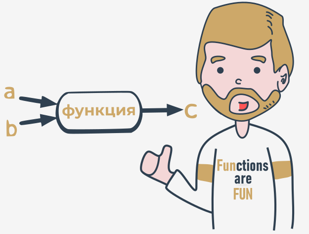

## Параметризованные функции

Полная мощь функции проявляется, когда она может быть оснащена интерфейсом, способным принимать данные, предоставленные вызывающей стороной. Такие данные могут изменять поведение функции, делая ее более гибкой и адаптируемой к меняющимся условиям.

Параметр на самом деле является переменной, но есть два важных фактора, которые делают параметры разными и особенными:

* **параметры существуют только внутри функций, в которых они были определены**, и единственное место, где можно определить параметр, - это пространство между парой круглых скобок в выражении `def`;
* **присвоение значения параметру выполняется во время вызова функции** путем указания соответствующего аргумента.

```
def function([!mark!]parameter[!/mark!]):
    ###

```  

Не забудьте:

* **параметры находятся внутри функций** (это их естественная среда обитания)
* **аргументы существуют вне функций** и являются носителями значений, передаваемых в соответствующие параметры.

Между этими двумя мирами существует четкая и недвусмысленная граница.

Давайте обогатим приведенную выше функцию всего одним параметром - мы собираемся использовать его, чтобы показать пользователю номер значения, запрашиваемого функцией.

Нам нужно переделать выражение `def` - вот как оно выглядит сейчас:

```
def message([!mark!]number[!/mark!]):
    ###
    
```  

В определении указано, что наша функция работает только с одним параметром с именем `number`. Вы можете использовать его как обычную переменную, но **только внутри функции** - он больше нигде не виден.

Теперь давайте перепишем тело функции:

```python
def message(number):
    print("Enter a number:", number)

```  

Мы использовали параметр. Примечание: мы не присвоили параметру какое-либо значение. Верно?

Да.

Значение параметра будет поступать из среды функции.

Помните: **указание одного или нескольких параметров в определении функции** также является требованием, и Вы должны выполнить его во время вызова. Вы должны **указать столько аргументов, сколько задано параметров**.

В противном случае возникнет ошибка.

Попробуйте запустить код.

Вот что вы увидите в консоли:

`TypeError: message() missing 1 required positional argument: 'number'`


Это наверняка выглядит лучше:

```
def message(number):
    print("Enter a number:", number)

[!mark!]message(1)[!/mark!]

```  

Более того, это лучше себя ведет. Код выдаст следующий результат:

`Enter a number: 1`

Видите, как это работает? Значение аргумента, используемого во время вызова (`1`), было передано в функцию, установив начальное значение параметра с именем `number`.

Мы должны обратить Ваше внимание на одно важное обстоятельство.

Допустимо и возможно иметь **переменную с таким же именем, как у параметра функции**.

Код иллюстрирует этот феномен:

```python
def message([!mark!]number[!/mark!]):
    print("Enter a number:", number)

[!mark!]number[!/mark!] = 1234
message(1)
print(number)

```  

Подобная ситуация активирует механизм, называемый **затенением**:

* параметр `x` затеняет любую переменную с таким же именем, но...
* ... только внутри функции, определяющей параметр.

Параметр с именем `number` - это не то же самое, что и переменная с именем `number`.

Это означает, что приведенный выше фрагмент даст следующий вывод:

```
Enter a number: 1
1234
```

Функция может иметь **сколько угодно параметров**, но чем больше у вас параметров, тем сложнее запомнить их роли и цели.

  
  
Давайте изменим функцию - теперь у нее есть **два параметра**:

```python
def message([!mark!]what[!/mark!], [!mark!]number[!/mark!]):
    print("Enter", what, "number", number)

```  

Это также означает, что для вызова функции потребуются **два аргумента**.

Первый новый параметр предназначен для обозначения желаемого значения.

Вот он:

```python
def message(what, number):
    print("Enter", what, "number", number)

message("telephone", 11)
message("price", 5)
message("number", "number")

```

Вот результат, который вы должны увидеть:

```
Enter telephone number 11
Enter price number 5
Enter number number number
```

Запустите код, измените его, добавьте дополнительные параметры и посмотрите, как это повлияет на результат.

  
## Позиционная передача параметров

Техника присваивания значения i-го аргумента (первого, второго и т. Д.) i-му параметру функции (первому, второму и т. Д.), называется **позиционной передачей параметров**, а переданные таким образом аргументы называются **позиционными аргументами**.

Вы уже использовали ее, но Python может предложить гораздо больше. Сейчас мы вам об этом расскажем.

```python
def my_function(a, b, c):
    print(a, b, c)

my_function(1, 2, 3)

```  

Примечание: передача позиционных параметров интуитивно используется людьми во многих социальных ситуациях. Например, общепринято считать, что, представляясь, мы упоминаем свое имя (имена) перед фамилией, например: "Меня зовут Джон Доу".

Кстати, венгры делают это в обратном порядке.

Давайте реализуем этот социальный обычай на Python. Следующая функция будет отвечать за представление кого-либо:

```python
def introduction(first_name, last_name):
    print("Hello, my name is", first_name, last_name)

introduction("Luke", "Skywalker")
introduction("Jesse", "Quick")
introduction("Clark", "Kent")

```  

Можете угадать результат? Запустите код и посмотрите, правы ли Вы.

А теперь представьте, что такая же функция используется в Венгрии. В этом случае код будет выглядеть так:

```python
def introduction(first_name, last_name):
    print("Hello, my name is", first_name, last_name)

introduction("Skywalker", "Luke")
introduction("Quick", "Jesse")
introduction("Kent", "Clark")

```

Результат будет выглядеть иначе. Можете угадать, как?

Запустите код, чтобы убедиться, что Вы здесь тоже правы. Удивлены?

Можете ли Вы сделать эту функцию менее зависимой от культуры?

  
## Передача аргументов по имени

Python предлагает еще одну конвенцию передачи аргументов, где **значение аргумента определяется его именем**, а не его позицией - это называется **передачей аргументов по имени**.

Взгляните на фрагмент:

```python
def introduction(first_name, last_name):
    print("Hello, my name is", first_name, last_name)

introduction(first_name = "James", last_name = "Bond")
introduction(last_name = "Skywalker", first_name = "Luke")

```

Концепция проста - значениям, передаваемым в параметры, предшествуют имена целевых параметров, за которыми следует знак `=`.

Положение здесь не имеет значения - значение каждого аргумента знает свое назначение по используемому имени.

Вы должны быть в состоянии предсказать результат. Запустите код, чтобы проверить, правы ли Вы.

Конечно же, Вы **не должны использовать несуществующее имя параметра**.

Следующий код вызовет ошибку выполнения:

```python
def introduction(first_name, last_name):
    print("Hello, my name is", first_name, last_name)

introduction([!mark!]surname[!/mark!]="Skywalker", first_name="Luke")

```

Вот что вам скажет Python:

`TypeError: introduction() got an unexpected keyword argument 'surname'`

Попробуйте сами.


## Смешивание позиционных и именованных аргументов

Вы можете смешивать оба стиля, если хотите - есть только одно нерушимое правило: Вы должны помещать **позиционные аргументы перед именованными**.

Если Вы немного подумаете, Вы наверняка догадаетесь, почему.

Чтобы показать Вам, как это работает, мы будем использовать следующую простую функцию с тремя параметрами:

```python
def adding(a, b, c):
    print(a, "+", b, "+", c, "=", a + b + c)

```  

Ее цель - вычислить и вывести сумму всех своих аргументов.

Функция при вызове следующим образом:

```python
adding(1, 2, 3)
```  

выведет:

`1 + 2 + 3 = 6`

Как вы можете догадаться, это был пример **позиционной передачи аргументов.**

Конечно же, Вы можете заменить такой вызов вариантом с передачей по имени, например:

```python
adding(c = 1, a = 2, b = 3)  
```

Наша программа выведет такую строку:

`2 + 3 + 1 = 6`

Обратите внимание на порядок значений.

Теперь попробуем смешать оба стиля.

Посмотрите на вызов функции ниже:

```python
adding(3, c = 1, b = 2)
```  

Давайте проанализируем его:

* аргумент (`3`) для параметра `a` передается позиционным способом;
* аргументы для `c` и `b` указаны с помощью имен.

вот, что Вы увидите в консоли:

`3 + 2 + 1 = 6`

Будьте осторожны и остерегайтесь ошибок. Если Вы попытаетесь передать более одного значения одному аргументу, все, что Вы получите, - это ошибка выполнения.

Посмотрите на вызов ниже - кажется, мы дважды пытались задать значение `a`:

```
adding([!mark!]3, a = 1[!/mark!], b = 2)
```  

Ответ Python:

`TypeError: adding() got multiple values for argument 'a'`

Посмотрите на код ниже. Такой код полностью корректен, но не имеет особого смысла:

```python
adding(4, 3, c = 2)
```  

Все правильно, но оставить только один именованный аргумент выглядит немного странно - как Вы думаете?

  
## Параметризованные функции ‒ больше деталей

Иногда бывает, что значения одного параметра используются чаще других. Такие аргументы могут принимать во внимание их **значения по умолчанию (предопределенные)**, если соответствующие им аргументы были опущены.

Говорят, самая популярная английская фамилия - _Смит_. Попробуем это учесть.

Значение параметра по умолчанию устанавливается с помощью четкого и наглядного синтаксиса:

```python
def introduction(first_name, [!mark!]last_name="Smith"[!/mark!]):
    print("Hello, my name is", first_name, last_name)
```  

Вам нужно только расширить имя параметра знаком `=`, за которым следует значение по умолчанию.

Давайте вызовем функцию как обычно:

```python
introduction("James", "Doe")
```  

Вы можете угадать, что выведет программа? Запустите ее и проверьте, правы ли Вы.

И? Все выглядит так же, но когда вы вызываете функцию образом, который на первый взгляд выглядит немного подозрительно, например:

```python
introduction("Henry")
```  

или так:

```python
introduction(first_name="William")
```  

ошибки не будет, и оба вызова будут успешными, а в консоль будет выведено следующее:

```
Hello, my name is Henry Smith
Hello, my name is William Smith
```

Протестируйте это.

Вы можете пойти дальше, если это будет полезно. Оба параметра теперь имеют значения по умолчанию, посмотрите на код ниже:

```python
def introduction(first_name="John", last_name="Smith"):
    print("Hello, my name is", first_name, last_name)

```  

Это делает следующий вызов полностью верным:

```python
introduction()
```  

А это - ожидаемый вывод:

`Hello, my name is John Smith`

Если вы используете один именованный аргумент, другой примет значение по умолчанию:

```python
introduction(last_name="Hopkins")
```  

Вывод:

`Hello, my name is John Hopkins`

Протестируйте.

Поздравляем - вы только что узнали несколько основных приемов взаимодействия с функциями.

  
## Основные тезисы

1. С помощью параметров Вы можете передавать информацию в функции. Ваши функции могут иметь столько параметров, сколько Вам нужно.
    
    Пример функции с одним параметром:
    
    ```python
    def hi(name):
        print("Hi,", name)
    
    hi("Greg")
    
    ```  
    
    Пример функции с двумя параметрами:
    
    ```python
    def hi_all(name_1, name_2):
        print("Hi,", name_2)
        print("Hi,", name_1)
    
    hi_all("Sebastian", "Konrad")
    
    ```  
    
    Пример функции с тремя параметрами
    
    ```python
    def address(street, city, postal_code):
        print("Your address is:", street, "St.,", city, postal_code)
    
    s = input("Street: ")
    p_c = input("Postal Code: ")
    c = input("City: ")
    
    address(s, c, p_c)
    
    ```

2. Вы можете передавать аргументы в функции, используя следующие техники:

   * **позиционная передача аргументов** , в которой порядок передачи аргументов имеет значение (Пример 1)
   * **передача аргументов по имени**, в которой порядок переданных аргументов не имеет значения (Пример 2)
   * сочетание позиционной передачи аргументов с передачей по имени (Пример 3).

    Пример 1
    
    ```python
    def subtra(a, b):
        print(a - b)
    
    subtra(5, 2)    # outputs: 3
    subtra(2, 5)    # outputs: -3
    
    ```
    
    Пример 2
    
    ```python
    def subtra(a, b):
        print(a - b)
    
    subtra(a=5, b=2)    # outputs: 3
    subtra(b=2, a=5)    # outputs: 3
    
    ```
    
    Пример 3
    
    ```python
    def subtra(a, b):
        print(a - b)
    
    subtra(5, b=2)    # outputs: 3
    subtra(5, 2)    # outputs: 3
    
    ```
    
    Важно помнить, что **позиционные аргументы не должны следовать за именованными**. Поэтому, если Вы попытаетесь запустить следующий код:
    
    ```python
    def subtra(a, b):
        print(a - b)
    
    subtra(5, b=2)    # outputs: 3
    subtra([!mark!]a=5, 2[!/mark!])    # Syntax Error

    ```  

    Python не позволит вам сделать это, сигнализируя об ошибке `SyntaxError`.

3. Вы можете использовать технику передачи аргументов по имени, чтобы **предварительно определить** значение для данного аргумента:

```python
def name(first_name, last_name="Smith"):
    print(first_name, last_name)

name("Andy")    # outputs: Andy Smith
name("Betty", "Johnson")    # outputs: Betty Johnson (the keyword argument replaced by "Johnson")

```  


**Упражнение 1**

Что выведет следующий код?

```python
def intro(a="James Bond", b="Bond"):
    print("My name is", b + ".", a + ".")

intro()

```

<details><summary>Проверка</summary>

```
My name is Bond. James Bond.
```

</details>

**Упражнение 2**

Что выведет следующий код?

```python
def intro(a="James Bond", b="Bond"):
    print("My name is", b + ".", a + ".")

intro(b="Sean Connery")

```

<details><summary>Проверка</summary>

```
My name is Sean Connery. James Bond.
```

</details>

**Упражнение 3**

Что выведет следующий код?

```python
def intro(a, b="Bond"):
    print("My name is", b + ".", a + ".")

intro("Susan")

```

<details><summary>Проверка</summary>

```
My name is Bond. Susan.
```

</details>

**Упражнение 4**

Что выведет следующий код?

```python
def add_numbers(a, b=2, c):
    print(a + b + c)

add_numbers(a=1, c=3)

```

<details><summary>Проверка</summary>

`SyntaxError` - a non-default argument (`c`) follows a default argument (`b=2`)

</details>

