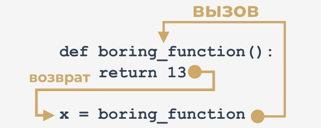

## Эффекты и результаты: инструкция return

Все ранее представленные функции имеют какой-то эффект - они генерируют какой-то текст и отправляют его в консоль.

Конечно, функции - как и их математические родственники - могут давать результаты.

Чтобы заставить **функции возвращать значение** (но не только для этой цели), вы используете инструкцию `return`.

Это слово дает вам полное представление о его возможностях. Примечание: это **ключевое слово** Python.

У инструкции `return` есть **два разных варианта** - рассмотрим их отдельно.


### return без выражения

Первый состоит из самого ключевого слова, за которым ничего не следует.

При использовании внутри функции он вызывает **немедленное прекращение выполнения функции и мгновенный возврат (отсюда и название) к точке вызова**.

Примечание: если функция не предназначена для получения результата, **использование инструкции `return` не обязательно** - она будет выполняться неявно в конце функции.

В любом случае Вы можете использовать ее, чтобы **завершить работу функции по желанию**, прежде чем исполнение достигнет последней строки функции.

Рассмотрим следующую функцию:

```python
def happy_new_year(wishes = True):
    print("Three...")
    print("Two...")
    print("One...")
    if not wishes:
        return
    
    print("Happy New Year!")

```

При вызове без аргументов:

```python
happy_new_year()
```

Функция вызывает небольшой шум - результат будет выглядеть так:

```
Three...
Two...
One...
Happy New Year!
```

Передача `False` в качестве аргумента:

```python
happy_new_year(False)
```  

изменит поведение функции - инструкция `return` прервет ее непосредственно перед пожеланием - это обновленный вывод:

```
Three...
Two...
One...
```


### return с выражением

Второй вариант `return` **расширен выражением**:

```python
def function():
    return [!mark!]expression[!/mark!]

```

Его использование может привести к двум последствиям:

* вызывает **немедленное прекращение выполнения функции** (ничего нового по сравнению с первым вариантом)
* кроме того, функция **вычисляет значение выражения и возвращает его (еще раз, отсюда и название) в качестве результата функции**.

Да, мы знаем - этот пример не особо сложный:

```python
def boring_function():
    return 123

x = boring_function()

print("The boring_function has returned its result. It's:", x)

```  

Код выведет в консоль следующий текст:

`The boring_function has returned its result. It's: 123`  

Давайте разберемся с этим.

Проанализируйте картинку ниже:

  

Инструкция `return`, дополненная выражением (здесь выражение очень простое), "переносит" значение выражения в место, где была вызвана функция.

Результат можно использовать как угодно, например, для присвоения переменной.

Он также может быть полностью проигнорирован и потерян без следа.

Обратите внимание, мы здесь не слишком вежливы - функция возвращает значение, а мы его игнорируем (мы его никак не используем):

```python
def boring_function():
    print("'Boredom Mode' ON.")
    return 123

print("This lesson is interesting!")
boring_function()
print("This lesson is boring...")

```

Код выведет следующее:

`This lesson is interesting! 'Boredom Mode' ON. This lesson is boring...`

Наказуемо ли это? Нет.

Единственный минус - результат безвозвратно утерян.

Не забывайте:

* Вам всегда разрешено **игнорировать результат функции** и быть удовлетворенным ее эффектом (если функция имеет таковой)
* если функция предназначена для возврата полезного результата, она должна содержать второй вариант инструкции `return`.

Погодите - значит, есть и бесполезные результаты? В каком-то смысле да.


## Несколько слов о None

Позвольте представить вам очень любопытное значение (честно говоря, никакое не значение) с именем `None`.

Его данные не представляют какого-либо разумного значения - на самом деле, это вообще не значение; следовательно, оно **не должно принимать участие ни в каких выражениях**.

Например, код вроде этого:

```python
print(None + 2)
```  

вызовет ошибку выполнения, описанную следующим диагностическим сообщением:

`TypeError: unsupported operand type(s) for +: 'NoneType' and 'int'`

Примечание: `None` - это **ключевое слово**.

`None` можно безопасно использовать только в двух случаях:

* когда Вы **присваиваете его переменной** (или возвращаете как **результат функции**)
* когда вы **сравниваете его с переменной**, чтобы диагностировать ее внутреннее состояние.

Как здесь:

```python
value = None
if value is None:
    print("Sorry, you don't carry any value")

```

Не забывайте об этом: если функция не возвращает определенное значение с помощью выражения `return`, предполагается, что она **неявно возвращает `None`**.

Давайте протестируем это.

Посмотрите на код.

```python
def strange_function(n):
    if(n % 2 == 0):
        return True

```

Очевидно, что функция `strictFunction` возвращает `True`, когда ее аргумент четный.

Что она возвращает в противном случае?

Мы можем использовать следующий код, чтобы проверить это:

```python
print(strange_function(2))
print(strange_function(1))

```  

Вот что мы видим в консоли:

```
True
None
```

Не удивляйтесь, когда в следующий раз увидите `None` в качестве результата функции - это может быть признаком тонкой ошибки внутри функции.


## Эффекты и результаты: списки и функции

Здесь нужно ответить на два дополнительных вопроса.

Первый: **может ли список быть передан функции в качестве аргумента?**

Конечно может! Любая сущность, распознаваемая Python, может играть роль аргумента функции, хотя нужно быть уверенным, что функция способна с ней работать.

Итак, если Вы передаете список в функцию, она должна обрабатывать его как список.

Вот такая функция:

```python
def list_sum(lst):
    s = 0
    
    for elem in lst:
        s += elem
    
    return s

```  

вызываемая так:

```python
print(list_sum([5, 4, 3]))

```  

в результате вернет `12`, но Вы должны готовиться к проблемам, если вызовете ее таким рискованным способом:

```python
print(list_sum(5))
```

Ответ Python будет однозначным:

`TypeError: 'int' object is not iterable`

Это вызвано тем, что **по одному целочисленному значению нельзя итерироваться циклом `for`**.

Второй вопрос: **может ли список быть результатом функции?**

Конечно да! Результатом функции может быть любой объект, распознаваемый Python.

Посмотрите на код.

```python
def strange_list_fun(n):
    strange_list = []
    
    for i in range(0, n):
        strange_list.insert(0, i)
    
    return strange_list

print(strange_list_fun(5))

```

Вывод программы будет выглядеть так:

`[4, 3, 2, 1, 0]`

Теперь вы можете писать функции с результатами и без результатов.

Давайте углубимся в вопросы, связанные с переменными в функциях. Это важно для создания эффективных и безопасных функций.
  

## Основные тезисы

1. Вы можете использовать ключевое слово `return`, чтобы указать функции, чтобы она возвращала какое-либо значение. Оператор `return` завершает функцию, например:
    
    ```python
    def multiply(a, b):
        return a * b
    
    print(multiply(3, 4))    # outputs: 12
    
    
    def multiply(a, b):
        return
    
    print(multiply(3, 4))    # outputs: None
    
    ```

2. Результат функции можно легко присвоить переменной, например:
    
    ```python
    def wishes():
        return "Happy Birthday!"
    
    [!mark!]w = wishes()[!/mark!]
    
    print(w)    # outputs: Happy Birthday!
    
    ```
    
    Посмотрите на разницу в выводе в следующих двух примерах:
    
    Пример 1
    
    ```python
    def wishes():
        print("My Wishes")
        return "Happy Birthday"
    
    wishes()    # outputs: My Wishes
    
    ```
    
    Пример 2
    
    ```python
    def wishes():
        print("My Wishes")
        return "Happy Birthday"
    
    print(wishes())
    
    # outputs: My Wishes
    #          Happy Birthday
    
    ```  

3. Вы можете использовать список в качестве аргумента функции, например:
    
    ```python
    def hi_everybody(my_list):
        for name in my_list:
            print("Hi,", name)
    
    hi_everybody(["Adam", "John", "Lucy"])
    
    ```

4. Список также может быть результатом функции, например:
    
    ```python
    def create_list(n):
        my_list = []
        for i in range(n):
            my_list.append(i)
        return my_list
    
    print(create_list(5))
    
    ```  
  
**Упражнение 1**

Что вернет следующий код?

```python
def hi():
    return
    print("Hi!")

hi()

```

<details><summary>Проверка</summary>

функция вернет неявное значение `None`

</details>

**Упражнение 2**

Что выведет следующий код?

```python
def is_int(data):
    if type(data) == int:
        return True
    elif type(data) == float:
        return False

print(is_int(5))
print(is_int(5.0))
print(is_int("5"))

```

<details><summary>Проверка</summary>

```
True
False
None
```

</details>

**Упражнение 3**

Что выведет следующий код?

```python
def even_num_lst(ran):
    lst = []
    for num in range(ran):
        if num % 2 == 0:
            lst.append(num)
    return lst

print(even_num_lst(11))

```

<details><summary>Проверка</summary>

`[0, 2, 4, 6, 8, 10]`

</details>

**Упражнение 4**

Что выведет следующий код?

```python
def list_updater(lst):
    upd_list = []
    for elem in lst:
        elem **= 2
        upd_list.append(elem)
    return upd_list

foo = [1, 2, 3, 4, 5]
print(list_updater(foo))

```

<details><summary>Проверка</summary>

`[1, 4, 9, 16, 25]`

</details>

