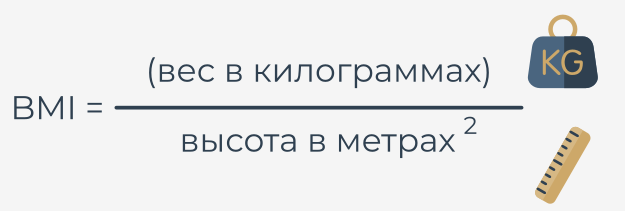
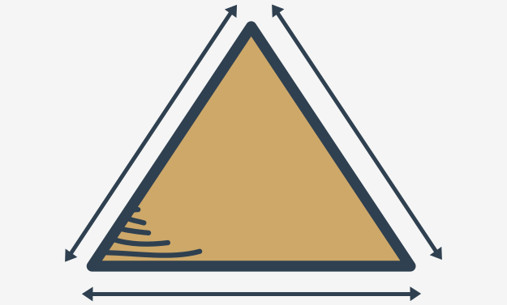
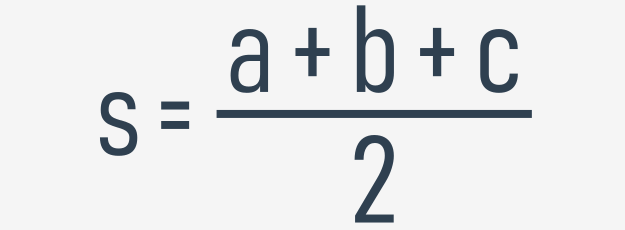
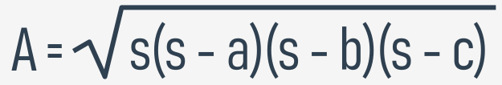

## Несколько простых функций: оценка ИМТ

Давайте начнем с функции для оценки индекса массы тела (ИМТ).

  
  
Как видите, формула принимает два значения:

* вес (в киллограммах)
* рост (в метрах)

Похоже, эта новая функция будет иметь **два параметра**. Ее имя будет `bmi`, но если Вы предпочитаете другое, используйте его.

Давайте напишем функцию:

```python
def bmi(weight, height):
    return weight / height ** 2


print(bmi(52.5, 1.65))

```  

Результат, полученный при запуске кода, выглядит следующим образом:

`19.283746556473833`

Функция оправдывает наши ожидания, но она несколько простая - она предполагает, что значения обоих параметров всегда имеют смысл. Определенно стоит проверить, заслуживают ли они доверия.

Давайте проверим их оба и вернем `None`, если какое-либо из них выглядит подозрительно.


## Некоторые простые функции: оценка ИМТ и преобразование единиц измерения в метрические.

Посмотрите на код. Нам нужно обратить внимание на две вещи.

```python
def bmi(weight, height):
    if height < 1.0 or height > 2.5 or \
    weight < 20 or weight > 200:
        return None

    return weight / height ** 2


print(bmi(352.5, 1.65))

```

Во-первых, тестовый вызов гарантирует, что **защита** работает должным образом. Результат:

`None`

Во-вторых, посмотрите, как используется символ **обратная косая черта** (`\`). Если вы используете его в коде Python и завершите им строку, он скажет Python продолжить текущую строку кода в следующей строке.

Это может быть особенно полезно, когда Вам приходится иметь дело с длинными строками кода и Вы хотите улучшить его читаемость.

Хорошо, но есть кое-что, что мы слишком легко упустили - единицы измерения. Эта функция не слишком полезна для людей, привыкших к фунтам, футам и дюймам.

Что можно сделать для них?

Мы можем написать две простые функции для **преобразования британских единиц измерения в метрические**. Начнем с фунтов.

Хорошо известно, что `1 фунт = 0,45359237 кг`. Мы воспользуемся этим в нашей новой функции.

Это наша вспомогательная функция с именем `lb_to_kg`:

```python
def lb_to_kg(lb):
    return lb * 0.45359237


print(lb_to_kg(1))

```  

Результат тестового вызова выглядит неплохо:

`0.45359237`

А теперь пришло время для футов и дюймов: `1 фут = 0,3048 м` и `1 дюйм = 2,54 см = 0,0254 м`.

Написанная нами функция называется `ft_and_inch_to_m`:

```python
def ft_and_inch_to_m(ft, inch):
    return ft * 0.3048 + inch * 0.0254


print(ft_and_inch_to_m(1, 1))

```  

Результат быстрой проверки:

`0.3302`

Выглядит так, как ожидалось.

Примечание: мы хотели назвать второй параметр просто `in`, а не `inch`, но не смогли. Знаете почему?

`in` - это **ключевое слово** в Python ‒ его нельзя использовать в качестве названия.

Преобразуем _шесть футов_ в метры:

```python
print(ft_and_inch_to_m(6, 0))
```  

И вот результат:

`1.8288000000000002`

Вполне возможно, что иногда Вам может понадобиться использовать только футы без дюймов. Поможет ли Вам Python? Конечно поможет.

Мы немного изменили код:

```python
def ft_and_inch_to_m([!mark!]ft, inch = 0.0[!mark!]):
    return ft * 0.3048 + inch * 0.0254


print(ft_and_inch_to_m(6))

```  

Теперь параметр `inch` имеет значение по умолчанию, равное `0,0`.

Код дает следующий вывод - это то, чего мы ожидали:

`1.8288000000000002`

Наконец, код может ответить на вопрос: каков ИМТ человека ростом 5 футов 7 дюймов и весом 176 фунтов?

Код, который мы написали:

```python
def ft_and_inch_to_m(ft, inch = 0.0):
    return ft * 0.3048 + inch * 0.0254


def lb_to_kg(lb):
    return lb * 0.45359237


def bmi(weight, height):
    if height < 1.0 or height > 2.5 or weight < 20 or weight > 200:
        return None
    
    return weight / height ** 2


print(bmi(weight = lb_to_kg(176), height = ft_and_inch_to_m(5, 7)))

```

И ответ равен:

`27.565214082533313`

Запустите код и протестируйте его.


## Некоторые простые функции: треугольники и теорема Пифагора

А теперь поиграем с треугольниками. Мы начнем с функции, чтобы проверить, могут ли три стороны заданной длины построить треугольник.

  
  
Из школы мы знаем, что _сумма двух произвольных сторон должна быть больше длины третьей стороны_.

Это не будет сложной задачей. У функции будет **три параметра** - по одному для каждой стороны.

Она вернет `True`, если стороны могут образовать треугольник, и `False` в противном случае. В этом случае `is_a_triangle` - хорошее название для такой функции.

Посмотрите на код. Запустите программу.

```python
def is_a_triangle(a, b, c):
    if a + b <= c:
        return False
    if b + c <= a:
        return False
    if c + a <= b:
        return False
    return True


print(is_a_triangle(1, 1, 1))
print(is_a_triangle(1, 1, 3))

```

Кажется, хорошо работает - вот результаты:

```
True
False
```

Можно ли сделать код более компактным? Он выглядит многословно.

Более компактная версия:

```python
def is_a_triangle(a, b, c):
    if a + b <= c or b + c <= a or c + a <= b:
        return False
    return True


print(is_a_triangle(1, 1, 1))
print(is_a_triangle(1, 1, 3))

```  

Можем ли мы сократить его еще больше?

Да, можем - посмотрите:

```python
def is_a_triangle(a, b, c):
    return a + b > c and b + c > a and c + a > b


print(is_a_triangle(1, 1, 1))
print(is_a_triangle(1, 1, 3))

```  

Мы отменили условие (поменяли местами операторы отношения и заменили `or` на `and`, получив **универсальное выражение для проверки треугольников**).

Давайте добавим функцию в программу побольше. Она запросит у пользователя три значения и воспользуется функцией.

Посмотрите код. Он запрашивает у пользователя три значения. Затем он использует функцию `is_a_triangle`. Код готов к запуску.

```python
def is_a_triangle(a, b, c):
    return a + b > c and b + c > a and c + a > b


a = float(input('Enter the first side\'s length: '))
b = float(input('Enter the second side\'s length: '))
c = float(input('Enter the third side\'s length: '))

if is_a_triangle(a, b, c):
    print('Yes, it can be a triangle.')
else:
    print('No, it can\'t be a triangle.')
    
```

На втором этапе мы постараемся сделать определенный треугольник **прямоугольным**.

Нам нужно будет воспользоваться **теоремой Пифагора**:

**c2 = a2 + b2**

Как узнать, какая из трех сторон гипотенуза?

**Гипотенуза - самая длинная сторона**.

Код:

```python
def is_a_triangle(a, b, c):
    return a + b > c and b + c > a and c + a > b


def is_a_right_triangle(a, b, c):
    if not is_a_triangle(a, b, c):
        return False
    if c > a and c > b:
        return c ** 2 == a ** 2 + b ** 2
    if a > b and a > c:
        return a ** 2 == b ** 2 + c ** 2


print(is_a_right_triangle(5, 3, 4))
print(is_a_right_triangle(1, 3, 4))

```  

Посмотрите, как мы проверяем связь между гипотенузой и остальными сторонами - мы выбираем самую длинную сторону и применяем **теорему Пифагора**, чтобы проверить, все ли правильно. Всего для этого требуется три проверки.


## Несколько простых функций: оценка площади треугольника

Мы также можем оценить площадь треугольника. Здесь Вам пригодится **формула Герона**:



 


Мы собираемся использовать оператор возведения в степень, чтобы найти квадратный корень - это может показаться странным, но оно работает:

  
  
Вот конечный код:

```python
def is_a_triangle(a, b, c):
    return a + b > c and b + c > a and c + a > b


def heron(a, b, c):
    p = (a + b + c) / 2
    return (p * (p - a) * (p - b) * (p - c)) ** 0.5


def area_of_triangle(a, b, c):
    if not is_a_triangle(a, b, c):
        return None
    return heron(a, b, c)


print(area_of_triangle(1., 1., 2. ** .5))

```

Пробуем это с прямоугольным треугольником как половиной квадрата с одной стороной, равной 1. Это означает, что его площадь должна быть равна 0,5.

Это странно - код дает следующий вывод:

`0.49999999999999983`

Это очень близко к 0,5, но это не совсем 0,5. Что это значит? Это ошибка?

Нет, это не так. Это **особенности вычислений с плавающей запятой**. Мы скоро расскажем об этом подробнее.

  
## Некоторые простые функции: факториалы

Еще одна функция, которую мы собираемся написать, - это **факториалы**. Вы помните, как определяется факториал?

```
0! = 1 (yes! it's true)  
1! = 1  
2! = 1 \* 2  
3! = 1 \* 2 \* 3  
4! = 1 \* 2 \* 3 \* 4  
:  
:  
n! = 1 \* 2 \* 3 \* 4 \* ... \* n-1 \* n
```

Он обозначается **восклицательным знаком** и равен **произведению** всех натуральных чисел от единицы до аргумента.

Напишем наш код. Мы создадим функцию и назовем ее `factorial_function`. Вот код:

```python
def factorial_function(n):
    if n < 0:
        return None
    if n < 2:
        return 1
    
    product = 1
    for i in range(2, n + 1):
        product *= i
    return product


for n in range(1, 6):  # testing
    print(n, factorial_function(n))

```  

Обратите внимание, как мы шаг за шагом отражаем математическое определение и как мы используем цикл `for`, чтобы **найти результат**.

Мы добавляем простой тестовый код и получаем следующие результаты:

```
1 1
2 2
3 6
4 24
5 120
```


## Некоторые простые функции: числа Фибоначчи

Вы знакомы с числами **Фибоначчи**?

Они представляют собой **последовательность целых чисел**, построенную по очень простому правилу:

* первый элемент последовательности равен единице (**Fib1 = 1**)
* второй также равен единице (**Fib2 = 1**)
* каждое последующее число является суммой двух предыдущих чисел:  
    (**Fibi = Fibi-1 + Fibi-2**)

Вот некоторые из первых чисел Фибоначчи:

```
fib_1 = 1
fib_2 = 1
fib_3 = 1 + 1 = 2
fib_4 = 1 + 2 = 3
fib_5 = 2 + 3 = 5
fib_6 = 3 + 5 = 8
fib_7 = 5 + 8 = 13
```

Что Вы думаете о **реализации этой функции**?

Давайте создадим нашу функцию `fib` и протестируем ее:

```python
def fib(n):
    if n < 1:
        return None
    if n < 3:
        return 1

    elem_1 = elem_2 = 1
    the_sum = 0
    for i in range(3, n + 1):
        the_sum = elem_1 + elem_2
        elem_1, elem_2 = elem_2, the_sum
    return the_sum


for n in range(1, 10):  # testing
    print(n, "->", fib(n))

```

Тщательно проанализируйте тело цикла `for` и узнайте, как мы **перемещаем переменные `elem_1` и `elem_2` по последовательности чисел Фибоначчи**.

Тестовая часть кода дает следующий результат:

```
1 -> 1
2 -> 1
3 -> 2
4 -> 3
5 -> 5
6 -> 8
7 -> 13
8 -> 21
9 -> 34
```


## Некоторые простые функции: рекурсия

Еще одна вещь, которую мы хотим показать Вам, чтобы сделать все завершенным, - это **рекурсия**.

Этот термин может описывать множество различных концепций, но особенно интересна одна из них - относящаяся к компьютерному программированию.

В этой области рекурсия - это **метод, при котором функция вызывает сама себя**.

Эти два случая, кажется, лучше всего иллюстрируют этот феномен - факториалы и числа Фибоначчи. Особенно последний.

**Определение чисел Фибоначчи - наглядный пример рекурсии**. Мы уже говорили Вам, что:

**Fibi = Fibi-1 + Fibi-2**

Определение i-го числа привязано к i-1 числу и так далее, пока вы не дойдете до первых двух.

Можно ли это использовать в коде? Да, можно. Это также может сделать код короче и понятнее.

Вторая версия нашей функции `fib()` напрямую использует это определение:

```python
def fib(n):
    if n < 1:
        return None
    if n < 3:
        return 1
    return fib(n - 1) + fib(n - 2)

```

Теперь код стал намного понятнее.

Но так ли это безопасно? Влечет ли это за собой риск?

Да, риск действительно есть. **Если Вы забудете учесть условия, которые могут остановить цепочку рекурсивных вызовов, программа может войти в бесконечный цикл**. Вы должны быть осторожны.

Факториал также имеет вторую, **рекурсивную** сторону. Смотрите:

`n! = 1 × 2 × 3 × ... × n-1 × n`

Очевидно, что:

`1 × 2 × 3 × ... × n-1 = (n-1)!`

Итак, наконец, результат:

`n! = (n-1)! × n`

По сути, это готовое описание нашего нового решения.

Вот оно:

```python
def factorial_function(n):
    if n < 0:
        return None
    if n < 2:
        return 1
    return n * factorial_function(n - 1)

```  

Работает ли это? Да. Попробуйте сами.

Наш короткий _функциональный_ путь почти завершен. В следующем разделе мы рассмотрим два любопытных типа данных Python: кортежи и словари.

  
## Основные тезисы

1. Функция может вызывать другие функции или даже саму себя. Ситуация, когда функция вызывает саму себя, известна как **рекурсия**, и функция, которая вызывает сама себя и содержит определенное условие завершения (т.е. базовый случай - условие, которое указывает функции не выполнять любые дальнейшие вызовы этой функции) называется **рекурсивной** функцией.

2. Вы можете использовать рекурсивные функции в Python, чтобы написать **чистый, элегантный код и разделить его на более мелкие, организованные части**. С другой стороны, Вам нужно быть очень осторожным, так как может быть **легко допустить ошибку и создать функцию, которая никогда не завершается**. Вы также должны помнить, что **рекурсивные вызовы потребляют много памяти** и поэтому иногда могут быть неэффективными.

    При использовании рекурсии нужно учитывать все ее достоинства и недостатки.
    
    Факториальная функция - классический пример того, как концепция рекурсии может быть реализована на практике:
    
    ```python
    # Recursive implementation of the factorial function.
    
    def [!mark!]factorial(n)[!/mark!]:
        if n == 1:    # The base case (termination condition.)
            return 1
        else:
            return n * [!mark!]factorial(n - 1)[!/mark!]
    
    
    print(factorial(4)) # 4 * 3 * 2 * 1 = 24
    
    ```  
  
**Упражнение 1**

Что произойдет, когда Вы попытаетесь запустить следующий код и почему?

```python
def factorial(n):
    return n * factorial(n - 1)


print(factorial(4))

```  

<details><summary>Проверка</summary>

Факториальная функция не имеет условия завершения (нет базового случая), поэтому Python вызовет исключение (`RecursionError: maximum recursion depth exceeded`)

</details>

**Упражнение 2**

Какой вывод будет у следующего фрагмента?

```python
def fun(a):
    if a > 30:
        return 3
    else:
        return a + fun(a + 3)


print(fun(25))

```  

<details><summary>Проверка</summary>

`56`

</details>

