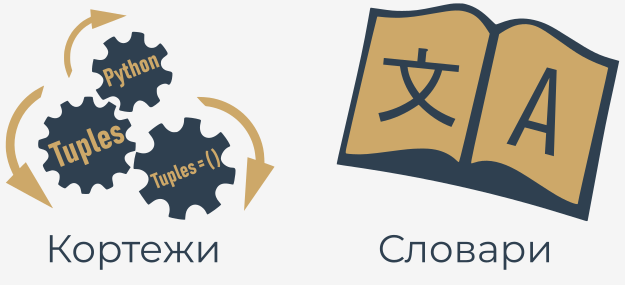

## Типы последовательностей и изменяемость

Прежде чем мы начнем говорить о **кортежах** и **словарях**, мы должны ввести два важных понятия: **типы последовательностей** и **изменчивость**.

**Тип последовательности - это тип данных в Python, который может хранить более одного значения (или менее одного, поскольку последовательность может быть пустой), и эти значения можно просматривать последовательно (отсюда и название)**, элемент за элементом.

Поскольку цикл `for` - это инструмент, специально разработанный для итерации по последовательностям, мы можем выразить определение как: **последовательность - это данные, по которым можно итерироваться с помощью цикла `for`**.

Пока что Вы встретили одну последовательность Python - список. Список представляет собой классический пример последовательности Python, хотя есть некоторые другие последовательности, о которых стоит упомянуть, и мы собираемся представить их Вам сейчас.

  

Второе понятие - **изменяемость** - это свойство любых данных Python, которое описывает их готовность к произвольному изменению во время выполнения программы. Есть два типа данных Python: **изменяемые** и **неизменяемые**.

**Изменяемые данные могут быть свободно изменены в любое время** \- мы называем такую операцию операцией in situ.

_In situ_ - это латинская фраза, которая буквально переводится как _на месте_. Например, следующая инструкция изменяет данные in situ:

```python
list.append(1)
```  

**Неизменяемые данные нельзя изменить таким образом**.

Представьте, что список можно только составить и прочитать. Вы не сможете ни добавить, ни удалить из него какой-либо элемент. Это означает, что добавление элемента в конец списка потребует воссоздания списка с нуля.

Вам нужно будет создать полностью новый список, состоящий из всех элементов уже существующего списка плюс новый элемент.

Тип данных, о котором мы хотим Вам рассказать, — это **кортеж**. **Кортеж - это неизменяемый тип последовательности**. Он может вести себя как список, но не может быть изменен in situ.

  
### Что такое кортеж?

Первое и самое четкое различие между списками и кортежами - это синтаксис, используемый для их создания: **кортежи предпочитают использовать круглые скобки**, тогда как списки любят видеть квадратные скобки, хотя также **возможно создать кортеж просто из набора значений, разделенных запятыми**.

Посмотрите на пример:

```python
tuple_1 = (1, 2, 4, 8)
tuple_2 = 1., .5, .25, .125

```  

Есть два кортежа, каждый из которых содержит **четыре элемента**.

Давайте выведем их:

```python
tuple_1 = (1, 2, 4, 8)
tuple_2 = 1., .5, .25, .125

print(tuple_1)
print(tuple_2)

```  

Вот что вы должны увидеть в консоли:

```
(1, 2, 4, 8)
(1.0, 0.5, 0.25, 0.125)
```

Примечание: **каждый элемент кортежа может быть любого типа** (с плавающей запятой, целочисленным или любым другим, еще не введенным типом данных).

### Как создать кортеж?

Возможно создание пустого кортежа - тогда скобки обязательны:

```python
empty_tuple = ()

```  

Если вы хотите создать **одноэлементный кортеж**, Вы должны принять во внимание тот факт, что по причинам синтаксиса (кортеж должен отличаться от обычного одиночного значения) Вы должны закончить кортеж запятой:

```
one_element_tuple_1 = (1[!mark!],[!/mark!] )
one_element_tuple_2 = 1.[!mark!],[!/mark!]
```  

Удаление запятых не испортит программу в синтаксическом смысле, но вместо этого Вы получите две одиночные переменные, а не кортежи.


## Как использовать кортеж?

Если Вы хотите получить элементы кортежа, чтобы читать их, Вы можете использовать тот же принцип, к которому Вы привыкли при использовании списков.

Посмотрите на код.

```python
my_tuple = (1, 10, 100, 1000)

print(my_tuple[0])
print(my_tuple[-1])
print(my_tuple[1:])
print(my_tuple[:-2])

for elem in my_tuple:
    print(elem)

```

Программа должна выдать следующий результат - запустите ее и проверьте:

```
1
1000
(10, 100, 1000)
(1, 10)
1
10
100
1000
```

Сходство может вводить в заблуждение - **не пытайтесь изменить содержимое кортежа** ! Это не список!

Все эти инструкции (кроме самой верхней) вызовут ошибку выполнения:

```python
my_tuple = (1, 10, 100, 1000)
[!mark!]
my_tuple.append(10000)
del my_tuple[0]
my_tuple[1] = -10
[!/mark!]
```  

Это сообщение, которое Python выдаст Вам в окне консоли:

`AttributeError: 'tuple' object has no attribute 'append'`

Что еще могут сделать для Вас кортежи?

* функция `len()` принимает кортежи и возвращает количество элементов, содержащихся внутри;
* оператор `+` может объединять кортежи (мы уже показывали Вам это)
* оператор `*` может умножать кортежи как списки;
* операторы `in` и `not in` работают так же, как в списках.

Код ниже представляет их все.

```python
my_tuple = (1, 10, 100)

t1 = my_tuple + (1000, 10000)
t2 = my_tuple * 3

print(len(t2))
print(t1)
print(t2)
print(10 in my_tuple)
print(-10 not in my_tuple)

```

Результат должен выглядеть следующим образом:

```
9
(1, 10, 100, 1000, 10000)
(1, 10, 100, 1, 10, 100, 1, 10, 100)
True
True
```

Одним из наиболее полезных свойств кортежей является их способность **появляться слева от оператора присваивания**. Вы видели это явление некоторое время назад, когда нужно было найти элегантный инструмент для обмена значениями двух переменных.

Взгляните на приведенный ниже код:

```python
var = 123

t1 = (1, )
t2 = (2, )
t3 = (3, var)

t1, t2, t3 = t2, t3, t1

print(t1, t2, t3)

```  

Он показывает три взаимодействующих кортежа - фактически сохраненные в них значения "циркулируют" - `t1` становится `t2`, `t2` становится `t3`, а `t3` становится `t1` .

Примечание. В этом примере представлен еще один важный факт: **элементы кортежа могут быть переменными**, а не только литералами. Более того, они могут быть выражениями, если они находятся справа от оператора присваивания.


## Что такое словарь?

**Словарь** - это еще одна структура данных Python. Это **не последовательность** (но его можно легко адаптировать для обработки последовательности), и он **изменяемый**.

Чтобы объяснить, что такое словарь Python, важно понимать, что это буквально словарь.

Словарь Python работает так же, как **двуязычный словарь**. Например, у вас есть английское слово (например, кошка) и вам нужен его французский эквивалент. Вы просматриваете словарь, чтобы найти слово (Вы можете использовать для этого разные методы - это не имеет значения), и в конце концов Вы его получаете. Затем Вы проверяете французский аналог, и это (скорее всего) слово "chat".

  
  
В мире Python искомое слово называется `ключом`. Слово, которое Вы получаете из словаря, называется `значением`.

Это означает, что словарь - это набор **пар "ключ-значение"**. Примечание:

* каждый ключ должен быть **уникальным** - невозможно иметь более одного ключа с одним и тем же значением;
* ключ может быть **любым неизменяемым типом объекта**: это может быть число (целое или плавающее) или даже строка, но не список;
* словарь не является списком - список содержит набор пронумерованных значений, а **словарь содержит пары значений**;
* функция `len()` работает и со словарями - она возвращает количество элементов "ключ-значение" в словаре;
* словарь - это **односторонний инструмент**. Если у Вас есть англо-французский словарь, вы можете искать французские эквиваленты английских терминов, но не наоборот.

Теперь мы можем показать Вам несколько рабочих примеров.


### Как создать словарь?

Если Вы хотите присвоить словарю несколько начальных пар, вы должны использовать следующий синтаксис:

```python
dictionary = {"cat": "chat", "dog": "chien", "horse": "cheval"}
phone_numbers = {'boss': 5551234567, 'Suzy': 22657854310}
empty_dictionary = {}

print(dictionary)
print(phone_numbers)
print(empty_dictionary)

```  

В первом примере словарь использует ключи и значения, которые являются строками. Во втором ключи - это строки, а значения - целые числа. Возможна и обратная раскладка (ключи → числа, значения → строки), а также комбинации чисел и чисел.

Список пар **окружен фигурными скобками**, сами пары **разделены запятыми**, а **ключи и значения - двоеточиями**.

Первый из наших словарей - очень простой англо-французский словарь. Второй - крошечный телефонный справочник.

Пустой словарь состоит из **пустой пары фигурных скобок** - ничего необычного.

Словарь в целом можно распечатать с помощью одного вызова `print()`. Фрагмент **может** дать следующий результат:

```
{'dog': 'chien', 'horse': 'cheval', 'cat': 'chat'}
{'Suzy': 5557654321, 'boss': 5551234567}
{}
```

Заметили ли Вы что-нибудь удивительное? Порядок напечатанных пар отличается от исходного. Что это значит?

Прежде всего, это подтверждение того, что **словари не являются списками** - они не сохраняют порядок своих данных, поскольку порядок совершенно бессмысленен (в отличие от настоящих, бумажных словарей). Порядок, в котором словарь **хранит свои данные, никак не зависит от Вас** и от Ваших ожиданий. Это нормально. (*)

ПРИМЕЧАНИЕ

(*) В Python 3.6x словари по умолчанию стали **упорядоченными** коллекциями. Ваши результаты могут отличаться в зависимости от того, какую версию Python Вы используете.


## Как пользоваться словарем?

Если вы хотите получить какое-либо из значений, вы должны предоставить действительное значение ключа:

```python
print(dictionary['cat'])
print(phone_numbers['Suzy'])

```  

Получение значения из словаря похоже на индексацию, особенно благодаря скобкам, окружающим значение ключа.

Примечание:

* если ключ является строкой, вы должны указать его как строку;
* **ключи чувствительны к регистру**: `'Suzy'` это не то же, что и `'suzy'`.

Код выводит две строки текста.:

```
chat
5557654321
```

А теперь самая важная новость: **нельзя использовать несуществующий ключ**. Пробуем что-то вроде этого:

```python
print(phone_numbers['president'])

```  

Такой код вызовет ошибку во время выполнения. Попробуйте.

К счастью, есть простой способ избежать такой ситуации. Оператор `in` и его компаньон `not in` могут спасти эту ситуацию.

Следующий код выполняет безопасный поиск некоторых французских слов.:

```python
dictionary = {"cat": "chat", "dog": "chien", "horse": "cheval"}
words = ['cat', 'lion', 'horse']

for word in words:
    if word in dictionary:
        print(word, "->", dictionary[word])
    else:
        print(word, "is not in dictionary")

```  

Вывод кода выглядит следующим образом:

```
cat -> chat
lion is not in dictionary
horse -> cheval
```

ПРИМЕЧАНИЕ

Когда Вы пишете большое или длинное выражение, может быть хорошей идеей выровнять его по вертикали. Вот как Вы можете сделать свой код более читаемым и удобным для программистов, например:

```
# Пример 1:
dictionary = {
              "cat": "chat",
              "dog": "chien",
              "horse": "cheval"
              }

# Пример 2:
phone_numbers = {'boss': 5551234567,
                 'Suzy': 22657854310
                 }

```  

Такой вид форматирования называется **отступом**.


## Как пользоваться словарем: keys()

Можно ли **просматривать** словари с помощью цикла `for`, как например списки или кортежи?

И да, и нет.

Нет, поскольку словарь **не является последовательным типом**, цикл `for` с ним бесполезен.

Да, потому что есть простые и очень эффективные инструменты, которые могут **адаптировать любой словарь к требованиям цикла `for`** (другими словами, создать промежуточную связь между словарем и временной упорядоченной последовательностью).

Первый из них - это метод с именем `keys()`, которым обладает каждый словарь. Метод **возвращает итерируемый объект, состоящий из всех ключей, собранных в словаре**. Наличие группы ключей позволяет легко и удобно получить доступ ко всему словарю.

Как тут:

```python
dictionary = {"cat": "chat", "dog": "chien", "horse": "cheval"}

for key in [!mark!]dictionary.keys()[!mark!]:
    print(key, "->", dictionary[key]

```  

Вывод кода выглядит следующим образом:

```
horse -> cheval
dog -> chien
cat -> chat
```


### Функция sorted()

Вы хотите его **отсортировать**? Просто дополните цикл `for`, чтобы получить такую форму:

```python
for key in [!mark!]sorted(dictionary.keys())[!/mark!]:

```  

Функция `sorted()` все сделает - результат будет выглядеть так:

```
cat -> chat
dog -> chien
horse -> cheval
```


## Как пользоваться словарем: методы items() и values()

Теперь давайте посмотрим на метод словаря под названием `items()`. Метод **возвращает кортежи** (это первый пример, когда кортежи представляют собой нечто большее, чем просто пример самих себя) **где каждый кортеж представляет собой пару "ключ-значение"**.

Вот как это работает:

```python
dictionary = {"cat": "chat", "dog": "chien", "horse": "cheval"}

for english, french in [!mark!]dictionary.items()[!/mark!]:
    print(english, "->", french)

```  

Обратите внимание на использование кортежа в качестве переменной цикла `for`.

Код выводит:

```
cat -> chat
dog -> chien
horse -> cheval
```

Также существует метод `values()`, который работает аналогично `keys()`, но **возвращает значения**.

Вот пример:

```python
dictionary = {"cat": "chat", "dog": "chien", "horse": "cheval"}

for french in [!mark!]dictionary.values()[!/mark!]:
    print(french)

```  

Поскольку словарь не может автоматически найти ключ для заданного значения, роль этого метода довольно ограничена.

Ожидаемый вывод:

```
cheval
chien
chat
```


## Как пользоваться словарем: изменение и добавление значений

Присвоить новое значение существующему ключу просто - поскольку словари полностью **изменяемы**, нет никаких препятствий для их изменения.

Мы собираемся заменить значение `"chat"` на `"minou"`, что не очень точно, но это будет хорошо работать в нашем примере.

Посмотрите:

```python
dictionary = {"cat": "chat", "dog": "chien", "horse": "cheval"}

[!mark!]dictionary['cat'] = 'minou'[!/mark!]
print(dictionary)

```  

Вывод:

`{'cat': 'minou', 'dog': 'chien', 'horse': 'cheval'}`


### Добавление нового ключа

Добавить новую пару "ключ-значение" в словарь так же просто, как изменить значение - Вам нужно только присвоить значение новому, **ранее не существовавшему ключу**.

Примечание: это совершенно другое поведение по сравнению со списками, которые не позволяют Вам присваивать значения несуществующим индексам.

Давайте добавим в словарь новую пару слов - немного странно, но все же актуально:

```python
dictionary = {"cat": "chat", "dog": "chien", "horse": "cheval"}

[!mark!]dictionary['swan'] = 'cygne'[!/mark!]
print(dictionary)

```  

Код выводит:

`{'cat': 'chat', 'dog': 'chien', 'horse': 'cheval', 'swan': 'cygne'}`

**ДОПОЛНИТЕЛЬНАЯ ИНФОРМАЦИЯ**

Также Вы можете добавить элемент в словарь с помощью метода `update()`, например:

```python
dictionary = {"cat": "chat", "dog": "chien", "horse": "cheval"}

[!mark!]dictionary.update({"duck": "canard"})[!/mark!]
print(dictionary)

```  


### Удаление ключа

Угадаете, как удалить ключ из словаря?

Примечание: удаление ключа всегда приводит к **удалению связанного значения**. **Значения не могут существовать без их ключей**.

Это делается с помощью инструкции `del`.

Вот пример:

```python
dictionary = {"cat": "chat", "dog": "chien", "horse": "cheval"}

[!mark!]del dictionary['dog'][!/mark!]
print(dictionary)
```  

Примечание. **удаление несуществующего ключа вызывает ошибку**.

Код выводит:

`{'cat': 'chat', 'horse': 'cheval'}`

**ДОПОЛНИТЕЛЬНАЯ ИНФОРМАЦИЯ**

Чтобы удалить последний элемент в словаре, вы можете использовать метод `popitem()`:

```python
dictionary = {"cat": "chat", "dog": "chien", "horse": "cheval"}

[!mark!]dictionary.popitem()[!/mark!]
print(dictionary)    # outputs: {'cat': 'chat', 'dog': 'chien'}

```  

В более старых версиях Python, то есть до 3.6.7, метод `popitem()` удаляет случайный элемент из словаря.


## Кортежи и словари могут работать вместе

Мы подготовили простой пример, показывающий, как кортежи и словари могут работать вместе.

Представим себе следующую проблему:

* вам нужна программа для оценки средних баллов учеников;
* программа должна запрашивать имя ученика, а затем одну ее/его оценку;
* имена можно вводить в любом порядке;
* ввод пустого имени завершает ввод данных (примечание 1: ввод пустой оценки вызовет исключение ValueError, но не беспокойтесь об этом сейчас, Вы увидите, как обрабатывать такие случаи, когда мы говорим об исключениях во второй части серии курсов Основы Python)
* затем должен быть создан список всех имен вместе с вычисленным средним баллом.


Посмотрите на код. Вот как это делается.

```python
school_class = {}

while True:
    name = input("Enter the student's name: ")
    if name == '':
        break
    
    score = int(input("Enter the student's score (0-10): "))
    if score not in range(0, 11):
	    break
    
    if name in school_class:
        school_class[name] += (score,)
    else:
        school_class[name] = (score,)
        
for name in sorted(school_class.keys()):
    adding = 0
    counter = 0
    for score in school_class[name]:
        adding += score
        counter += 1
    print(name, ":", adding / counter)

```

Теперь давайте проанализируем это построчно:

* **строка 1**: создание пустого словаря для входных данных; имя студента используется в качестве ключа, а все связанные с ним оценки хранятся в кортеже (кортеж может быть значением словаря - это совсем не проблема)
* **строка 3**: вход в "бесконечный" цикл (не волнуйтесь, он прервется в нужный момент)
* **строка 4**: чтение имени ученика;
* **строка 5-6**: если имя - пустая строка ( ), выход из цикла ;
* **строка 8**: запрос одной из оценок ученика (целое число от 0 до 10)
* **строки 9-10**: если введенная оценка не находится в диапазоне от 0 до 10, выход из цикла;
* **строки 12-13**: если имя ученика уже есть в словаре, добавить к связанному кортежу новую оценку (обратите внимание на оператор +=)
* **строки 14-15**: если это новый ученик (неизвестный словарю), создать новую запись - ее значение представляет собой одноэлементный кортеж, содержащий введенную оценку;
* **строка 17**: итерирование по отсортированным именам студентов;
* **строки 18-19**: инициализация данных, необходимых для вычисления среднего (sum и counter)
* **строки 20-22**: мы перебираем кортеж, беря все последующие оценки и обновляя sum вместе с counter;
* **строка 23**: узнать и вывести имя ученика и средний балл.

Диалог с нашей программой:

```
Enter the student's name: Bob
Enter the student's score (0-10): 7
Enter the student's name: Andy
Enter the student's score (0-10): 3
Enter the student's name: Bob
Enter the student's score (0-10): 2
Enter the student's name: Andy
Enter the student's score (0-10): 10
Enter the student's name: Andy
Enter the student's score (0-10): 3
Enter the student's name: Bob
Enter the student's score (0-10): 9
Enter the student's name:
Andy : 5.333333333333333
Bob : 6.0
```


## Основные тезисы: кортежи

1. **Кортежи** \- это упорядоченные и неизменяемые коллекции данных. Их можно рассматривать как неизменяемые списки. Они пишутся в круглых скобках:
    
    ```python
    my_tuple = (1, 2, True, "a string", (3, 4), [5, 6], None)
    print(my_tuple)
    
    my_list = [1, 2, True, "a string", (3, 4), [5, 6], None]
    print(my_list)
    
    ```  
    
    Каждый элемент кортежа может относиться к разному типу (т.е. целые числа, строки, логические значения и т.д.). Более того, кортежи могут содержать другие кортежи или списки (и наоборот).

2. Так Вы можете создать пустой кортеж:
    
    ```python
    empty_tuple = ()
    print(type(empty_tuple))    # outputs: <class 'tuple'>
    
    ```  

3. Одноэлементный кортеж может быть создан следующим образом:
    
    ```python
    one_elem_tuple_1 = ("one", )    # Brackets and a comma.
    one_elem_tuple_2 = "one",       # No brackets, just a comma.
    
    
    ```  
    
    Если вы удалите запятую, вы скажете Python создать **переменную**, а не кортеж.:
    
    ```python
    my_tuple_1 = 1, 
    print(type(my_tuple_1))    # outputs: <class 'tuple'>
    
    my_tuple_2 = 1             # This is not a tuple.
    print(type(my_tuple_2))    # outputs: <class 'int'>
    
    ```  

4. Вы можете получить доступ к элементам кортежа, индексируя их:
    
    ```python
    my_tuple = (1, 2.0, "string", [3, 4], (5, ), True)
    print(my_tuple[3])    # outputs: [3, 4]
    
    ```  

5. Кортежи **неизменяемы**, что означает, что Вы не можете изменять их элементы (Вы не можете добавлять, изменять или удалять элементы кортежа). Следующий код вызовет исключение:
    
    ```python
    my_tuple = (1, 2.0, "string", [3, 4], (5, ), True)
    my_tuple[2] = "guitar"    # The TypeError exception will be raised.
    
    ```  
    
    Однако вы можете удалить кортеж целиком:
    
    ```python
    my_tuple = 1, 2, 3, 
    del my_tuple
    print(my_tuple)    # NameError: name 'my_tuple' is not defined
    
    ```  

6. Вы можете перебрать элементы кортежа (Пример 1), проверить, присутствует ли (или нет) конкретный элемент в кортеже (Пример 2), использовать функцию `len()`, чтобы проверить, сколько элементов есть в кортеже (Пример 3) или можете объединить/умножить кортежи (Пример 4):
    
    ```python
    # Пример 1
    tuple_1 = (1, 2, 3)
    for elem in tuple_1:
        print(elem)
    
    # Example 2
    tuple_2 = (1, 2, 3, 4)
    print(5 in tuple_2)
    print(5 not in tuple_2)
    
    # Example 3
    tuple_3 = (1, 2, 3, 5)
    print(len(tuple_3))
    
    # Example 4
    tuple_4 = tuple_1 + tuple_2
    tuple_5 = tuple_3 * 2
    
    print(tuple_4)
    print(tuple_5)
    
    ```  
    
    **ДОПОЛНИТЕЛЬНАЯ ИНФОРМАЦИЯ**
    
    Также Вы можете создать кортеж, используя встроенную функцию Python под названием `tuple()`. Это особенно полезно, когда Вы хотите преобразовать определенный итерируемый объект (например, список, диапазон, строку и т.д.) в кортеж.:
    
    ```python
    my_tuple = tuple((1, 2, "string"))
    print(my_tuple)
    
    my_list = [2, 4, 6]
    print(my_list)    # outputs: [2, 4, 6]
    print(type(my_list))    # outputs: <class 'list'>
    tup = tuple(my_list)
    print(tup)    # outputs: (2, 4, 6)
    print(type(tup))    # outputs: <class 'tuple'>
    
    ```  
    
    Таким же образом, если Вы хотите преобразовать итерируемый объект в список, Вы можете использовать встроенную функцию Python под названием `list()`:
    
    ```python
    tup = 1, 2, 3, 
    my_list = list(tup)
    print(type(my_list))    # outputs: <class 'list'>
    
    ```  


## Основные тезисы: словари

1. Словари - это неупорядоченные **\***, изменяемые и индексированные коллекции данных. (**\*** словари Python 3.6x упорядочены по умолчанию.)
    
    Каждый словарь представляет собой набор пар _ключ: значение_. Вы можете создать его, используя следующий синтаксис:
    
    ```python
    my_dictionary = {
        key1: value1,
        key2: value2,
        key3: value3,
        }
    
    ```  

2. Если Вы хотите получить доступ к элементу словаря, Вы можете сделать это, сделав ссылку на его ключ внутри пары квадратных скобок (Пример 1) или используя метод `get()` (Пример 2 ):
    
    ```python
    pol_eng_dictionary = {
        "kwiat": "flower",
        "woda": "water",
        "gleba": "soil"
        }
    
    item_1 = pol_eng_dictionary["gleba"]    # ex. 1
    print(item_1)    # outputs: soil
    
    item_2 = pol_eng_dictionary.get("woda")    # ex. 2
    print(item_2)    # outputs: water
    
    
    ```  

3. Если Вы хотите изменить значение, связанное с определенным ключом, Вы можете сделать это, обратившись к имени ключа элемента следующим образом:
    
    ```python
    pol_eng_dictionary = {
        "zamek": "castle",
        "woda": "water",
        "gleba": "soil"
        }
    
    pol_eng_dictionary["zamek"] = "lock"
    item = pol_eng_dictionary["zamek"]    
    print(item)  # outputs: lock
    
    ```  

4. Чтобы добавить или удалить ключ (и связанное с ним значение), используйте следующий синтаксис:
    
    ```python
    phonebook = {}    # an empty dictionary
    
    phonebook["Adam"] = 3456783958    # create/add a key-value pair
    print(phonebook)    # outputs: {'Adam': 3456783958}
    
    del phonebook["Adam"]
    print(phonebook)    # outputs: {}
    
    ```  

    Также Вы можете вставить элемент в словарь с помощью метода `update()` и удалить последний элемент с помощью метода `popitem()`, например:
    
    ```python
    pol_eng_dictionary = {"kwiat": "flower"}
    
    pol_eng_dictionary.update({"gleba": "soil"})
    print(pol_eng_dictionary)    # outputs: {'kwiat': 'flower', 'gleba': 'soil'}
    
    pol_eng_dictionary.popitem()
    print(pol_eng_dictionary)    # outputs: {'kwiat': 'flower'}
    
    ```  

5. Вы можете использовать цикл `for` для просмотра словаря, например:
    
    ```python
    pol_eng_dictionary = {
        "zamek": "castle",
        "woda": "water",
        "gleba": "soil"
        }
    
    for item in pol_eng_dictionary:
        print(item) 
    
    # outputs: zamek
    #          woda
    #          gleba
    
    ```  

6. Если Вы хотите перебрать ключи и значения словаря, Вы можете использовать метод `items()` , например:
    
    ```python
    pol_eng_dictionary = {
        "zamek": "castle",
        "woda": "water",
        "gleba": "soil"
        }
    
    for key, value in pol_eng_dictionary.items():
        print("Pol/Eng ->", key, ":", value)
    
    ```  

7. Чтобы проверить, существует ли данный ключ в словаре, Вы можете использовать ключевое слово `in`:
    
    ```python
    pol_eng_dictionary = {
        "zamek": "castle",
        "woda": "water",
        "gleba": "soil"
        }
    
    if "zamek" in pol_eng_dictionary:
        print("Yes")
    else:
        print("No")
    
    ```  

8. Вы можете использовать ключевое слово `del`, чтобы удалить определенный элемент или удалить весь словарь. Чтобы удалить все элементы словаря, вам нужно использовать метод `clear()`:
    
    ```python
    pol_eng_dictionary = {
        "zamek": "castle",
        "woda": "water",
        "gleba": "soil"
        }
    
    print(len(pol_eng_dictionary))    # outputs: 3
    del pol_eng_dictionary["zamek"]    # remove an item
    print(len(pol_eng_dictionary))    # outputs: 2
    
    pol_eng_dictionary.clear()   # removes all the items
    print(len(pol_eng_dictionary))    # outputs: 0
    
    del pol_eng_dictionary    # removes the dictionary
    
    ```  

9. Чтобы скопировать словарь, используйте метод `copy()`.:
    
    ```python
    pol_eng_dictionary = {
        "zamek": "castle",
        "woda": "water",
        "gleba": "soil"
        }
    
    copy_dictionary = pol_eng_dictionary.copy()
    
    ```  
  

## Основные тезисы: кортежи и словари

**Упражнение 1**

Что произойдет, когда Вы попытаетесь запустить следующий код?

```python
my_tup = (1, 2, 3)
print(my_tup[2])

```  

<details><summary>Проверка</summary>

Программа выведет `3` на экран.

</details>

**Упражнение 2**

Что выведет следующий код?

```python
tup = 1, 2, 3
a, b, c = tup

print(a * b * c)

```  

<details><summary>Проверка</summary>

Программа выведет на экран `6`. Элементы кортежа `tup` были "распакованы" в переменных `a`, `b` и `c`.

</details>

**Упражнение 3**

Дополните код, чтобы правильно использовать метод `count()` для определения количества дубликатов `2` в следующем кортеже.

```python
tup = 1, 2, 3, 2, 4, 5, 6, 2, 7, 2, 8, 9
duplicates = # Write your code here.

print(duplicates)    # outputs: 4

```  

<details><summary>Проверка</summary>

```python
tup = 1, 2, 3, 2, 4, 5, 6, 2, 7, 2, 8, 9
duplicates = tup.count(2)

print(duplicates)    # outputs: 4

```

</details>

**Упражнение 4**

Напишите программу, которая "склеит" два словаря (`d1` и `d2`) вместе и создаст новый (`d3`).

```python
d1 = {'Adam Smith': 'A', 'Judy Paxton': 'B+'}
d2 = {'Mary Louis': 'A', 'Patrick White': 'C'}
d3 = {}

for item in (d1, d2):
    # Write your code here.

print(d3)

```  

<details><summary>Проверка</summary>

Пример решения:  

```python
d1 = {'Adam Smith': 'A', 'Judy Paxton': 'B+'}
d2 = {'Mary Louis': 'A', 'Patrick White': 'C'}
d3 = {}

for item in (d1, d2):
    d3.update(item)

print(d3)

```

</details>

**Упражнение 5**

Напишите программу, которая преобразует список `my_list` в кортеж.

```python
my_list = ["car", "Ford", "flower", "Tulip"]

t =  # Write your code here.
print(t)

```  

<details><summary>Проверка</summary>

Пример решения:

```python
my_list = ["car", "Ford", "flower", "Tulip"]

t = tuple(my_list)
print(t)
```

</details>

**Упражнение 6**

Напишите программу, которая преобразует кортеж `colors` в словарь.

```python
colors = (("green", "#008000"), ("blue", "#0000FF"))

# Write your code here.

print(colors_dictionary)

```  

<details><summary>Проверка</summary>

Пример решения:

```python
colors = (("green", "#008000"), ("blue", "#0000FF"))

colors_dictionary = dict(colors)
print(colors_dictionary)

```

</details>

**Упражнение 7**

Что произойдет, когда Вы попытаетесь запустить следующий код?

```python
my_dictionary = {"A": 1, "B": 2}
copy_my_dictionary = my_dictionary.copy()
my_dictionary.clear()

print(copy_my_dictionary)

```  

<details><summary>Проверка</summary>

Программа выведет на экран `{'A': 1, 'B': 2}`.

</details>

**Упражнение 8**

Что выведет следующая программа?

```python
colors = {
    "white": (255, 255, 255),
    "grey": (128, 128, 128),
    "red": (255, 0, 0),
    "green": (0, 128, 0)
    }

for col, rgb in colors.items():
    print(col, ":", rgb)

```  

<details><summary>Проверка</summary>

```
white : (255, 255, 255)
grey : (128, 128, 128)
red : (255, 0, 0)
green : (0, 128, 0)
```

</details>

