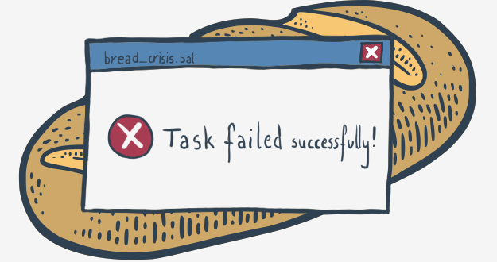
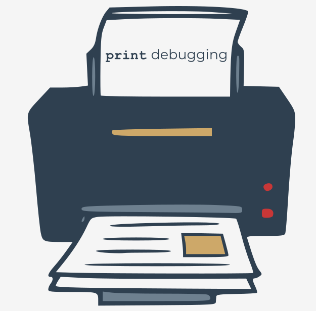

## Ошибки - хлеб насущный разработчика

Кажется бесспорным, что все программисты (включая Вас) хотят писать код без ошибок и делают все возможное для достижения этой цели. К сожалению, в этом мире нет ничего идеального, и программное обеспечение не исключение. Обратите внимание на слово "исключение", поскольку мы очень скоро снова увидим его в значении, не имеющем ничего общего с абсолютом.

Человеку свойственно ошибаться. Невозможно не ошибиться и написать код, не содержащий ошибок. Не поймите нас неправильно - мы не хотим убеждать Вас, что написание беспорядочных и ошибочных программ - это достоинство. Мы скорее хотим объяснить, что даже самый внимательный программист не может избежать мелких или серьезных дефектов. Не ошибаются только те, кто ничего не делает.

Парадоксально, но принятие этой непростой истины может сделать вас лучшим программистом и улучшить качество Вашего кода.

"Как это возможно?", - можете Вы спросить.

Мы попытаемся Вам показать.




## Ошибки в данных и ошибки в коде

Работа с ошибками в программировании имеет (как минимум) две стороны. Одна появляется, когда Вы попадаете в беду, потому что Ваш - очевидно правильный - код содержит неверные данные. Например, Вы ожидаете, что код будет принимать целое число, но Ваш неосторожный пользователь вместо него вводит случайные буквы. Может случиться так, что выполнение Вашего кода будет прервано, и пользователь останется один на один с кратким и неоднозначным сообщением об ошибке на экране. Пользователь будет неудовлетворен, и Вы тоже должны быть недовольны. Мы собираемся показать Вам, как защитить свой код от такого рода сбоев и как не вызвать гнева пользователя.

Другая сторона работы с ошибками в программировании проявляется, когда нежелательное поведение кода вызвано ошибками, которые Вы допустили при написании программы. Ошибки такого типа обычно называют "багами" (от англ. bug - жук), что является проявлением устоявшегося мнения о том, что если программа работает плохо, это должно быть вызвано жуками-вредителями, которые живут внутри аппаратного обеспечения компьютера и вызывают короткие замыкания или другие помехи. Эта идея не так безумна, как может показаться - такие инциденты были обычным явлением во времена, когда компьютеры занимали большие залы, потребляли киловатты электроэнергии и производили огромное количество тепла. К счастью или нет, эти времена прошли навсегда, и единственные ошибки, которые могут испортить Ваш код, — это те, которые Вы сами внесли в него. Поэтому мы постараемся показать Вам, как находить и устранять ошибки, другими словами, как отлаживать Ваш код.

Начнем путешествие по стране ошибок и багов.

  
## Когда данные не такие, какими они должны быть

Напишем кусок чрезвычайно тривиального кода - он прочитает натуральное число (неотрицательное целое) и выведет его обратное. Таким образом, `2` превратится в `0.5` (1/2), а `4` - в `0.25` (1/4). Вот программа:

```python
value = int(input('Enter a natural number: '))
print('The reciprocal of', value, 'is', 1/value)

```  

Есть ли что-нибудь, что может пойти не так? Код такой короткий и такой компактный, что не похоже, чтобы мы обнаружим там какие-либо проблемы.

Кажется, Вы уже знаете, куда мы идем. Да, Вы правы - ввод данных, которые не являются целыми числами (что также включает в себя ввод вообще ничего), полностью испортит выполнение программы. Вот что увидит пользователь кода:

`Traceback (most recent call last): File "code.py", line 1, in value = int(input('Enter a natural number: ')) ValueError: invalid literal for int() with base 10: ''`

Все строки Python значимы и важны, но последняя строка кажется наиболее ценной. Первое слово в строке - это имя **исключения**, из-за которого Ваш код останавливается. Здесь это `ValueError`. Остальная часть строки - это просто краткое объяснение, которое более точно указывает причину возникшего исключения.

Как Вам с этим справиться? Как защитить свой код от прерывания, пользователя от разочарования, а себя от неудовлетворенности пользователя?

Самая первая мысль, которая может прийти Вам в голову, — это проверить, верны ли данные, введенные пользователем, и отказаться от сотрудничества, если данные неверны. В этом случае проверка может основываться на том факте, что мы ожидаем, что входная строка будет содержать только цифры. Вы уже должны уметь реализовать эту проверку и написать ее самостоятельно, не так ли? Также можно проверить, является ли тип переменной текущего `значение` `int` (в Python есть специальные средства для таких проверок - это оператор с именем `is`). Сама проверка может выглядеть так:

```python
type(value) is int
```  

и принимает значение `true`, если тип переменной текущего значения - `int`.

Сейчас мы не будем тратить много времени на это - Вы найдете более подробные объяснения оператора `is` в модуле курса, посвященном объектно-ориентированному программированию.

Вы можете удивиться, что мы не хотим, чтобы вы выполняли предварительную проверку данных. Почему? Потому что Python не рекомендует это. Действительно.


## Код Python

В мире Python есть правило, которое гласит: _"Лучше просить прощения, чем просить разрешения"_.

Остановимся здесь ненадолго. Не поймите нас неправильно - мы не хотим, чтобы Вы применяли это правило в своей повседневной жизни. Не берите чью-либо машину без разрешения в надежде, что Вы будете настолько убедительны, что избежите осуждения. Правило заключается в другом.

На самом деле, правило гласит: _"Лучше обрабатывать ошибку, когда она случается, чем пытаться ее избежать"_.

_"Хорошо,_ - можете Вы сейчас сказать, — _но как я должен просить прощения, когда программа завершена, и не остается ничего, что можно было бы сделать?"_ Вот, где в дело вступает **исключение**.

Посмотрите на код.

```python
try:
	# Это место, где
	# Вы можете что-то сделать
    # без запроса разрешения.
except:
	# Это место, посвященное
    # торжественному извинению.

```

Вы можете увидеть две ветви:

* первая, начинающаяся с ключевого слова `try` - это место, куда Вы помещаете код, который, по вашему мнению, является рискованным и может быть прерван в случае ошибки; примечание: этот вид ошибки называется **исключением**, а возникновение исключения называется **вызовом** - мы можем сказать, что вызвано (или было вызвано) исключение;
* вторая, часть кода, начинающаяся с ключевого слова `except`, предназначена для обработки исключения; Вам решать, что Вы хотите здесь сделать: Вы можете убрать беспорядок или Вы можете просто скрыть проблему (хотя мы бы предпочли первое решение).

Итак, можно сказать, что эти два блока работают следующим образом:

* ключевое слово `try` отмечает место, где Вы пытаетесь что-то сделать без разрешения;
* ключевое слово `except` открывает место, где Вы можете продемонстрировать свои таланты извиняться.

Как видите, этот подход допускает ошибки (рассматривает их как нормальную часть жизни программы) вместо того, чтобы наращивать усилия, чтобы избежать ошибок вообще.

  
## Исключение подтверждает правило

Давайте перепишем код, чтобы применить подход Python к жизни:

```python
try:
    value = int(input('Enter a natural number: '))
    print('The reciprocal of', value, 'is', 1/value)        
except:
    print('I do not know what to do with', value)

```  

Подведем итог тому, о чем мы говорили:

* любая часть кода, помещенная между `try` и `except`, выполняется особым образом - любая ошибка, возникающая здесь, **не прерывает выполнение программы**. Вместо этого элемент управления немедленно перейдет к первой строке, расположенной после ключевого слова `except`, и никакая другая часть ветви `try` не будет выполнена;
* код в ветви `except` активируется только тогда, когда в блоке `try` обнаружено исключение. Другими способами добраться туда невозможно;
* когда блок `try` или блок `except` выполняется успешно, элемент управления возвращается к обычному пути выполнения, и любой код, расположенный за пределами исходного файла, будет выполнен, как ни в чем не бывало.

Теперь мы хотим задать Вам невинный вопрос: является ли `ValueError` единственным способом попадания элемента управления в ветвь `except`?

Внимательно проанализируйте код и продумайте свой ответ!


## Как справиться с более чем одним исключением

Да, Вы правы - деление, помещенное внутри вызова функции `print()`, вызовет `ZeroDivisionError`. Как и следовало ожидать, поведение кода будет таким же, как и в предыдущем случае - пользователь увидит сообщение _"I do not know what to do..."_, что кажется вполне разумным этом контексте, но также возможно, что Вы захотите решить эту проблему немного по-другому.

Является ли это возможным? Конечно. Здесь Вы можете реализовать как минимум два подхода.

Первый из них одновременно прост и сложен: Вы можете просто добавить два отдельных блока try, один из которых включает вызов функции `input()`, где может вызываться `ValueError` , а второй посвящен решению возможных проблем, вызванных делением. Оба этих блока try будут иметь свои собственные ветви `except`, и, по сути, Вы получите полный контроль над двумя разными ошибками.

Это хорошее решение, но оно немного длинновато - код излишне раздувается. Более того, это не единственная опасность, которая Вас поджидает. Обратите внимание, что оставление первого блока `try-except` оставляет много неопределенностей - Вам придется добавить дополнительный код, чтобы гарантировать, что значение, введенное пользователем, безопасно для использования при делении. Вот как кажущееся простым решение становится чрезмерно сложным.

К счастью, Python предлагает более простой способ справиться с подобными проблемами.


## Два except после одного try

Посмотрите на код:

```python
try:
    value = int(input('Enter a natural number: '))
    print('The reciprocal of', value, 'is', 1/value)        
except ValueError:
    print('I do not know what to do with', value)    
except ZeroDivisionError:
    print('Division by zero is not allowed in our Universe')    

```  

Как видите, мы только что добавили вторую ветвь `except`. Это не единственное различие - обратите внимание, что в обеих ветвях указаны **имена** исключений. В этом варианте каждое из ожидаемых исключений имеет свой собственный способ обработки ошибки, но следует подчеркнуть, что **только одна** из всех ветвей может перехватить элемент управления - **если одна из ветвей выполняется, все остальные ветви остаются бездействующими**. Кроме того, количество ветвей `except` не ограничено - Вы можете указать их столько, сколько Вам нужно, но не забывайте, что **ни одно из исключений не может быть указано больше, чем один раз**.

Но это еще не последнее слово Python об исключениях. Будьте на связи.


## Исключение по умолчанию и как его использовать

Код снова изменился - видите разницу?

```python
try:
    value = int(input('Enter a natural number: '))
    print('The reciprocal of', value, 'is', 1/value)        
except ValueError:
    print('I do not know what to do with', value)    
except ZeroDivisionError:
    print('Division by zero is not allowed in our Universe')    
except:
    print('Something strange has happened – sorry!')

```  

Мы добавили третью ветвь `except`, но на этот раз для нее **не указано имя исключения** - мы можем сказать, что оно **анонимное** или (что ближе в соответствии с его реальной ролью) это **значение по умолчанию**. Вы можете ожидать, что когда возникает исключение и нет ветви `except`, выделенной для этого исключения, оно будет обрабатываться ветвью по умолчанию.

**Примечание:**

Ветвь `except` по умолчанию должна быть последней ветвью `except`! Всегда!


## Некоторые полезные исключения

Давайте подробнее обсудим некоторые полезные (или, скорее, наиболее распространенные) исключения, с которыми Вы можете столкнуться.

  
### `ZeroDivisionError`

Оно вызывается, когда Вы пытаетесь заставить Python выполнить любую операцию, которая выполняет деление, в котором делитель равен нулю или неотличим от нуля. Обратите внимание, что существует более одного оператора Python, который может вызвать это исключение. Вы можете угадать их все?

Да, вот они: `/`, `//` и `%`.

  
### `ValueError`

Ожидайте этого исключения, когда имеете дело со значениями, которые могут быть неправильно использованы в каком-то контексте. Обычно это исключение возникает, когда функция (например, `int()` или `float()`) получает аргумент правильного типа, но его значение неприемлемо.

  
### `TypeError`

Это исключение вызывается, когда Вы пытаетесь применить данные, тип которых не может быть принят в текущем контексте. Посмотрите на пример:

```python
short_list = [1]
one_value = short_list[0.5]

```  

Вам не разрешается использовать значение с плавающей запятой в качестве индекса списка (то же правило применяется и к кортежам). `TypeError` - подходящее имя для описания проблемы и подходящее исключение, которое следует вызвать.

  
### `AttributeError`

Это исключение возникает - среди других случаев - когда Вы пытаетесь активировать метод, которого нет в элементе, с которым Вы имеете дело. Например:

```python
short_list = [1]
short_list.append(2)
short_list.depend(3)

```  

В третьей строке нашего примера делается попытка использовать метод, которого нет в списках. Это место, где возникает `AttributeError`.
  

### `SyntaxError`

Это исключение возникает, когда элемент управления достигает строки кода, нарушающей грамматику Python. Это может показаться странным, но некоторые ошибки такого рода невозможно идентифицировать без предварительного запуска кода. Такое поведение типично для интерпретируемых языков - интерпретатор всегда работает в спешке и не успевает просмотреть весь исходный код. Он удовлетворен проверкой кода, который в настоящее время выполняется. Пример такой категории проблем будет представлен очень скоро.

Обработка этого исключения в Ваших программах - плохая идея. Вы должны создавать код, не имеющий синтаксических ошибок, вместо того, чтобы маскировать ошибки, которые Вы допустили.

  
### Почему нельзя избежать тестирования кода

Хотя здесь мы собираемся подвести итог нашим соображениям об _исключениях_, не думайте, что это все, что Python может предложить, чтобы помочь Вам просить прощения. Механизм исключений Python намного сложнее, и его возможности позволяют создавать расширенные стратегии обработки ошибок. Вернемся к этим вопросам - обещаем. Не стесняйтесь проводить свои эксперименты и самостоятельно разбирать исключения.

Теперь мы хотим рассказать Вам о второй стороне непрекращающейся борьбы с ошибками - неизбежном уделе жизни разработчика. Поскольку Вы не можете избежать ошибок в своем коде, Вы всегда должны быть готовы найти и уничтожить их. Не прячьте голову в песок - игнорирование ошибок не заставит их исчезнуть.

Важной обязанностью разработчиков является тестирование вновь созданного кода, но Вы не должны забывать, что тестирование - это не способ доказать, что код не содержит ошибок. Как это ни парадоксально, единственное, что может гарантировать тестирование, — это то, что Ваш код содержит ошибки. Не думайте, что после успешного теста можно расслабиться.

Второй важный аспект тестирования программного обеспечения - сугубо психологический. Уже много лет известна истина, что авторы - даже надежные и знающие себя - **не могут объективно оценивать и проверять свои работы**. Вот почему каждому писателю нужен редактор, а каждому программисту - тестировщик. Некоторые говорят - немного злобно, но правдиво - что разработчики тестируют код, чтобы показать свое совершенство, а не найти проблемы, которые могут их расстроить. У тестировщиков нет таких дилемм, поэтому их работа более эффективна и прибыльна.

Конечно, это не освобождает Вас от внимательности и осторожности. Проверьте свой код как можно лучше. Не усложняйте работу тестировщиков.

Ваша основная обязанность - убедиться, что Вы проверили все пути выполнения, которые может пройти Ваш код. Звучит загадочно? Ничего подобного!


## Отслеживание последовательности выполнения

Предположим, Вы только что закончили писать этот фрагмент кода:

```python
temperature = float(input('Enter current temperature:'))
if temperature > 0:
    print("Above zero")
elif temperature < 0:
    print("Below zero")
else:
    print("Zero")

```  

В коде есть три независимых пути выполнения - Вы их видите? Они определяются операторами `if-elif-else`. Конечно, пути выполнения могут быть построены с помощью множества других операторов, таких как циклы или даже блоки `try-except`. Если Вы собираетесь честно протестировать свой код и хотите крепко спать и не видеть кошмаров (кошмары об ошибках могут иметь разрушительные последствия для производительности разработчика), Вы обязаны подготовить набор тестовых данных, который заставит Ваш код согласовывать все возможные пути. В нашем примере набор должен содержать как минимум три значения с плавающей запятой: одно положительное, одно отрицательное и нулевое.
  

## Когда Python закрывает глаза

Такой тест крайне важен. Мы хотим показать вам, почему Вы не должны его пропускать. Посмотрите на код:

```python
temperature = float(input('Enter current temperature:'))

if temperature > 0:
    print("Above zero")
elif temperature < 0:
    prin("Below zero")
else:
    print("Zero")

```  

Мы намеренно ввели ошибку в код - надеемся, что Ваши зоркие глаза сразу ее заметили. Да, мы удалили только одну букву, и, по сути, действительный вызов функции `print()` превращается в явно недопустимое выражение "`prin()`". В области видимости нашей программы нет такой функции, как "`prin()`", но действительно ли это очевидно для Python?

Запустите код и введите `0`.

Как видите, код завершает свое выполнение без каких-либо препятствий.

Как такое возможно? Почему Python **упускает из виду** такую очевидную ошибку разработчика?

Можете ли Вы найти ответы на эти фундаментальные вопросы?
  

## Тесты, тестирование и тестировщики

Ответ проще, чем Вы можете ожидать, и к тому же немного разочаровывающий. Python - как Вы точно знаете - это **интерпретируемый** язык. Это означает, что исходный код анализируется и выполняется одновременно. Следовательно, Python может не успеть проанализировать строки кода, которые не подлежат исполнению. Как сказал старый разработчик: _"Это фича, а не баг"_ (разг. от англ. - it's a feature, not a bug) (пожалуйста, не используйте эту фразу для оправдания странного поведения Вашего кода).

Теперь Вы понимаете, почему прохождение всех путей исполнения так важно и неизбежно?

Предположим, Вы завершили свой код и все тесты прошли успешно. Вы доставляете свой код тестировщикам и - к счастью! - они нашли в нем какие-то ошибки. Мы используем выражение _"к счастью"_ совершенно сознательно. Вы должны признать, что, во-первых, тестировщики - лучшие друзья разработчика. Не относитесь к обнаруженным ими ошибкам как к преступлению или злокачественному новообразованию; и, во-вторых, каждая ошибка, которую обнаруживают тестировщики, не затрагивает пользователей. Оба фактора ценны и заслуживают вашего внимания.

Вы уже знаете, что Ваш код содержит ошибку или ошибки (последнее более вероятно). Как их найти и как исправить код?

  
## Баг и дебаг

Базовая мера, которую разработчик может использовать против ошибок, - неудивительно, - это **отладчик (дебаггер)**, в то время как процесс, во время которого ошибки удаляются из кода, называется **отладкой (дебагом)**. Согласно старинному анекдоту, отладка - это сложная мистическая игра, в которой Вы одновременно и убийца, и детектив, и - самая болезненная часть интриги - жертва. Вы готовы сыграть все эти роли? Тогда Вы должны вооружиться отладчиком.

Отладчик - это специализированное программное обеспечение, которое может контролировать выполнение Вашей программы. Используя отладчик, Вы можете выполнять свой код построчно, проверять состояния всех переменных и изменять их значения по запросу без изменения исходного кода, останавливать выполнение программы, когда определенные условия выполняются или не выполняются, и выполнять множество других полезных задач.

Можно сказать, что каждая IDE оснащена более или менее продвинутым отладчиком. Он есть даже в IDLE, хотя работа с ним может показаться Вам немного сложной и хлопотной. Если Вы хотите использовать встроенный отладчик IDLE, Вы должны активировать его, используя пункт "Debug" в строке меню главного окна IDLE. Это начальная точка для всех средств отладчика.

На снимках экрана, которые Вы можете увидеть по ссылке, показан отладчик IDLE во время простого сеанса отладки. Вы можете увидеть, как отладчик визуализирует переменные и значения параметров, и обратить внимание на стек вызовов, который показывает цепочку вызовов, ведущих от текущей выполняемой функции до уровня интерпретатора.

Если вы хотите узнать больше об отладчике IDLE, обратитесь к [документации IDLE](https://www.cs.uky.edu/~keen/help/debug-tutorial/debug.html).


## Отладка `print`

Эта форма отладки, которую можно применить к Вашему коду с помощью любого отладчика, иногда называется **интерактивной отладкой**. Значение этого термина говорит само за себя - процесс требует Вашего (разработчика) взаимодействия.

Некоторые другие методы отладки могут использоваться для поиска ошибок. Возможно, Вы не можете или не хотите использовать отладчик (причины могут быть разными). Вы тогда беспомощны? Точно нет!

Вы можете использовать одну из самых простых и старых (но все же полезных) тактик отладки, известную как **отладка выводом**. Название говорит само за себя - Вы просто вставляете несколько дополнительных вызовов `print()` в свой код для вывода данных, которые иллюстрируют путь, по которому Ваш код проходит в настоящее время. Вы можете вывести значения переменных, которые могут повлиять на выполнение. Этот вывод может выводить важный текст, например _"Я здесь"_, _"Я вошел в функцию `foo()`"_, _"Результат равен `0`"_, или они могут содержать последовательности символов, которые читаете только Вы. Пожалуйста, не используйте обсценные или непристойные слова для этой цели, даже если Вы чувствуете сильное искушение - Ваша репутация может быть испорчена в мгновение ока, если эти выходки станут достоянием общественности.

Как видите, этот вид отладки на самом деле совсем не интерактивен или интерактивен лишь в небольшой степени, когда Вы решаете использовать функцию `input()` для остановки или задержки выполнения кода.

После того как ошибки будут обнаружены и удалены, дополнительные выводы сообщений могут быть закомментированы или удалены - выбор за Вами. Не позволяйте им выполняться в конечном коде - они могут запутать как тестировщиков, так и пользователей и навлечь на Вас плохую карму.


  

## Несколько полезных советов

Вот несколько советов, которые могут помочь Вам найти и устранить ошибки. Ни один из них не является обязательным или безусловным. Используйте их гибко и полагайтесь на свою интуицию. Не верьте себе - проверьте все дважды.

1. **Попробуйте рассказать кому-нибудь** (например, своему другу или коллеге), что Ваш код должен делать и как он ведет себя на самом деле. Будьте конкретны и не упускайте деталей. Ответьте на все вопросы, которые задает Ваш помощник. Вы, вероятно, поймете причину проблемы, рассказывая свою историю, поскольку речь активирует те части вашего мозга, которые остаются бездействующими во время кодирования. Если ни один человек не может помочь Вам с этой проблемой, используйте вместо него желтого резинового утенка. Мы не шутим - обратитесь к статье в Википедии, чтобы узнать больше об этом часто используемом методе: [Метод утенка](https://ru.wikipedia.org/wiki/Метод_утёнка).
2. **Попытайтесь изолировать проблему**. Вы можете извлечь ту часть кода, которая предположительно несет ответственность за Ваши проблемы, и запустить ее отдельно. Вы можете закомментировать части кода, которые скрывают проблему. Присваивайте переменным конкретные значения вместо того, чтобы читать их из ввода. Проверьте свои функции, применяя предсказуемые значения аргументов. Тщательно проанализируйте код. Читайте его вслух.
3. Если ошибка появилась недавно и не обнаруживалась ранее, **проанализируйте все изменения, которые Вы внесли в свой код** - причиной может быть одно из них.
4. **Сделайте перерыв**, выпейте чашку кофе, возьмите собаку и выйдите на прогулку, почитайте хорошую книгу минуту или две, позвоните своему лучшему другу - Вы будете удивлены, как часто это помогает.
5. **Будьте оптимистом** - в конце концов Вы найдете ошибку; мы обещаем.
  

## Модульное тестирование - более высокий уровень кодирования

Существует также одна важная и широко используемая техника программирования, которую Вам рано или поздно придется освоить на протяжении Вашей карьеры разработчика - это модульное тестирование. Название может немного сбивать с толку, поскольку оно касается не только тестирования программного обеспечения, но также (и, прежде всего) того, как написан код.

Короче говоря, модульное тестирование предполагает, что тесты являются неотъемлемыми частями кода, а подготовка тестовых данных является неотъемлемой частью кодирования. Это означает, что когда Вы пишете функцию или набор взаимодействующих функций, Вы также обязаны создать набор данных, для которых поведение вашего кода предсказуемо и известно. Более того, Вы должны снабдить свой код интерфейсом, который может использоваться автоматизированной средой тестирования. При таком подходе за любой поправкой, внесенной в код (даже наименее существенной), должно следовать выполнение всех модульных тестов, сопровождаемых Вашим исходным кодом.

Чтобы стандартизировать этот подход и упростить его применение, Python предоставляет специальный модуль с именем `unittest`. Мы не собираемся здесь его обсуждать - это обширная и сложная тема.


## Основные тезисы – Исключения

1. В Python различают два типа ошибок:

   * **синтаксические ошибки** (ошибки анализа, англ. parsing errors), которые проявляются, когда синтаксический анализатор сталкивается с неверным выражением. Например:
    
    Попытка выполнить следующую строку:
    
    ```python
    print("Hello, World!)
    ```
    
    вызовет SyntaxError, и в результате на консоли отобразится следующее (или похожее) сообщение:
    
    ```
    File "main.py", line 1
    
        print("Hello, World!)
                            ^
    SyntaxError: EOL while scanning string literal
    ```
    
    Обратите внимание на стрелку - она указывает на то место, где у парсера Python возникла проблема. В нашем случае это отсутствующая двойная кавычка. Заметили?

    * **исключения**, которые возникают, даже если оператор/выражение синтаксически корректно; это ошибки, которые обнаруживаются во время выполнения, когда Ваш код приводит к ошибке, которая не является безусловно фатальной. Например:
    
    Попытка выполнить следующую строку:
    
    ```python
    print(1/0)
    ```
    
    вызовет исключение ZeroDivisionError, и в результате на консоли отобразится следующее (или похожее) сообщение:
    
    ```
    Traceback (most recent call last):
      File "main.py", line 1, in 
        print(1/0)
    ZeroDivisionError: division by zero
    ```
    
    Обратите внимание на последнюю строку сообщения об ошибке - она действительно сообщает Вам, что произошло. Существует множество различных типов исключений, таких как _ZeroDivisionError_, _NameError_, _TypeError_ и многие другие; и эта часть сообщения информирует Вас о том, какое исключение было вызвано. Предыдущие строки показывают контекст, в котором возникло исключение.

2. Вы можете "ловить" и обрабатывать исключения в Python с помощью блока _try-except_. Итак, если у Вас есть подозрение, что какой-либо конкретный кусок кода может вызвать исключение, Вы можете написать код, который будет корректно обрабатывать его и не прервет выполнение программы. Посмотрите на пример:
    
    ```python
    while True:
        try:
            number = int(input("Введите целое число: "))
            print(number/2)
            break
        except:
            print("Предупреждение: введенное значение не является допустимым числом. Повторите попытку...")
    
    ```

    Приведенный выше код запрашивает у пользователя ввод, пока он не введет действительное целое число. Если пользователь вводит значение, которое не может быть преобразовано в int, программа напечатает `Предупреждение: введенное значение не является допустимым числом. Повторите попытку...` и попросит пользователя ввести число еще раз. Что происходит в таком случае?

   1. Программа входит в цикл _while_.
   2. Выполняется блок `try`. Пользователь вводит неверное значение, например: `hello!`.
   3. Возникает исключение, и оставшаяся часть блока `try` пропускается. Программа переходит к блоку except, выполняет его, а затем продолжает работу после блока _try-except_. 
      Если пользователь вводит правильное значение и никаких исключений не возникает, выполняются последующие инструкции в блоке _try_.

3. Вы можете обрабатывать несколько исключений в своем блоке кода. Посмотрите на следующие примеры:
    
    ```python
    while True:
        try:
            number = int(input("Введите целое число: "))
            print(5/number)
            break
        except ValueError:
            print("Неверное значение.")
        except ZeroDivisionError:
            print("Извините. Я не могу делить на ноль.")
        except:
            print("Я не знаю, что делать...")
    
    ```
    
    Вы можете использовать несколько блоков except после одного блока _try_ и указать конкретные имена исключений. Если выполняется одна из ветвей `except`, другие ветви будут пропущены. Помните: Вы можете указать конкретное встроенное исключение только один раз. Кроме того, не забывайте, что исключение **по умолчанию** (или общее), то есть исключение без указанного имени, должно быть помещено **в конец ветви** (используйте сначала более конкретные исключения, а в последнюю очередь - более общие).
    
    Вы также можете указать и обработать несколько встроенных исключений в одной инструкции `except`:
    
    ```python
    while True:
        try:
            number = int(input("Введите целое число: "))
            print(5/number)
            break
        except (ValueError, ZeroDivisionError):
            print("Неверное значение или нарушение правила неделения на ноль.")
        except:
            print("Извините, что-то пошло не так...")
    
    ```

4. Некоторые из наиболее полезных встроенных исключений Python: _ZeroDivisionError_, _ValueError_, _TypeError_, _AttributeError_ и _SyntaxError_. Еще одно исключение, которое, на наш взгляд, заслуживает Вашего внимания, - это исключение _KeyboardInterrupt_, которое возникает, когда пользователь нажимает клавишу прерывания (CTRL-C или Delete). Запустите приведенный выше код и нажмите комбинацию клавиш, чтобы увидеть, что произойдет.

    Чтобы узнать больше о встроенных исключениях Python, обратитесь к официальной [документации Python](https://docs.python.org/3/library/exceptions.html#bltin-exceptions).

5. И последнее, но не менее важное: Вы должны помнить о тестировании и отладке кода. Используйте такие методы отладки, как отладка _print_-ом; если есть возможность - попросите кого-нибудь прочитать Ваш код и помочь найти в нем ошибки или улучшить его; попытайтесь выделить проблемный и подверженный ошибкам фрагмент кода: **протестируйте свои функции**, используя предсказуемые значения аргументов, и попытайтесь **обработать** ситуации, когда кто-то вводит неправильные значения; **закомментируйте** части кода, которые скрывают проблему. Наконец, делайте перерывы и через некоторое время возвращайтесь к своему коду со свежим взглядом.


**Упражнение**

Что выведет следующая программа, если пользователь введет `0`?

```python
try:
    value = int(input("Введите число: "))
    print(value/value)
except ValueError:
    print("Неправильный ввод...")
except ZeroDivisionError:
    print("Очень неправильный ввод...")
except:
    print("Бууу!")

```

<details><summary>Проверка</summary>

Программа выведет: `Очень неправильный ввод...`.

</details>


## Поздравляем! Вы завершили Модуль 4.

Хорошая работа! Вы достигли конца Модуля 4 и завершили важный этап в своем обучении программированию на Python. Вот краткое изложение задач, которые Вы рассмотрели и с которыми ознакомились в Модуле 4:

* определение и использование функций - их объяснение, цель, условные обозначения и ловушки;
* концепция передачи аргументов разными способами и установления их значений по умолчанию, а также механизмы возвращения результатов функции;
* задачи области видимости;
* новые коллекции данных: кортежи и словари и их роль в обработке данных.

Теперь Вы готовы выполнить лабораторную работу, пройти тест по модулю и попытаться выполнить последнее задание: тест по Модулю 4, который поможет Вам проверить, чему Вы уже научились.
  


