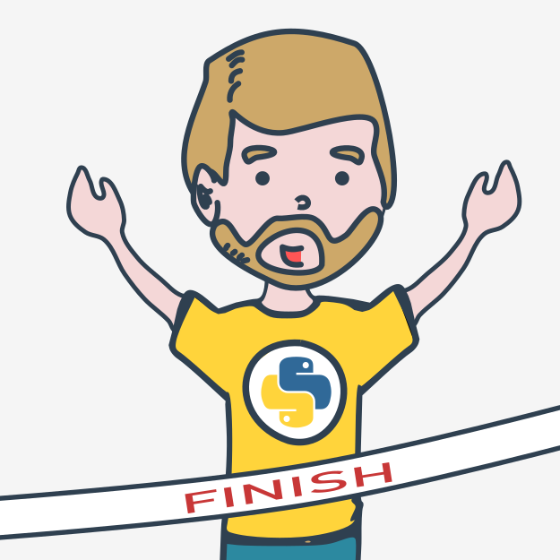
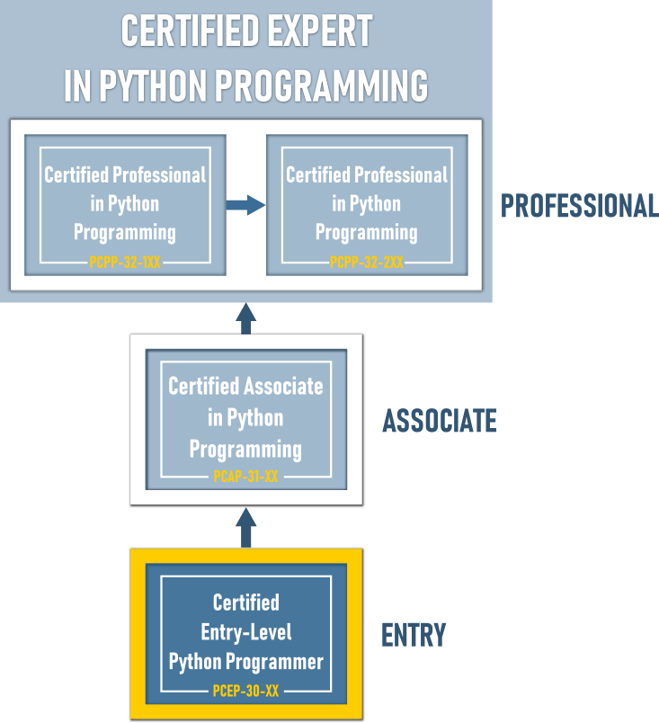

# Поздравляем!

## Вы завершили _Основы Python 1_

Отличная работа! Вы дошли до конца курса **Основы Python 1** и закончили важную веху в своем обучении программированию на Python.

Теперь Вы готовы к последнему испытанию - **Итоговому тесту**, который поможет Вам проанализировать наиболее важную информацию, которую Вы прочитали, и проверить свои навыки и знания, полученные в ходе курса.  
  
Завершив курс, Вы также готовы к сдаче сертификационного экзамена [PCEP - Certified Entry-Level Python Programmer](https://pythoninstitute.org/pcep-certification-entry-level/), который является промежуточным этапом к сертификации _PCAP - Certified Associate in Python Programming_ , а также отправной точкой для начала карьеры в разработке программного обеспечения, программировании на Python и связанных технологиях.  
  
Готовы?
  

