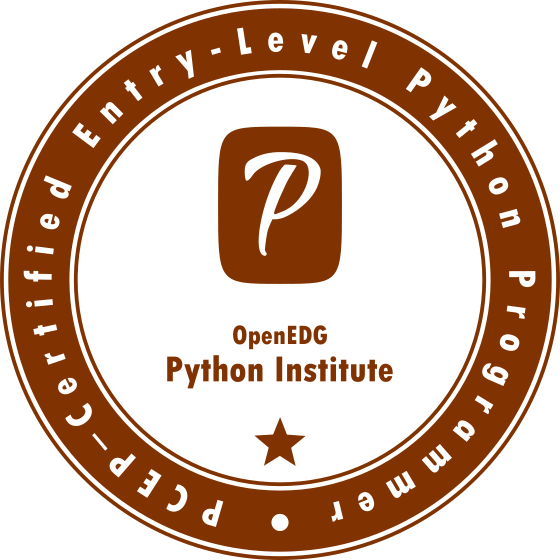

## Что такое сертификация PCEP?

_Сертификация PCEP - Certified Entry-Level Python Programmer_ показывает, что Вы знакомы с универсальными концепциями компьютерного программирования, такими как типы данных, контейнеры, функции, условия и циклы, а также с синтаксисом, семантикой и средой выполнения языка программирования Python.

Получение сертификата PCEP гарантирует, что Вы ознакомитесь с наиболее важными средствами, предоставляемыми Python 3, которые позволят Вам начать собственное обучение на среднем уровне и продолжить свое профессиональное развитие.  
  
Сертификация PCEP позволяет Вам продемонстрировать, что Вы не только в курсе задач, связанных с Python, но и что Вы можете грамотно их решать.  
  
Кроме того, с OpenEDG Python Institute Вы получаете доступ к большой сети профессионалов в области программирования на Python, ценному ресурсу для решения задач, связанных с Python, и для разработки инновационных решений.  
  
Начните работу с сертификатом _PCEP - Certified Entry-Level Python Programmer_. Получите работу по программированию на начальном уровне, начните работать в этой сфере и получите необходимые навыки, знания и опыт для продвижения по карьерной лестнице.  

## Как получить сертификат PCEP?

По завершении _Основы Python 1_ Вы готовы попытаться пройти квалификацию [PCEP - Certified Entry-Level Python Programmer](https://pythoninstitute.org/pcep-certification-entry-level/).

**Регистрация**

Кандидаты на тестирование в OpenEDG Python Institute могут зарегистрироваться и сдать экзамен PCEP онлайн через **OpenEDG Testing Service Platform**, доступную по адресу [https://edube.org](https://edube.org).

Экзаменационные сессии OpenEDG Python Institute PCEP не нужно планировать заранее, и кандидаты на тестирование могут зарегистрироваться и сдать экзамены в тот же день (экзамены без контроля).

**Аккаунт кандидата на тест**

Перед сдачей экзамена кандидат должен создать **учетную запись пользователя** (учетную запись кандидата на тест) по адресу [https://edube.org/registration](https://edube.org/registration). Кандидат должен предоставить свою личную информацию и адрес, установить безопасный пароль, прочитать и принять Условия обслуживания. Если Вы проходили курс _Основы Python 1_ непосредственно через **Edube Interactive**, это означает, что у Вас уже есть учетная запись кандидата на тест, и от Вас не требуется ничего делать.

Обратите внимание, что после того, как Ваша учетная запись будет настроена, Вы больше не сможете редактировать часть информации, связанной с Вашим профилем (например, Ваше имя, адрес электронной почты и дату рождения), поэтому, пожалуйста, убедитесь, что все данные, указанные Вами в регистрационной форме, верны.

## Как сдать экзамен PCEP?

Для сдачи экзамена необходимо иметь **экзаменационный ваучер**. Вы можете приобрести ваучер на экзамен в магазине ваучеров OpenEDG и привязать его к своей учетной записи кандидата на тест.

**Приобрести сертификат на экзамен**

Чтобы приобрести ваучер на экзамен, Вам необходимо зайти в [OpenEDG Voucher Store](https://ums.edube.org/store), добавить ваучер PCEP в корзину и оформить заказ.

Во время процесса Вас попросят предоставить платежную информацию (детали счета и адрес электронной почты, на который должна быть отправлена квитанция), информацию о доставке (адрес электронной почты, на который должен быть отправлен ваучер), а также вам необходимо прочитать и принять Правила Ваучера.

На заключительном этапе процесса размещения заказа Вам будет предложено произвести оплату (PayPal/кредитной картой или банковским переводом на основании выставленного счета).

Вы можете оплатить экзамен всеми основными кредитными картами (например, Visa, MasterCard, American Express), дебетовыми картами или через учетную запись PayPal.

**Добавьте ваучер к своей учетной записи**

Кандидаты на тестирование, у которых уже есть экзаменационный ваучер, могут привязать его к своей учетной записи перед сдачей экзамена. Добавленные экзаменационные ваучеры отображаются в учетной записи тестируемого кандидата и могут использоваться для начала экзамена службой тестирования OpenEDG.

Также Вы можете привязать ваучер к своей учетной записи во время оформления заказа. Ваучер будет привязан к Вашей учетной записи, как только мы получим платеж.

**Сдайте экзамен**

После входа на [https://edube.org/login](https://edube.org/login) Вы можете начать экзамен:

* нажав Take Exam (если у Вас есть ваучер на экзамен и Вы хотите немедленно приступить к экзамену) или
* нажав "Launch Exam" рядом с ваучером, добавленным к учетной записи пользователя OpenEDG (если ваучер уже был добавлен к Вашей учетной записи).

Дополнительные сведения о технических требованиях, кодексе чести и правилах сдачи экзаменов см. на сайте [https://pythoninstitute.org/pcep-testing-policies/](https://pythoninstitute.org/pcep-testing-policies/).

