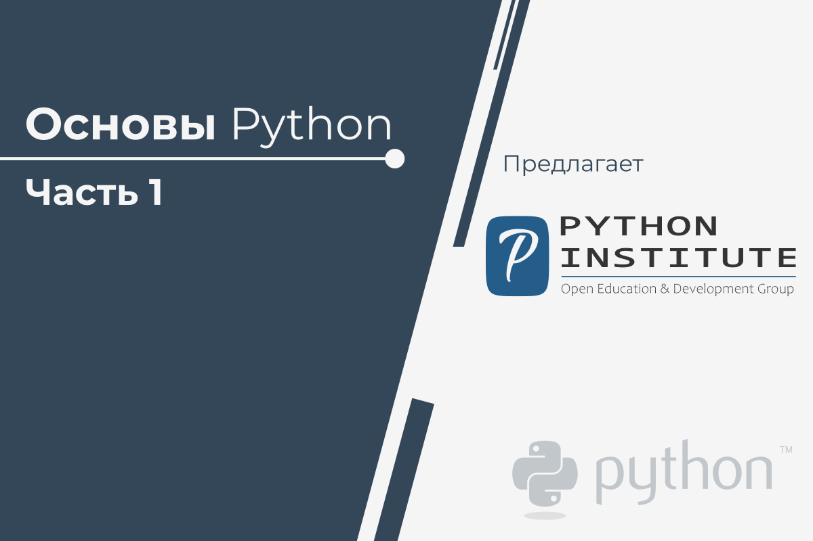

# learn-pe1

Основы Python 1

Этот курс является первым в серии из 2-х курсов, который подготовит Вас к сертификационным экзаменам [PCEP - Certified Entry-Level Python Programmer](https://pythoninstitute.org/certification/pcep-certification-entry-level/) и [PCAP: Certified Associate in Python Programming](https://pythoninstitute.org/certification/pcap-certification-associate/)

Главная цель этого курса - вывести Вас из состояния полной неграмотности в программировании на тот уровень знания программирования, который позволит Вам **проектировать**, **писать**, **исправлять**, и **запускать** программы, написанные в языке Python, и понять **базовые концепции технологий разработки программного обеспечения**.

Этот курс подготовит Вас к работе и построению карьеры, связанной с широко известной **разработкой программного обеспечения**, которое включает в себя не только написание кода самого по себе, в роли младшего разработчика (junior developer), но также **проектирование компьютерных систем** и **тестирование программного обеспечения**.
